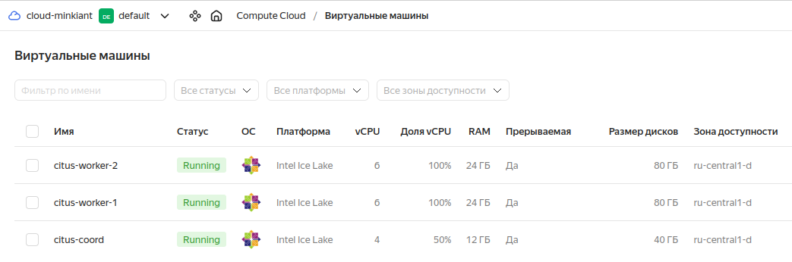
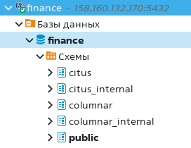
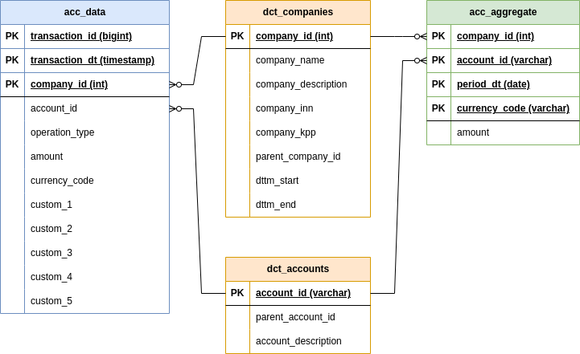
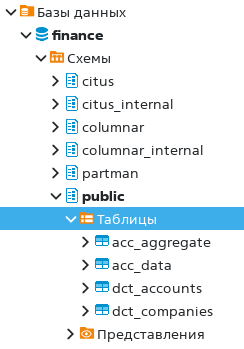
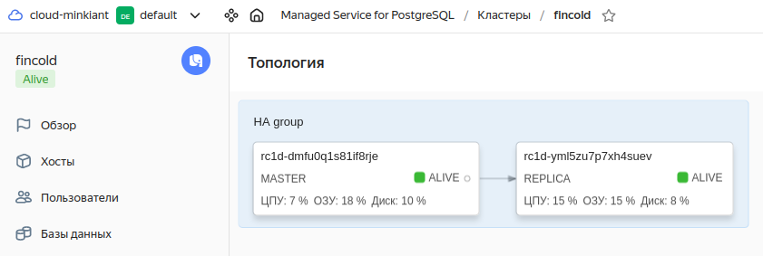
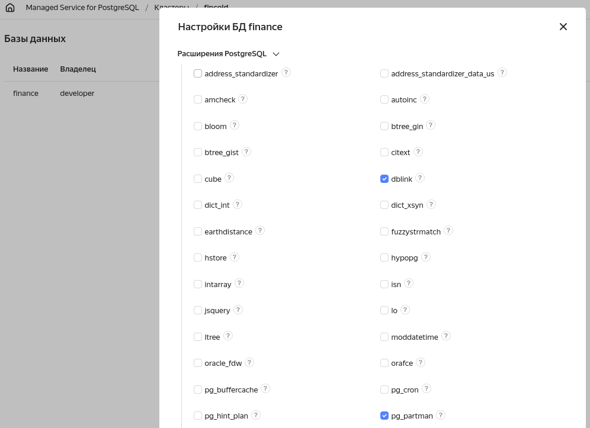
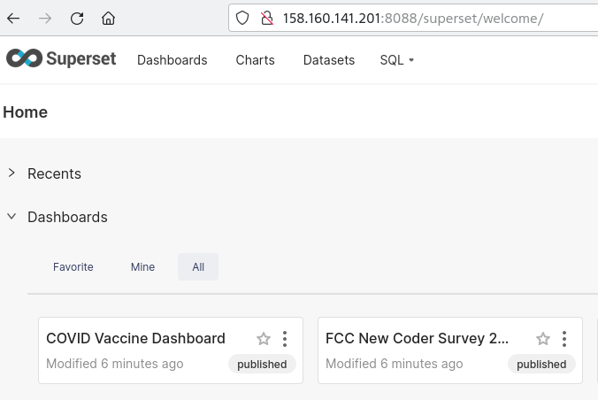
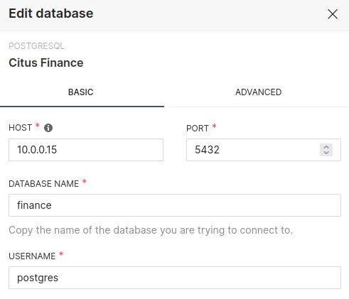
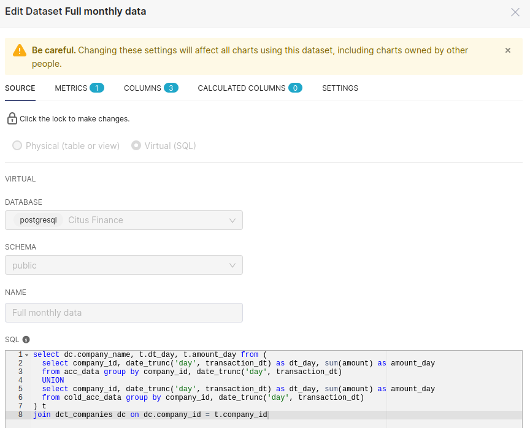
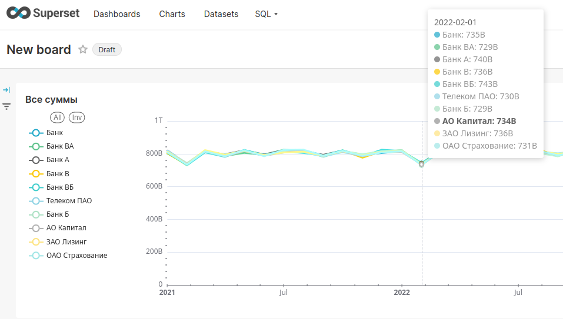

# Построение шардированной базы данных на основе Сitus с использованием партиционирования и холодного хранения

- [Презентация доклада на защиту](Минкин_Защита_OTUS_2024.pptx)

## Требования

- Необходимо создать базу для хранения бухгалтерской отчетности группы компаний по паттерну multi-tenant приложения. Шардирование по company_id (он же tenant). Шард с данными головной организации должен быть привязан к выделенному воркеру в Citus.

- Сущности:

    а) **организации** (справочник, не шардируется, должен присутствовать на каждом воркере)

    б) **план счетов** (справочник, не шардируется, должен присутствовать на каждом воркере)

    в) **данные отчетности** (основная таблица, шардируется, содержит company_id, период, счёт, операцию, сумму и набор из нескольких аналитик)

    г) **агрегированные данные** (дополнительная таблица, ко-шардируется с основной по company_id, содержит период, счет и сумму без аналитик)

- Внутри каждого шарда должно дополнительно применяться range-партиционирование по месяцам. Должно использоваться расширение pg_partman для автоматического управления партициями.

- Должен быть реализован скрипт для переноса партиций с данными закрытых периодов (старше 24 мес) на холодное хранение в отдельный read-only кластер Postgres под управлением patroni+etcd. Обратное подключение вынесенных партиций должно быть реализовано с помощью postgres_fdw.

## Создание кластера Citus

### Установка и настройка

- Будем использовать инфраструктуру YA cloud, поднимем три машины - одну для координатора, две для воркеров. Базовая ОС - Centos Stream 8.

```
anton@aminkin:~$ yc compute instance list
+----------------------+----------------+---------------+---------+-----------------+-------------+
|          ID          |      NAME      |    ZONE ID    | STATUS  |   EXTERNAL IP   | INTERNAL IP |
+----------------------+----------------+---------------+---------+-----------------+-------------+
| fv4gqrcvdsrfrk4os10g | citus-worker-2 | ru-central1-d | RUNNING | 158.160.136.69  | 10.0.0.25   |
| fv4i145u43t1r3k0kb9j | citus-worker-1 | ru-central1-d | RUNNING | 158.160.137.128 | 10.0.0.30   |
| fv4po7monltuhb69pjr9 | citus-coord    | ru-central1-d | RUNNING | 158.160.132.170 | 10.0.0.15   |
+----------------------+----------------+---------------+---------+-----------------+-------------+

anton@aminkin:~$ yc vpc subnet show citusnodes
id: fl8a57f1o0m95rhu7kli
folder_id: b1ggfiad3opmftvi9r55
created_at: "2023-12-28T09:59:33Z"
name: citusnodes
description: Подсеть citus
network_id: enpi8htrfm74c3ctr69r
zone_id: ru-central1-d
v4_cidr_blocks:
  - 10.0.0.0/16
```



- Поднимем Citus вручную (без использования контейнеризации) на всех нодах согласно [документации](https://docs.citusdata.com/en/v12.1/installation/multi_node_rhel.html)

- На всех нодах (включая координатор): добавляем репозиторий

```
[anton@citus-coord ~]$ curl https://install.citusdata.com/community/rpm.sh | sudo bash
  % Total    % Received % Xferd  Average Speed   Time    Time     Time  Current
                                 Dload  Upload   Total   Spent    Left  Speed
100  8471  100  8471    0     0  22529      0 --:--:-- --:--:-- --:--:-- 22469
Detected operating system as centos/8.
Checking for curl...
Detected curl...
Checking for postgresql16-server...
Installing pgdg repo... Failed to set locale, defaulting to C.UTF-8
Failed to set locale, defaulting to C.UTF-8

Installed:
  pgdg-redhat-repo-42.0-35PGDG.noarch                                                                                                                                                       

done.
Checking for EPEL repositories...
Installing epel-release repo... done.
Downloading repository file: https://repos.citusdata.com/community/config_file.repo?os=centos&dist=8&source=script... done.
Installing pygpgme to verify GPG signatures... 
WARNING: 
The pygpgme package could not be installed. This means GPG verification is not possible for any RPM installed on your system. 
To fix this, add a repository with pygpgme. Usualy, the EPEL repository for your system will have this. 
More information: https://fedoraproject.org/wiki/EPEL#How_can_I_use_these_extra_packages.3F

done.
Installing yum-utils... done.
Generating yum cache for citusdata_community... done.

The repository is set up! You can now install packages.
```

- На всех нодах (включая координатор): устанавливаем софт из репозитория

```
[anton@citus-coord ~]$ sudo yum install -y citus121_16
...
Installed:
  citus121_16-12.1.1.citus-1.el8.x86_64         libicu-60.3-2.el8_1.x86_64   lz4-1.8.3-3.el8_4.x86_64   postgresql16-16.1-4PGDG.rhel8.x86_64   postgresql16-libs-16.1-4PGDG.rhel8.x86_64  
  postgresql16-server-16.1-4PGDG.rhel8.x86_64  

Complete!
```

- На всех нодах (включая координатор): инициализируем системную БД, добавляем библиотеку citus в shared_preload_libraries

```
[anton@citus-coord ~]$ sudo /usr/pgsql-16/bin/postgresql-16-setup initdb
Initializing database ... OK

[anton@citus-coord ~]$ echo "shared_preload_libraries = 'citus'" | sudo tee -a /var/lib/pgsql/16/data/postgresql.conf
shared_preload_libraries = 'citus'
```

- На всех нодах (включая координатор): редактируем конфиги. В */var/lib/pgsql/16/data/postgresql.conf* прописываем `listen_addresses = '*'`, в */var/lib/pgsql/16/data/pg_hba.conf* доверенный доступ внутри сетки - `10.0.0.0/16 trust` и для себя `127.0.0.1/32 trust`, `::1/128 trust`

- На всех нодах (включая координатор): стартуем БД, создаём базу **finance** и добавляем в неё расширение citus

```
[anton@citus-coord ~]$ sudo service postgresql-16 restart
Redirecting to /bin/systemctl restart postgresql-16.service
[anton@citus-coord ~]$ sudo chkconfig postgresql-16 on
Note: Forwarding request to 'systemctl enable postgresql-16.service'.
Created symlink /etc/systemd/system/multi-user.target.wants/postgresql-16.service → /usr/lib/systemd/system/postgresql-16.service.
[anton@citus-coord ~]$ sudo su - postgres
[postgres@citus-coord ~]$ psql
psql (16.1)
Type "help" for help.

postgres=# \l
                                                       List of databases
   Name    |  Owner   | Encoding | Locale Provider |   Collate   |    Ctype    | ICU Locale | ICU Rules |   Access privileges   
-----------+----------+----------+-----------------+-------------+-------------+------------+-----------+-----------------------
 postgres  | postgres | UTF8     | libc            | en_US.UTF-8 | en_US.UTF-8 |            |           | 
 template0 | postgres | UTF8     | libc            | en_US.UTF-8 | en_US.UTF-8 |            |           | =c/postgres          +
           |          |          |                 |             |             |            |           | postgres=CTc/postgres
 template1 | postgres | UTF8     | libc            | en_US.UTF-8 | en_US.UTF-8 |            |           | =c/postgres          +
           |          |          |                 |             |             |            |           | postgres=CTc/postgres
(3 rows)

postgres=# create database finance;
CREATE DATABASE
postgres=# \c finance
You are now connected to database "finance" as user "postgres".
finance=# create extension citus;
CREATE EXTENSION
```

- На координаторе: регистрируем самого координатора и воркеры, проверяем

```
finance=# SELECT citus_set_coordinator_host('citus-coord', 5432);
 citus_set_coordinator_host 
----------------------------
 
(1 row)

finance=# SELECT * from citus_add_node('citus-worker-1', 5432);
 citus_add_node 
----------------
              2
(1 row)

finance=# SELECT * from citus_add_node('citus-worker-2', 5432);
 citus_add_node 
----------------
              3
(1 row)

finance=# SELECT * FROM citus_get_active_worker_nodes();
   node_name    | node_port 
----------------+-----------
 citus-worker-1 |      5432
 citus-worker-2 |      5432
(2 rows)
```

- Откроем доступ к БД снаружи (на координатор) зададим пароль пользователю postgres и подключимся через DBeaver

```
[anton@citus-coord ~]$ sudo vi /var/lib/pgsql/16/data/pg_hba.conf
[anton@citus-coord ~]$ sudo cat /var/lib/pgsql/16/data/pg_hba.conf | grep -v "#"
host    all             all             0.0.0.0/0               scram-sha-256
host    all             all             ::1/128                 scram-sha-256
[anton@citus-coord ~]$ sudo su - postgres
Last login: Thu Dec 28 11:08:18 UTC 2023 on pts/0
[postgres@citus-coord ~]$ psql
psql (16.1)
Type "help" for help.

postgres=# alter user postgres with password '*********';
ALTER ROLE
postgres=# \q
[postgres@citus-coord ~]$ /usr/pgsql-16/bin/pg_ctl reload
server signaled
```



- TODO: Для отказоустойчивости неплохо было бы каждую ноду включая координатор засунуть в патрони как мастер-реплику и положить всё в etcd

- Установим расширение [pg_partman](https://github.com/pgpartman/pg_partman/tree/master) на каждой ноде, благо оно есть в репозитории 

```
[anton@citus-coord ~]$ sudo dnf -y install pg_partman_16
...
Installed:
  pg_partman_16-5.0.0-1PGDG.rhel8.x86_64                                                                                                                                                      

Complete!
```

- На каждой ноде добавляем библиотеку *pg_partman_bgw* в postgresql.conf: `shared_preload_libraries = 'citus,pg_partman_bgw'` (требует рестарта кластера), а также указываем базу где работать: `pg_partman_bgw.dbname = 'finance'` (можно обойтись SELECT pg_reload_conf();)

```
[anton@citus-coord$ ~] sudo su - postgres
[postgres@citus-coord ~]$ cd 16/data/
[postgres@citus-coord data]$ vi postgresql.conf
...
[postgres@citus-coord data]$ exit
[anton@citus-coord$ ~] sudo service postgresql-16 restart
```

- На координаторе заходим в psql и устанавливаем расширение партмана в выбранную БД, создаём пользователя. Все эти команды автоматически выполнятся на воркерах.

```
[anton@citus-coord$ ~] sudo su - postgres
[postgres@citus-coord data]$ psql
psql (16.1)
Type "help" for help.

postgres=# show shared_preload_libraries;
 shared_preload_libraries 
--------------------------
 citus,pg_partman_bgw
(1 row)

postgres=# \c finance
You are now connected to database "finance" as user "postgres".
finance=# CREATE SCHEMA partman;
CREATE SCHEMA
finance=# CREATE EXTENSION pg_partman SCHEMA partman;
CREATE EXTENSION
finance=# CREATE ROLE partman_user WITH LOGIN;
CREATE ROLE
finance=# GRANT ALL ON SCHEMA partman TO partman_user;
GRANT
finance=# GRANT ALL ON ALL TABLES IN SCHEMA partman TO partman_user;
GRANT
finance=# GRANT EXECUTE ON ALL FUNCTIONS IN SCHEMA partman TO partman_user;
GRANT
finance=# GRANT EXECUTE ON ALL PROCEDURES IN SCHEMA partman TO partman_user;
GRANT
finance=# GRANT ALL ON SCHEMA public TO partman_user;
GRANT
finance=# GRANT TEMPORARY ON DATABASE finance to partman_user;
GRANT
```

### Создание бд и наполнение

- Создадим в базе finance таблицы **dct_companies, dct_accounts, acc_data, acc_aggregate** с требуемыми партициями - [create_objects.sql](sql/create_objects.sql).



- Словари dct_companies и dct_accounts зарегистрируем в citus с помощью функции *create_reference_table* - как референсные таблицы, которые будут скопированы на каждый воркер.

- Таблицы с данными объявим как партиционируемые с помощью конструкции `PARTITION BY RANGE`. Затем шардируем их функцией *create_distributed_table*, после чего шарды родительской таблицы появятся на воркерах. И наконец применим функцию *partman.create_parent* с интервалом в 1 месяц которая создаст для каждого шарда партиции (по умолчанию 4 штуки до и после текущего момента + партицию с суффиксом _default) причём всё это успешно продублируется на воркерах. Ссылки между таблицами делать не будем. Подробнее - см комментарии в [create_objects.sql](sql/create_objects.sql)



- Наполним данными словари - добавим 10 [компаний](sql/insert_data_orgs.sql), 70 [счетов](sql/insert_data_accs.sql)

- Теперь сгенерируем данные фин. отчетности, для начала за период в 1 год (2023) для всех организаций и счетов: [generate_data.sql](sql/generate_data.sql). Получилось около 2 млн строк. Данные упали в существующие партиции но новые партиции автоматически не создались, большая часть легла в acc_data_default. Для решения этой проблемы существует функция *partman.partition_data_proc*, запускаем и партиции автоматически создаются, данные переносятся в них из default, причём citus всё сам транслирует на воркеры.

- После генерации пробуем привязать данные головной организации (company_id = 1) к выделенному шарду с помощью функции *isolate_tenant_to_new_shard*. Здесь вылезли некоторые проблемы, в частности пришлось донастроить файл .pgpass для localhost и выставить на всех нодах `wal_level = logical` (включая координатор). В результате выполнения изоляции tenant получилось следующее - все шарды, содержащие company_id = 1, были разбиты на три части - первая со значениями хэша меньше чем хэш с company_id = 1, вторая с хэшом строго соответствующим company_id = 1 и третья со значениями большими чем у хэша company_id = 1. Итого в таблице стало на два шарда больше - 34 вместо 32. Подробности в [generate_data.sql](sql/generate_data.sql). План выполнения запроса по tenant, выделенному в отдельный шард: [explain_main_company_select.txt](sql/explain_main_company_select.txt)

- Попробуем также перенос шардов между воркерами с помощью функции *citus_move_shard_placement*. В идеале хотелось перенести все шарды кроме выделенного на другой воркер, но наткнулся на ограничение `moving multiple shard placements via logical replication in the same transaction is currently not supported`, нужно писать скрипт (TODO). Ограничился демонстрационным переносом одного из шардов. Подробности также в [generate_data.sql](sql/generate_data.sql)

- Наконец добавляем данных по головной организации за текущий (2024) год. Вставилось ещё 200к строк в выделенный шард, но они опять же упали по большей части в дефолтную партицию этого шарда (кроме тех что были созданы партманом изначально - до мая 2024). Воспользуемся повторно функцией *partman.partition_data_proc*.

- Теперь агрегируем данные нехитрым запросом: [aggregate_data.sql](sql/aggregate_data.sql). Как выяснилось, citus при создании таблицы автоматически неявно делает colocation с другими таблицами у которых та же колонка для разбивки и то же число шардов. В нашем примере у всех шардов обоих таблиц с данными один и тот же colocation_id = 3. В частности из-за этого у таблицы acc_agregate также стало 34 шарда после применения функции *isolate_tenant_to_new_shard* к таблице acc_data (т.к. применялось с опцией CASCADE). Для явного задания зависимости между таблицами пробуем функцию *update_distributed_table_colocation*.

- Последнее упражнение с данными - составной запрос ко всем таблицам с отборами и пр., см в конце [aggregate_data.sql](sql/aggregate_data.sql)

## Создание кластера холодного хранения

### Установка и настройка

- Поднимем managed-сервис postgres в облаке из двух хостов (мастер-реплика). Имя кластера - *fincold*, CPU optimized, минимальные параметры, в той же зоне что и citus. Доступ developer/developer. База при создании - finance.

```
anton@aminkin:~$ yc postgres clusters list
+----------------------+---------+---------------------+--------+---------+
|          ID          |  NAME   |     CREATED AT      | HEALTH | STATUS  |
+----------------------+---------+---------------------+--------+---------+
| c9qjdcidpvm091khmh9b | fincold | 2024-01-11 09:17:51 | ALIVE  | RUNNING |
+----------------------+---------+---------------------+--------+---------+

anton@aminkin:~$ yc postgres hosts list --cluster-name fincold
+-------------------------------------------+----------------------+---------+--------+---------------+-----------+--------------------+
|                   NAME                    |      CLUSTER ID      |  ROLE   | HEALTH |    ZONE ID    | PUBLIC IP | REPLICATION SOURCE |
+-------------------------------------------+----------------------+---------+--------+---------------+-----------+--------------------+
| rc1d-dmfu0q1s81if8rje.mdb.yandexcloud.net | c9qjdcidpvm091khmh9b | MASTER  | ALIVE  | ru-central1-d | false     |                    |
| rc1d-yml5zu7p7xh4suev.mdb.yandexcloud.net | c9qjdcidpvm091khmh9b | REPLICA | ALIVE  | ru-central1-d | false     |                    |
+-------------------------------------------+----------------------+---------+--------+---------------+-----------+--------------------+
```


- Установим через GUI в бд finance расширения dblink, postgres_fdw и pg_partman (dblink далее не пригодился, т.к. все сделано через postgres_fdw)



- Настроим доступ с серверов citus по SSL по инструкции из UI облака. Публичный доступ включать не будем.

```
[anton@citus-coord ~]$ sudo dnf install wget
...
Installed:
  libmetalink-0.1.3-7.el8.x86_64                                                                  wget-1.19.5-11.el8.x86_64                                                                 

Complete!

[anton@citus-coord ~]$ sudo su - postgres
Last login: Thu Jan 11 11:03:35 UTC 2024 on pts/0
[postgres@citus-coord ~]$ mkdir -p ~/.postgresql && \
> wget "https://storage.yandexcloud.net/cloud-certs/CA.pem" \
>     --output-document ~/.postgresql/root.crt && \
> chmod 0600 ~/.postgresql/root.crt
--2024-01-11 11:14:15--  https://storage.yandexcloud.net/cloud-certs/CA.pem
Resolving storage.yandexcloud.net (storage.yandexcloud.net)... 213.180.193.243, 2a02:6b8::1d9
Connecting to storage.yandexcloud.net (storage.yandexcloud.net)|213.180.193.243|:443... connected.
HTTP request sent, awaiting response... 200 OK
Length: 3579 (3.5K) [application/x-x509-ca-cert]
Saving to: ‘/var/lib/pgsql/.postgresql/root.crt’

/var/lib/pgsql/.postgresql/root.crt            100%[====================================================================================================>]   3.50K  --.-KB/s    in 0s      

2024-01-11 11:14:15 (79.5 MB/s) - ‘/var/lib/pgsql/.postgresql/root.crt’ saved [3579/3579]

[postgres@citus-coord ~]$ psql "host=rc1d-dmfu0q1s81if8rje.mdb.yandexcloud.net,rc1d-yml5zu7p7xh4suev.mdb.yandexcloud.net \
>     port=6432 \
>     sslmode=verify-full \
>     dbname=finance \
>     user=developer \
>     target_session_attrs=read-write"
Password for user developer: 
psql (16.1, server 16.0 (Ubuntu 16.0-201-yandex.56587.637d925cc2))
SSL connection (protocol: TLSv1.3, cipher: TLS_AES_256_GCM_SHA384, compression: off)
Type "help" for help.

finance=> SELECT version();
                                                                     version                                                                     
-------------------------------------------------------------------------------------------------------------------------------------------------
 PostgreSQL 16.0 (Ubuntu 16.0-201-yandex.56587.637d925cc2) on x86_64-pc-linux-gnu, compiled by gcc (Ubuntu 11.4.0-1ubuntu1~22.04) 11.4.0, 64-bit
(1 row)
```

- Доступ есть. Однако, оказалось что после добавления файла `/var/lib/pgsql/.postgresql/root.crt` сломался citus - начал выдавать ошибку `ERROR:  connection to the remote node citus-worker-1:5432 failed with the following error: SSL error: certificate verify failed`. Согласно [доке](https://docs.citusdata.com/en/stable/reference/common_errors.html#ssl-error-certificate-verify-failed) уберём этот файлик, а к сервису холодного хранения можно подключаться без SSL т.к. он не публичный:

```
[postgres@citus-coord ~]$ psql "host=c-c9qjdcidpvm091khmh9b.rw.mdb.yandexcloud.net \
>       port=6432 \
>       sslmode=disable \
>       dbname=finance \
>       user=developer \
>       target_session_attrs=read-write"
Password for user developer: 
psql (16.1, server 16.0 (Ubuntu 16.0-201-yandex.56587.637d925cc2))
Type "help" for help.

finance=> 
finance=> select * from pg_extension;
  oid  |   extname    | extowner | extnamespace | extrelocatable | extversion |      extconfig      | extcondition 
-------+--------------+----------+--------------+----------------+------------+---------------------+--------------
 14193 | plpgsql      |       10 |           11 | f              | 1.0        |                     | 
 16567 | pg_partman   |       10 |         2200 | f              | 4.7.4      | {16571,16600,16633} | {"","",""}
 16719 | dblink       |       10 |         2200 | t              | 1.2        |                     | 
 16778 | postgres_fdw |       10 |         2200 | t              | 1.1        |                     | 
(4 rows)

```

- Настроим в бд холодного хранения коннект до координатора citus по внутреннему IP облака с помощью расширения postgres_fdw

```
finance=> CREATE SERVER citus_fin
finance-> FOREIGN DATA WRAPPER postgres_fdw
finance-> OPTIONS (host '10.0.0.15', port '5432', dbname 'finance');
ERROR:  permission denied for foreign-data wrapper postgres_fdw
```

- Ошибка т.к. сервис постгреса в YA cloud не предоставляет права суперадмина. Согласно [доке](https://cloud.yandex.ru/ru/docs/managed-postgresql/concepts/roles#mdb-admin), для использования postgres_fdw нужно через GUI облака дать роль **mdb_admin** пользователю developer в кластере. После добавления роли все ок:

```
finance=> CREATE SERVER citus_fin
finance-> FOREIGN DATA WRAPPER postgres_fdw
finance-> OPTIONS (host '10.0.0.15', port '5432', dbname 'finance');
CREATE SERVER

finance=> CREATE USER MAPPING FOR developer
finance-> SERVER citus_fin
finance-> OPTIONS (user 'postgres', password 'AoU9k=[W++');
CREATE USER MAPPING

finance=> CREATE FOREIGN TABLE citus_acc_data(
finance(>     transaction_id  bigint       NOT NULL,
finance(>     transaction_dt  date         NOT NULL,
finance(>     company_id      integer      NOT NULL,
finance(>     company_id_src  integer,
finance(>     account_id      varchar(20)  NOT NULL,
finance(>     account_id_src  varchar(20),
finance(>     operation_type  varchar(20),
finance(>     amount          numeric      NOT NULL,
finance(>     currency_code   varchar(3)   NOT NULL,
finance(>     custom_1        varchar(20),
finance(>     custom_2        varchar(20),
finance(>     custom_3        varchar(20),
finance(>     custom_4        varchar(20),
finance(>     custom_5        varchar(20)
finance(> )
finance-> SERVER citus_fin
finance-> OPTIONS (schema_name 'public', table_name 'acc_data');
CREATE FOREIGN TABLE

finance=> select count(*) from citus_acc_data where company_id = 1;
 count  
--------
 383753
(1 row)
```

### Перенос данных

- Создадим в базе *finance* схему *archdata* и в ней структуру для таблицы *acc_data* аналогичную той что в citus (агрегированные данные сносить в холодное хранение не будем, только основные): [create_foreign_objects.sql](sql/create_foreign_objects.sql)

- Напишем и запустим запрос который будет запускаться на кластере холодного хранения и вытаскивать все данные с citus за заданный период. Для теста возьмем январь 2023 г.

```
finance=> insert into archdata.acc_data(
    transaction_id,
    transaction_dt,
    company_id,
    company_id_src,
    account_id,
    account_id_src,
    operation_type,
    amount,
    currency_code,
    custom_1,
    custom_2,
    custom_3,
    custom_4,
    custom_5
)
select
    transaction_id,
    transaction_dt,
    company_id,
    company_id_src,
    account_id,
    account_id_src,
    operation_type,
    amount,
    currency_code,
    custom_1,
    custom_2,
    custom_3,
    custom_4,
    custom_5
from citus_acc_data
where transaction_dt >= '2023-01-01'::date and transaction_dt < '2023-01-01'::date + '1 month'::interval;

INSERT 0 162897
```

- Как и в citus всё упало в партицию archdata.acc_data_default, запустим partition_data_proc

```
finance=> select count(*) from archdata.acc_data_default;
 count  
--------
 162897
(1 row)

finance=> call partition_data_proc('archdata.acc_data');
NOTICE:  Batch: 1, Rows moved: 162897
NOTICE:  Total rows moved: 162897
NOTICE:  Ensure to VACUUM ANALYZE the parent (and source table if used) after partitioning data
CALL

finance=> select count(*) from archdata.acc_data_default;
 count 
-------
     0
(1 row)

finance=> select count(*) from archdata.acc_data_p2023_01;
 count  
--------
 162897
(1 row)
```

- Сгенерируем исторические данные за 2021 и 2022 гг. в основной БД citus (см запрос в [generate_data.sql](sql/generate_data.sql)), применим функцию партмана для создания партиций

```
finance=# INSERT INTO public.acc_data (
  ...
finance(#     FROM generate_series
finance(#         ( '2021-01-01'::timestamp 
finance(#         , '2022-12-31'::timestamp
finance(#         , '1 day'::interval) dd
  ...
INSERT 0 3832389
Time: 23290.447 ms (00:23.290)

finance=# call partman.partition_data_proc('public.acc_data');
NOTICE:  Loop: 1, Rows moved: 162590
NOTICE:  Loop: 2, Rows moved: 146795
NOTICE:  Loop: 3, Rows moved: 162522
NOTICE:  Loop: 4, Rows moved: 157529
NOTICE:  Loop: 5, Rows moved: 162797
NOTICE:  Loop: 6, Rows moved: 157835
NOTICE:  Loop: 7, Rows moved: 162608
NOTICE:  Loop: 8, Rows moved: 162524
NOTICE:  Loop: 9, Rows moved: 157197
NOTICE:  Loop: 10, Rows moved: 162742
NOTICE:  Loop: 11, Rows moved: 157399
NOTICE:  Loop: 12, Rows moved: 162599
NOTICE:  Loop: 13, Rows moved: 163059
NOTICE:  Loop: 14, Rows moved: 146916
NOTICE:  Loop: 15, Rows moved: 162659
NOTICE:  Loop: 16, Rows moved: 157512
NOTICE:  Loop: 17, Rows moved: 162517
NOTICE:  Loop: 18, Rows moved: 157541
NOTICE:  Loop: 19, Rows moved: 162949
NOTICE:  Loop: 20, Rows moved: 162863
NOTICE:  Loop: 21, Rows moved: 157702
NOTICE:  Loop: 22, Rows moved: 162853
NOTICE:  Loop: 23, Rows moved: 157690
NOTICE:  Loop: 24, Rows moved: 162991
NOTICE:  Total rows moved: 3832389
NOTICE:  Ensure to VACUUM ANALYZE the parent (and source table if used) after partitioning data
CALL
Time: 99881.960 ms (01:39.882)

finance=# \d+ acc_data
...
Partitions: acc_data_p20210101 FOR VALUES FROM ('2021-01-01') TO ('2021-02-01'),
            acc_data_p20210201 FOR VALUES FROM ('2021-02-01') TO ('2021-03-01'),
...
            acc_data_p20250201 FOR VALUES FROM ('2025-02-01') TO ('2025-03-01'),
            acc_data_p20250301 FOR VALUES FROM ('2025-03-01') TO ('2025-04-01'),
            acc_data_p20250401 FOR VALUES FROM ('2025-04-01') TO ('2025-05-01'),
            acc_data_default DEFAULT
```

- В холодном хранилище почистим табличку после теста - `truncate table archdata.acc_data;`

- Создадим на координаторе citus bash-скрипт [move_to_cold_storage.sh](move_to_cold_storage.sh) для переноса партиций старше указанной даты из citus в managed-сервис. Входной параметр - количество месяцев назад от текущей даты, по умолчанию = 24 (т.е. всё что старше 24 месяцев - переносим). Для авторизации в холодном хранилище добавляем пароль от пользователя developer в .pgpass на координаторе: `c-c9qjdcidpvm091khmh9b.rw.mdb.yandexcloud.net:6432:finance:developer:developer`.

- Внутри скрипт подключается к холодному хранилищу и выполняет [copy_data_to_cold.sql](sql/copy_data_to_cold.sql) передавая внутрь количество месяцев. Затем запускает функцию партмана для создания партиций и проверочный запрос по последнему месяцу. После этого скрипт подключается локально к кластеру на координаторе citus, выставляет параметр retention для таблички acc_data и запускает процедуру партмана run_maintenance, которая чистит старые партиции. TODO: сделать предварительное создание партиций в холодном кластере чтобы не приходилось перегонять данные лишний раз (из дефолтной партиции в нормальную)

```
[postgres@citus-coord cold]$ ./move_to_cold_storage.sh 24
INSERT 0 1915137
psql:copy_data_to_cold.sql:38: NOTICE:  Batch: 1, Rows moved: 162590
psql:copy_data_to_cold.sql:38: NOTICE:  Batch: 2, Rows moved: 146795
psql:copy_data_to_cold.sql:38: NOTICE:  Batch: 3, Rows moved: 162522
psql:copy_data_to_cold.sql:38: NOTICE:  Batch: 4, Rows moved: 157529
psql:copy_data_to_cold.sql:38: NOTICE:  Batch: 5, Rows moved: 162797
psql:copy_data_to_cold.sql:38: NOTICE:  Batch: 6, Rows moved: 157835
psql:copy_data_to_cold.sql:38: NOTICE:  Batch: 7, Rows moved: 162608
psql:copy_data_to_cold.sql:38: NOTICE:  Batch: 8, Rows moved: 162524
psql:copy_data_to_cold.sql:38: NOTICE:  Batch: 9, Rows moved: 157197
psql:copy_data_to_cold.sql:38: NOTICE:  Batch: 10, Rows moved: 162742
psql:copy_data_to_cold.sql:38: NOTICE:  Batch: 11, Rows moved: 157399
psql:copy_data_to_cold.sql:38: NOTICE:  Batch: 12, Rows moved: 162599
psql:copy_data_to_cold.sql:38: NOTICE:  Total rows moved: 1915137
psql:copy_data_to_cold.sql:38: NOTICE:  Ensure to VACUUM ANALYZE the parent (and source table if used) after partitioning data
CALL
   mindt    |   maxdt    |  cnt   
------------+------------+--------
 2021-12-01 | 2021-12-31 | 162599
(1 row)

UPDATE 1
 run_maintenance 
-----------------
 
(1 row)
```

- На citus остались только партиции старше 2022-01-01

```
finance=# \d+ acc_data                     
...
Partitions: acc_data_p20220101 FOR VALUES FROM ('2022-01-01') TO ('2022-02-01'),
            acc_data_p20220201 FOR VALUES FROM ('2022-02-01') TO ('2022-03-01'),
            acc_data_p20220301 FOR VALUES FROM ('2022-03-01') TO ('2022-04-01'),
...
```

- На сервере холодного хранения появились партиции до 2022-01-01 (в дополнение к созданным изначально и к тестовой на 2023-01-01)

```
finance=> \d+ archdata.acc_data
...
Partitions: archdata.acc_data_p2021_01 FOR VALUES FROM ('2021-01-01') TO ('2021-02-01'),
            archdata.acc_data_p2021_02 FOR VALUES FROM ('2021-02-01') TO ('2021-03-01'),
            archdata.acc_data_p2021_03 FOR VALUES FROM ('2021-03-01') TO ('2021-04-01'),
            archdata.acc_data_p2021_04 FOR VALUES FROM ('2021-04-01') TO ('2021-05-01'),
            archdata.acc_data_p2021_05 FOR VALUES FROM ('2021-05-01') TO ('2021-06-01'),
            archdata.acc_data_p2021_06 FOR VALUES FROM ('2021-06-01') TO ('2021-07-01'),
            archdata.acc_data_p2021_07 FOR VALUES FROM ('2021-07-01') TO ('2021-08-01'),
            archdata.acc_data_p2021_08 FOR VALUES FROM ('2021-08-01') TO ('2021-09-01'),
            archdata.acc_data_p2021_09 FOR VALUES FROM ('2021-09-01') TO ('2021-10-01'),
            archdata.acc_data_p2021_10 FOR VALUES FROM ('2021-10-01') TO ('2021-11-01'),
            archdata.acc_data_p2021_11 FOR VALUES FROM ('2021-11-01') TO ('2021-12-01'),
            archdata.acc_data_p2021_12 FOR VALUES FROM ('2021-12-01') TO ('2022-01-01'),
            archdata.acc_data_p2023_01 FOR VALUES FROM ('2023-01-01') TO ('2023-02-01'),
...
```

- TODO: можно добавить скрипт переноса в crontab

- Теперь подключим холодные данные обратно в citus с помощью *postgres_fdw*. На всех нодах citus (воркеры и координатор) устанавливаем библиотеки расширений постгреса (contrib), затем создаём само расширение postgres_fdw в базе finance и объекты

```
[anton@citus-coord ~]$ sudo dnf install postgresql16-contrib
...
finance=# CREATE EXTENSION postgres_fdw;
CREATE EXTENSION

finance=# CREATE SERVER cold_fin
FOREIGN DATA WRAPPER postgres_fdw
OPTIONS (host 'c-c9qjdcidpvm091khmh9b.rw.mdb.yandexcloud.net', port '6432', dbname 'finance');
CREATE SERVER

finance=# CREATE USER MAPPING FOR postgres
SERVER cold_fin
OPTIONS (user 'developer', password 'developer');
CREATE USER MAPPING

finance=# CREATE FOREIGN TABLE cold_acc_data(
    transaction_id  bigint       NOT NULL,
    transaction_dt  date         NOT NULL,
    company_id      integer      NOT NULL,
    company_id_src  integer,
    account_id      varchar(20)  NOT NULL,
    account_id_src  varchar(20),
    operation_type  varchar(20),
    amount          numeric      NOT NULL,
    currency_code   varchar(3)   NOT NULL,
    custom_1        varchar(20),
    custom_2        varchar(20),
    custom_3        varchar(20),
    custom_4        varchar(20),
    custom_5        varchar(20)
)
SERVER cold_fin
OPTIONS (schema_name 'archdata', table_name 'acc_data');
CREATE FOREIGN TABLE

finance=# select count(*) from cold_acc_data;
 count  
--------
 162897
(1 row)
```

- Сделаем выборку данных за период, включающий данные с холодного хранения, проверим план. Попробуем создать для этой цели представление в котором объединим обе таблицы (удалённую и локальную):

```
finance=# create or replace view v_acc_data_full as
finance-# select * from acc_data
finance-# union
finance-# select * from cold_acc_data;
WARNING:  "view v_acc_data_full" has dependency to "foreign table cold_acc_data" that is not in Citus' metadata
DETAIL:  "view v_acc_data_full" will be created only locally
HINT:  Distribute "foreign table cold_acc_data" first to distribute "view v_acc_data_full"
CREATE VIEW
```

- Однако [план](sql/explain_view_select.txt) простого запроса `select * from v_acc_data_full where transaction_dt between '2023-01-01'::date and '2023-01-02'::date limit 5;` с отбором на дату показывает что предикаты почему-то в представление не пушатся - то ли из-за распределенности, то-ли из за внешней таблицы... В итоге постгрес начинает скакать (Seq Scan) по всем партициям и работает очень долго (около минуты), хотя в отборе явно указано условие на дату. Разные варианты синтаксиса роли не играют: `select * from v_acc_data_full where transaction_dt >= (select '2023-01-01'::date) and transaction_dt < (select '2023-01-02'::date) limit 5;`

- Запрос без представления с явными отборами в каждой части отрабатывает гораздо быстрее:


```
finance=# select * from (
finance(#    select * from acc_data where transaction_dt between '2023-01-01'::date and '2023-01-02'::date
finance(#    union
finance(#    select * from cold_acc_data where transaction_dt between '2023-01-01'::date and '2023-01-02'::date
finance(# ) v
finance-# limit 5;
 transaction_id | transaction_dt | company_id | company_id_src | account_id | account_id_src | operation_type |  amount  | currency_code | custom_1 | custom_2 | custom_3 | custom_4 | custom_
5 
----------------+----------------+------------+----------------+------------+----------------+----------------+----------+---------------+----------+----------+----------+----------+--------
--
          10400 | 2023-01-02     |          9 |                | 6.91.6     |                |                | 26845600 | RUR           | B        |          |          |          | 
           2236 | 2023-01-01     |          6 |                | 1.8        |                |                | 75355400 | RUR           |          |          |          |          | 
           2301 | 2023-01-01     |          1 |                | 2.47       |                |                |  5584300 | RUR           |          | XX       |          |          | 
           4018 | 2023-01-01     |          3 |                | 6.90.2     |                |                | 15888500 | RUR           |          | XX       |          |          | 
           7344 | 2023-01-02     |          5 |                | 1.5        |                |                | 66801300 | RUR           | B        |          |          |          | 
(5 rows)

Time: 632.994 ms
```

## Визуализация

### Установка Apache Superset

- Поскольку на координаторе достаточно ресурсов для нашего тестового приложения, то установим там докер и запустим Superset в докер-контейнере. В реальности конечно надо устанавливать суперсет отдельно.

- Ставим docker под CentOS по [инструкции](https://docs.docker.com/engine/install/centos/)

```
sudo yum install -y yum-utils
sudo yum-config-manager --add-repo https://download.docker.com/linux/centos/docker-ce.repo
sudo yum install docker-ce docker-ce-cli containerd.io docker-buildx-plugin docker-compose-plugin
sudo systemctl enable docker
sudo systemctl start docker
```

- Скачиваем исходники суперсета

```
[anton@citus-coord ~]$ git clone https://github.com/apache/superset.git
Cloning into 'superset'...
remote: Enumerating objects: 245161, done.
remote: Counting objects: 100% (1005/1005), done.
remote: Compressing objects: 100% (781/781), done.
remote: Total 245161 (delta 231), reused 978 (delta 216), pack-reused 244156
Receiving objects: 100% (245161/245161), 535.01 MiB | 27.29 MiB/s, done.
Resolving deltas: 100% (182567/182567), done.
Updating files: 100% (5543/5543), done.
[anton@citus-coord ~]$ cd superset/
```

- Перед запуском docker из-за того что порт 5432 занят citus придется поправить docker-compose.yaml

```
[anton@citus-coord superset]$ sudo docker compose up -d
WARN[0000] The "SCARF_ANALYTICS" variable is not set. Defaulting to a blank string. 
WARN[0000] The "CYPRESS_CONFIG" variable is not set. Defaulting to a blank string. 
WARN[0000] The "CYPRESS_CONFIG" variable is not set. Defaulting to a blank string. 
[+] Running 10/10
 ✔ Container superset_cache         Started                                                                                                                                            0.0s 
 ✔ Container superset_nginx         Started                                                                                                                                            0.0s 
 ✔ Container superset_websocket     Started                                                                                                                                            0.0s 
 ✔ Container superset_db            Started                                                                                                                                            0.0s 
 ✔ Container superset_app           Started                                                                                                                                            0.0s 
 ✔ Container superset_init          Started                                                                                                                                            0.0s 
 ✔ Container superset_tests_worker  Started                                                                                                                                            0.0s 
 ✔ Container superset_worker        Started                                                                                                                                            0.0s 
 ✔ Container superset_worker_beat   Started                                                                                                                                            0.0s 
 ✔ Container superset_node          Started 
```

- К сожалению dev версия не запустилась - после ввода логина/пароля интерфейс завис, пробуем продуктивную *docker-compose-non-dev.yml*, она заработала:

```
[anton@citus-coord superset]$ sudo docker compose -f docker-compose-non-dev.yml up -d
...
[+] Running 7/7
 ✔ Network superset_default        Created                                                                                                                                             0.1s 
 ✔ Container superset_db           Started                                                                                                                                             5.3s 
 ✔ Container superset_cache        Started                                                                                                                                             5.3s 
 ✔ Container superset_worker       Started                                                                                                                                             0.3s 
 ✔ Container superset_init         Started                                                                                                                                             0.3s 
 ✔ Container superset_app          Started                                                                                                                                             0.3s 
 ✔ Container superset_worker_beat  Started                                                                                                                                             0.3s 
```

- Авторизуемся admin/admin



### Вывод данных

- Создадим соединение с координатором по внутреннему IP облака



- Добавим источник данных в котором пропишем запрос к основным таблицам с данными (acc_data, cold_acc_data)



- Добавим чарт "Все суммы" на основе этого датасета и добавим его в дашборд "New board". Красивых графиков не получилось, т.к. данные сгенерированы равномерно.




