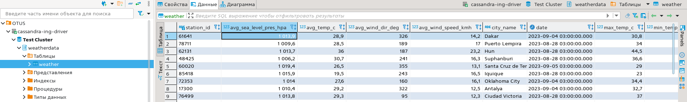

# PG Advanced - Домашняя работа 10 - Загрузка больших данных

Возьмём открытый датасет с информацией о погоде
https://www.kaggle.com/datasets/guillemservera/global-daily-climate-data/data

В составе:
- Cities DataFrame (cities.csv)
- Countries DataFrame (countires.csv)
- Daily Weather DataFrame (daily_weather.parquet)

Ограничения эксперимента:
- Будем загружать данные в Cassandra, Clickhouse и PostgreSQL.
- Будем загружать только паркетный файл (без словарей).
- СУБД будем поднимать в докере, в каждый момент времени будем работать только с одной из них.
- СУБД используем из коробки as-is, ничего не тюним.
- Используем для загрузки более-менее одинаковый подход - загрузку через pyspark.
- Загруженные данные не индексируем.
- Запросы к загруженным данным выполняем через DBeaver.


## Создание виртуалки

- 4CPU, 8Gb RAM, 40Gb HDD

```
yc compute instance create \
  --name otus-db-pg-lesson10 \
  --zone ru-central1-b \
  --hostname otus-db-pg-vm-10 \
  --network-interface subnet-name=default-ru-central1-b,nat-ip-version=ipv4 \
  --create-boot-disk image-folder-id=standard-images,image-family=ubuntu-2204-lts,type=network-hdd,size=40 \
  --memory 8 \
  --cores 4 \
  --core-fraction 50 \
  --preemptible \
  --metadata-from-file user-data=user-data.yaml
```

- ставим докер

```
anton@otus-db-pg-vm-10:~$ sudo apt-get update
anton@otus-db-pg-vm-10:~$ sudo install -m 0755 -d /etc/apt/keyrings
anton@otus-db-pg-vm-10:~$ curl -fsSL https://download.docker.com/linux/ubuntu/gpg | sudo gpg --dearmor -o /etc/apt/keyrings/docker.gpg
anton@otus-db-pg-vm-10:~$ sudo chmod a+r /etc/apt/keyrings/docker.gpg
anton@otus-db-pg-vm-10:~$ echo \
  "deb [arch="$(dpkg --print-architecture)" signed-by=/etc/apt/keyrings/docker.gpg] https://download.docker.com/linux/ubuntu \
  "$(. /etc/os-release && echo "$VERSION_CODENAME")" stable" | \
  sudo tee /etc/apt/sources.list.d/docker.list > /dev/null
anton@otus-db-pg-vm-10:~$ sudo apt-get update
anton@otus-db-pg-vm-10:~$ sudo apt-get install -y docker-ce docker-ce-cli containerd.io docker-buildx-plugin docker-compose-plugin
```

- скачиваем архив с данными, кладем на виртуалку и распаковываем

```
anton@otus-db-pg-vm-10:~/kaggle_weather$ ls -la
total 238800
drwxrwxr-x 2 anton anton      4096 Oct 11 09:38 .
drwxr-x--- 6 anton anton      4096 Oct 11 09:37 ..
-rw-rw-r-- 1 anton anton     86184 Sep  3 04:04 cities.csv
-rw-rw-r-- 1 anton anton     21134 Sep  3 04:04 countries.csv
-rw-rw-r-- 1 anton anton 244403425 Sep  3 04:04 daily_weather.parquet
```

### Установка Python + Java

- ставим питон и библиотеки для работы

```
anton@otus-db-pg-vm-10:~$ sudo apt update && sudo apt install -y python3-pip
anton@otus-db-pg-vm-10:~$ pip3 --version
pip 22.0.2 from /usr/lib/python3/dist-packages/pip (python 3.10)
anton@otus-db-pg-vm-10:~$ pip3 install pyspark findspark pandas pyarrow
```

- прочитаем файл и посмотрим на содержимое - 27.6 млн строк, объём - 2.7 Гб

```
>>> import pandas as pd
>>> df = pd.read_parquet('daily_weather.parquet', engine='pyarrow')
>>> print(df.info())
<class 'pandas.core.frame.DataFrame'>
Index: 27635763 entries, 0 to 24220
Data columns (total 14 columns):
 #   Column                  Dtype         
---  ------                  -----         
 0   station_id              category      
 1   city_name               category      
 2   date                    datetime64[us]
 3   season                  category      
 4   avg_temp_c              float64       
 5   min_temp_c              float64       
 6   max_temp_c              float64       
 7   precipitation_mm        float64       
 8   snow_depth_mm           float64       
 9   avg_wind_dir_deg        float64       
 10  avg_wind_speed_kmh      float64       
 11  peak_wind_gust_kmh      float64       
 12  avg_sea_level_pres_hpa  float64       
 13  sunshine_total_min      float64       
dtypes: category(3), datetime64[us](1), float64(10)
memory usage: 2.6 GB
```

- т.к. для драйверов jdbc нужна java, поставим её:

`anton@otus-db-pg-vm-10:~$ sudo apt install -y openjdk-19-jdk`

## Cassandra

### Установка Cassandra

- читаем документацию https://hub.docker.com/_/cassandra и запускаем контейнер с пробросом портов (основной - 9042) и подключением каталога для данных, устанавливаем перед этим переменную CASSANDRA_LISTEN_ADDRESS в нули, чтобы можно было подключиться не только локально (но вообще так делать не надо - https://cassandra.apache.org/doc/latest/cassandra/faq/index.html#why-cant-list-all)

```
anton@otus-db-pg-vm-10:~$ sudo mkdir -p /data/cassandra
anton@otus-db-pg-vm-10:~$ export CASSANDRA_LISTEN_ADDRESS=0.0.0.0
anton@otus-db-pg-vm-10:~$ sudo docker run \
    --name cassandra \
    -p 7000:7000 -p 7001:7001 -p 7199:7199 -p 9042:9042 -p 9160:9160 \
    -v /data/cassandra:/var/lib/cassandra \
    -d cassandra
```

- проверка соединения: подключаемся через dbeaver извне

через пару минут после старта контейнера пробуем подключиться по описанию:
https://stackoverflow.com/questions/77100407/dbeaver-community-edition-no-driver-for-apache-cassandra-on-mac
1) качаем драйвер: https://github.com/ing-bank/cassandra-jdbc-wrapper/releases
2) добавляем в dbeaver как описано на стеке: имя драйвера - cassandra-ing-driver, тип - generic, класс - com.ing.data.cassandra.jdbc.CassandraDriver
3) добавляем подключение со строкой `jdbc:cassandra://158.160.78.176:9042?localdatacenter=datacenter1&requesttimeout=30000`


### Загрузка в Cassandra

- для загрузки будем использовать [spark-cassandra-connector](https://github.com/datastax/spark-cassandra-connector/tree/master), настроим подключение по документации: https://github.com/datastax/spark-cassandra-connector/blob/master/doc/1_connecting.md

- подключимся к кассандре из контейнера чтобы создать базу (keyspace) = weatherdata и в ней табличку weather (колонки согласно описанию датасета выше)

```
anton@otus-db-pg-vm-10:~/kaggle_weather$ sudo docker exec -it cassandra bash
root@de73aa782ef7:/# cqlsh
Connected to Test Cluster at 127.0.0.1:9042
[cqlsh 6.1.0 | Cassandra 4.1.3 | CQL spec 3.4.6 | Native protocol v5]
Use HELP for help.
cqlsh> CREATE KEYSPACE weatherdata WITH REPLICATION = {'class' : 'SimpleStrategy', 'replication_factor' : 1};
cqlsh> CREATE TABLE weatherdata.weather (
    station_id              VARCHAR,
    city_name               VARCHAR,
    date                    TIMESTAMP,
    season                  VARCHAR,
    avg_temp_c              DOUBLE,
    min_temp_c              DOUBLE,
    max_temp_c              DOUBLE,
    precipitation_mm        DOUBLE,
    snow_depth_mm           DOUBLE,
    avg_wind_dir_deg        DOUBLE,
    avg_wind_speed_kmh      DOUBLE,
    peak_wind_gust_kmh      DOUBLE,
    avg_sea_level_pres_hpa  DOUBLE,
    sunshine_total_min      DOUBLE,
    PRIMARY KEY (city_name, date)
    );
```

- теперь выполняем скрипт для загрузки [load_cassandra.py](load_cassandra.py)

```
anton@otus-db-pg-vm-10:~/kaggle_weather$ python3
>>> import load_cassandra
...
[Stage 1:============================================>              (3 + 1) / 4]
517.7937979698181
```

- итого около 9 мин


- проверим наличие данных

`>>> load_cassandra.spark.sql("SELECT * FROM casweather.weatherdata.weather").show()`


- через dbeaver



- выполняем запросы, здесь почти везде таймауты, т.к. кассандра это не про аналитическую нагрузку

```
-- 1) общее количество
SELECT count(*) FROM weatherdata.weather;
-- Cassandra timeout during read query at consistency LOCAL_ONE (1 responses were required but only 0 replica responded).

-- 2) разброс дат
SELECT min(date), max(date) FROM weatherdata.weather;
-- Cassandra timeout during read query at consistency LOCAL_ONE (1 responses were required but only 0 replica responded).

-- 3) количество по городам
SELECT city_name, count(*) FROM weatherdata.weather GROUP BY city_name;
-- Cassandra timeout during read query at consistency LOCAL_ONE (1 responses were required but only 0 replica responded).

-- 4) предельные температуры Волгограда
SELECT max(max_temp_c), min(min_temp_c) FROM weatherdata.weather WHERE city_name = 'Volgograd';
-- 1 строк получено - 279ms,  42.6  -48.4

-- 5) средняя температура в Волгограде 1 января 2000 г
SELECT avg_temp_c FROM weatherdata.weather WHERE city_name = 'Volgograd' AND date >= '2000-01-01' AND date < '2000-01-02';
-- 1 строк получено - 31ms, -2.4
```

- попробуем проверить количество другими методами (т.к. count отваливается с таймаутом)
https://stackoverflow.com/questions/26620151/how-to-obtain-number-of-rows-in-cassandra-table

1) через copy

```
root@de73aa782ef7:/# cqlsh -e "copy weatherdata.weather (city_name) to '/dev/null'" | sed -n 5p | sed 's/ .*//'
27464754
```

2) утилитой dsbulk (устанавливается в контейнер скачиванием и распаковкой - https://docs.datastax.com/en/dsbulk/docs/installing/install.html)

```
root@8c8c1783a621:~# dsbulk count -k weatherdata -t weather
...
     total | failed |  rows/s | p50ms |  p99ms | p999ms
27,464,754 |      0 | 312,506 | 60.31 | 142.61 | 223.35
Operation COUNT_20231013-114724-211272 completed successfully in 1 minute and 26 seconds.
Checkpoints for the current operation were written to checkpoint.csv.
To resume the current operation, re-run it with the same settings, and add the following command line flag:
--dsbulk.log.checkpoint.file=/root/logs/COUNT_20231013-114724-211272/checkpoint.csv
27464754
```

результат почему-то немного меньше ожидаемого - за вычетом пустых городов должно быть 27621770 строк, что видно на скрине спарка выше (см number of output rows), а получаем 27464754

## Clickhouse

### Установка Clickhouse

- поднимаем в докере

```
anton@otus-db-pg-vm-10:~$ sudo mkdir -p /data/clickhouse/data
anton@otus-db-pg-vm-10:~$ sudo mkdir -p /data/clickhouse/logs
anton@otus-db-pg-vm-10:~$ sudo docker run -d \
    --name clickserver \
    --publish 8123:8123 --publish 9000:9000 --publish 9009:9009 \
    --ulimit nofile=262144:262144 \
    -v /data/clickhouse/data:/var/lib/clickhouse/ \
    -v /data/clickhouse/logs:/var/log/clickhouse-server/ \
    clickhouse/clickhouse-server
```

- проверка соединения: подключаемся через dbeaver извне


### Загрузка в Clickhouse

- для загрузки требуется предварительно создать таблицу weather в базе weatherdata

```
CREATE DATABASE weatherdata;
CREATE TABLE weatherdata.weather (
    station_id              String,
    city_name               String,
    date                    TIMESTAMP,
    season                  Nullable(String),
    avg_temp_c              Nullable(DOUBLE),
    min_temp_c              Nullable(DOUBLE),
    max_temp_c              Nullable(DOUBLE),
    precipitation_mm        Nullable(DOUBLE),
    snow_depth_mm           Nullable(DOUBLE),
    avg_wind_dir_deg        Nullable(DOUBLE),
    avg_wind_speed_kmh      Nullable(DOUBLE),
    peak_wind_gust_kmh      Nullable(DOUBLE),
    avg_sea_level_pres_hpa  Nullable(DOUBLE),
    sunshine_total_min      Nullable(DOUBLE)
)
ENGINE = MergeTree
ORDER BY tuple(city_name, date);
```

- теперь выполняем скрипт для загрузки [load_clickhouse.py](load_clickhouse.py)

```
anton@otus-db-pg-vm-10:~/kaggle_weather$ python3
>>> import load_clickhouse
...
[Stage 1:============================================>              (3 + 1) / 4]
321.10303711891174
```

- чуть больше 5 мин


- проверим наличие данных

```
>>> load_clickhouse.spark.read\
    .format("jdbc")\
    .option("driver", "com.github.housepower.jdbc.ClickHouseDriver")\
    .option("url", "jdbc:clickhouse://localhost:9000")\
    .option("dbtable", "weatherdata.weather")\
    .load()\
    .show()
```


- через dbeaver


- выполним запросы

```
-- 1) общее количество
SELECT count(*) FROM weatherdata.weather;
-- 1 строк получено - 59ms, 7621770

-- 2) разброс дат
SELECT min(date), max(date) FROM weatherdata.weather;
-- 1 строк получено - 112ms,  1970-01-01 00:00:00      2106-02-06 12:56:32
-- здесь очевидно проблема с датами, загрузились криво

-- 3) количество по городам
SELECT city_name, count(*) FROM weatherdata.weather GROUP BY city_name;
-- 200 строк получено - 296ms

-- 4) предельные температуры Волгограда
SELECT max(max_temp_c), min(min_temp_c) FROM weatherdata.weather WHERE city_name = 'Volgograd';
-- 1 строк получено - 77ms,   42.6  -48.4

-- 5) средняя температура в Волгограде 1 января 2000 г
SELECT avg_temp_c FROM weatherdata.weather WHERE city_name = 'Volgograd' AND date >= '2000-01-01' AND date < '2000-01-02';
-- 1 строк получено - 150ms,    -2.4
```

## PostgreSQL

### Установка PostgreSQL

- поднимаем в докере, сразу подмонтируем скрипт для инициализации БД weatherdata

```
anton@otus-db-pg-vm-10:~$ mkdir postgresqlinit
anton@otus-db-pg-vm-10:~$ cat <<EOF > postgresqlinit/pg_weather_db.sql
ALTER USER postgres PASSWORD 'password';
CREATE DATABASE weatherdata;
EOF
anton@otus-db-pg-vm-10:~$ sudo mkdir -p /data/postgresql
anton@otus-db-pg-vm-10:~$ sudo docker run -d \
	--name postgresql \
	-e POSTGRES_PASSWORD=password \
	-e PGDATA=/var/lib/postgresql/data/pgdata \
	-v /data/postgresql:/var/lib/postgresql/data \
    -v /home/anton/postgresqlinit:/docker-entrypoint-initdb.d \
    -p 5432:5432 \
	postgres
```

- проверка соединения: подключаемся через dbeaver извне


### Загрузка в PostgreSQL

- при загрузке в постгрес заранее создавать таблицу не нужно, просто запустим скрипт для загрузки [load_postgresql.py](load_postgresql.py)

```
anton@otus-db-pg-vm-10:~/kaggle_weather$ python3
>>> import load_postgresql
...
[Stage 1:============================================>              (3 + 1) / 4]
522.558878660202
```

- почти 9 мин


- проверим наличие данных

```
>>> load_postgresql.spark.read\
    .format("jdbc")\
    .option("driver", "org.postgresql.Driver")\
    .option("url", "jdbc:postgresql://localhost/weatherdata")\
    .option("user", "postgres")\
    .option("password", "password")\
    .option("dbtable", "public.weather")\
    .load()\
    .show()
```

упало с java.lang.OutOfMemoryError: Java heap space

- через dbeaver


- выполняем запросы

```
-- 1) общее количество
SELECT count(*) FROM weather;
-- 1 строк получено - 2.218s, 27621770

-- 2) разброс дат
SELECT min(date), max(date) FROM weather;
-- 1 строк получено - 2.325s, 1750-02-01 00:00:00.000  2023-09-05 00:00:00.000

-- 3) количество по городам
SELECT city_name, count(*) FROM weather GROUP BY city_name ORDER BY city_name;
-- 200 строк получено - 5.192s

-- 4) предельные температуры Волгограда
SELECT max(max_temp_c), min(min_temp_c) FROM weather WHERE city_name = 'Volgograd';
-- 1 строк получено - 2.693s, 42.6  -48.4

-- 5) средняя температура в Волгограде 1 января 2000 г
SELECT avg_temp_c FROM weather WHERE city_name = 'Volgograd' AND date >= '2000-01-01' AND date < '2000-01-02';
-- 1 строк получено - 2.292s,
```

## Сравнение

- Скорость загрузки 27.6 млн строк (2.7 Gb) из паркета с помощью spark:

| СУБД     | Время |
|----------|-------|
| CS 4.1.3 | 9 min |
| CH 23.9  | 5 min |
| PG 16    | 9 min |

вставки в клике явно быстрее, почти в два раза обгоняет кассандру и постгрес

- Скорость выполнения запросов, миллисекунды

| Запрос\СУБД | CS      | CH  | PG   |
|:------------|---------|-----|------|
| Количество  | timeout | 59  | 2218 |
| Разброс дат | timeout | 112 | 2325 |
| Группировка | timeout | 296 | 5192 |
| Волгоград, min/max    | 279     | 77  | 2693 |
| Волгоград, за 1 янв 2020  | 31      | 150 | 2292 |

колоночные бд на порядок быстрее, в постгресе без индексов делать нечего

- размер подключаемых к докеру каталогов с данными

```
anton@otus-db-pg-vm-10:~$ sudo du -sh /data/clickhouse/
550M    /data/clickhouse/
anton@otus-db-pg-vm-10:~$ sudo du -sh /data/clickhouse/data/
464M    /data/clickhouse/data/
anton@otus-db-pg-vm-10:~$ sudo du -sh /data/cassandra/
674M    /data/cassandra/
anton@otus-db-pg-vm-10:~$ sudo du -sh /data/cassandra/data/
674M    /data/cassandra/data/
anton@otus-db-pg-vm-10:~$ sudo du -sh /data/postgresql/
3.7G    /data/postgresql/
anton@otus-db-pg-vm-10:~$ sudo du -sh /data/postgresql/pgdata/base
2.7G    /data/postgresql/pgdata/base
```

объём данных в колоночных СУБД существенно меньше