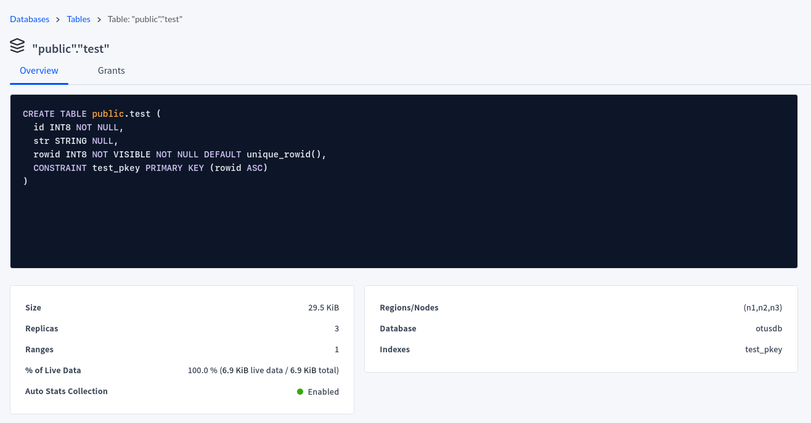

# PG Advanced - Домашняя работа 14 - Cockroach DB

Развернем мульти-мастер кластер Cockroach DB в яндекс-облаке.
Для кластера используем одну виртуалку с миникубом и используем оператор для установки Cockroach согласно этой инструкции:
https://www.cockroachlabs.com/docs/v23.1/orchestrate-a-local-cluster-with-kubernetes
Для встроенного sql-клиента и заливки данных используем отдельную виртуалку

## Создание виртуалки, установка докера, миникуба

- Виртуалка одна на кластер, поэтому сделаем её помощнее, согласно требованиям к ресурсам - 4 CPU / 16 Gb RAM:
https://www.cockroachlabs.com/docs/v23.1/orchestrate-a-local-cluster-with-kubernetes#resources

```
yc compute instance create \
  --name otus-db-pg-lesson14 \
  --zone ru-central1-b \
  --hostname otus-14-cockroach \
  --network-interface subnet-name=default-ru-central1-b,nat-ip-version=ipv4 \
  --create-boot-disk image-folder-id=standard-images,image-family=ubuntu-2204-lts,type=network-hdd,size=80 \
  --memory 16 \
  --cores 4 \
  --core-fraction 50 \
  --preemptible \
  --metadata-from-file user-data=user-data.yaml
```

- установка докера, как обычно

```
anton@otus-14-cockroach:~$ sudo apt-get update
anton@otus-14-cockroach:~$ sudo install -m 0755 -d /etc/apt/keyrings
anton@otus-14-cockroach:~$ curl -fsSL https://download.docker.com/linux/ubuntu/gpg | sudo gpg --dearmor -o /etc/apt/keyrings/docker.gpg
anton@otus-14-cockroach:~$ sudo chmod a+r /etc/apt/keyrings/docker.gpg
anton@otus-14-cockroach:~$ echo \
  "deb [arch="$(dpkg --print-architecture)" signed-by=/etc/apt/keyrings/docker.gpg] https://download.docker.com/linux/ubuntu \
  "$(. /etc/os-release && echo "$VERSION_CODENAME")" stable" | \
  sudo tee /etc/apt/sources.list.d/docker.list > /dev/null
anton@otus-14-cockroach:~$ sudo apt-get update
anton@otus-14-cockroach:~$ sudo apt-get install docker-ce docker-ce-cli containerd.io docker-buildx-plugin docker-compose-plugin docker-compose
```

- установка миникуба и старт

```
anton@otus-14-cockroach:~$ curl -LO https://storage.googleapis.com/minikube/releases/latest/minikube-linux-amd64
anton@otus-14-cockroach:~$ sudo install minikube-linux-amd64 /usr/local/bin/minikube
anton@otus-14-cockroach:~$ sudo usermod -aG docker $USER && newgrp docker
anton@otus-14-cockroach:~$ echo "alias kubectl=\"minikube kubectl --\"" > .bash_aliases
anton@otus-14-cockroach:~$ . ~/.bashrc
anton@otus-14-cockroach:~$ minikube start
```

- Виртуалка для клиента

```
yc compute instance create \
  --name otus-db-pg-lesson14-cli \
  --zone ru-central1-b \
  --hostname otus-14-cockroach-cli \
  --network-interface subnet-name=default-ru-central1-b,nat-ip-version=ipv4 \
  --create-boot-disk image-folder-id=standard-images,image-family=ubuntu-2204-lts,type=network-hdd,size=20 \
  --memory 4 \
  --cores 2 \
  --core-fraction 50 \
  --preemptible \
  --metadata-from-file user-data=user-data.yaml
```

# Установка Cockroach DB в миникуб

- установка custom resource definition и оператора

```
anton@otus-14-cockroach:~$ kubectl apply -f https://raw.githubusercontent.com/cockroachdb/cockroach-operator/v2.12.0/install/crds.yaml
customresourcedefinition.apiextensions.k8s.io/crdbclusters.crdb.cockroachlabs.com created

anton@otus-14-cockroach:~$ kubectl apply -f https://raw.githubusercontent.com/cockroachdb/cockroach-operator/v2.12.0/install/operator.yaml
namespace/cockroach-operator-system created
serviceaccount/cockroach-operator-sa created
clusterrole.rbac.authorization.k8s.io/cockroach-operator-role created
clusterrolebinding.rbac.authorization.k8s.io/cockroach-operator-rolebinding created
service/cockroach-operator-webhook-service created
deployment.apps/cockroach-operator-manager created
mutatingwebhookconfiguration.admissionregistration.k8s.io/cockroach-operator-mutating-webhook-configuration created
validatingwebhookconfiguration.admissionregistration.k8s.io/cockroach-operator-validating-webhook-configuration created

anton@otus-14-cockroach:~$ kubectl config set-context --current --namespace=cockroach-operator-system
Context "minikube" modified.

anton@otus-14-cockroach:~$ kubectl get pods
NAME                                          READY   STATUS    RESTARTS   AGE
cockroach-operator-manager-848fd7d88d-7jdzm   1/1     Running   0          38s
```

- скачиваем пример с описанием кластера и вносим небольшие изменения - сделаем 4 ноды вместо 3 и зададим поменьше диск: [example.yaml](example.yaml), применяем, проверяем

```
anton@otus-14-cockroach:~$ curl -O https://raw.githubusercontent.com/cockroachdb/cockroach-operator/v2.12.0/examples/example.yaml
anton@otus-14-cockroach:~$ kubectl apply -f example.yaml
crdbcluster.crdb.cockroachlabs.com/cockroachdb created

anton@otus-14-cockroach:~$ kubectl get pods
NAME                                          READY   STATUS    RESTARTS   AGE
cockroach-operator-manager-848fd7d88d-7jdzm   1/1     Running   0          12m
cockroachdb-0                                 1/1     Running   0          2m19s
cockroachdb-1                                 1/1     Running   0          2m19s
cockroachdb-2                                 1/1     Running   0          2m19s
cockroachdb-3                                 1/1     Running   0          2m19s
```
- эти же поды через OpenLens (предварительно откроем доступ через proxy)

`minikube kubectl -- proxy --accept-hosts='*' --address='0.0.0.0' --disable-filter=true &`


- Кроме подов в кластере кубера создались следующие объекты:

1) **Deployment** - cockroach-operator-manager
2) **ReplicaSet** - cockroach-operator-manager-848fd7d88d
3) **StatefulSet** - cockroachdb
4) **ConfigMap** - kube-root-ca.crt
5) **Secrets**
  cockroach-operator-webhook-ca - tls.crt/tls.key
  cockroachdb-ca - ca.key
  cockroachdb-node - ca.crt/tls.crt/tls.key
  cockroachdb-root - ca.crt/tls.crt/tls.key
6) **PodDisruptionBudget** - cockroachdb - запас допустимого количества упавших pod’ов (Max Unavailable = 1, Current Healthy = 4, Desired Healthy = 3)
7) **Webhook configs**
  cockroach-operator-mutating-webhook-configuration
  cockroach-operator-validating-webhook-configuration
8) **Services** (и соответствующие Endpoints)
  cockroach-operator-webhook-service - Ports 443:9443/TCP - сервис для пода оператора
  cockroachdb         - Ports 26258/TCP (grpc) 26257/TCP (sql) 8080/TCP (http) - внутренний сервис для подов кластера (Cluster IP не указан)
  cockroachdb-public  - Ports 26258/TCP (grpc) 26257/TCP (sql) 8080/TCP (http) - внешний сервис для подов кластера (Cluster IP указан - 10.98.64.207)
9) **PVC и PV** - 4 штуки - datadir-cockroachdb-0 .. datadir-cockroachdb-3
10) **ServiceAccounts**
  cockroach-operator-sa
  cockroachdb-sa
  default
11) **Roles, Role Bindings** - cockroachdb-role, cockroachdb-role-binding
12) **CRD** - crdbclusters.crdb.cockroachlabs.com

Все объекты создались в пространстве cockroach-operator-system (имя по умолчанию, можно переопределить при старте в example.yaml)


## Подключение к CockroachDB

- Для подключений на кластере прокинем наружу порт sql (26257) для сервиса cockroachdb-public

```
anton@otus-14-cockroach:~$ kubectl config set-context --current --namespace=cockroach-operator-system
anton@otus-14-cockroach:~$ kubectl port-forward --address 0.0.0.0 service/cockroachdb-public 26257 &
```

### Консольный клиент удаленно

- Установим консольный клиент на отдельной виртуалке согласно https://www.cockroachlabs.com/docs/stable/install-cockroachdb-linux, возьмем архив не полный, а только с командной строкой (cockroach-sql)

```
anton@otus-14-cockroach-cli:~$ wget https://binaries.cockroachdb.com/cockroach-sql-v23.1.11.linux-amd64.tgz
anton@otus-14-cockroach-cli:~$ tar -xzvf cockroach-sql-v23.1.11.linux-amd64.tgz 
cockroach-sql-v23.1.11.linux-amd64/cockroach-sql
anton@otus-14-cockroach-cli:~$ sudo cp -i cockroach-sql-v23.1.11.linux-amd64/cockroach-sql /usr/local/bin
```

- Возьмем сертификаты из секрета cockroachdb-root кубера и положим в каталог certs на клиенте


```
anton@otus-14-cockroach-cli:~$ mkdir certs
... здесь создаем файлики - копируем содержимое из секретов
anton@otus-14-cockroach-cli:~$ chmod 700 certs
anton@otus-14-cockroach-cli:~$ chmod 600 certs/*
anton@otus-14-cockroach-cli:~$ ls -la certs/
total 20
drwxr--r-- 2 anton anton 4096 Nov  9 14:01 .
drwxr-x--- 8 anton anton 4096 Nov  9 14:00 ..
-rw------- 1 anton anton 1150 Nov  9 14:01 ca.crt
-rw------- 1 anton anton 1142 Nov  9 14:01 client.root.crt
-rw------- 1 anton anton 1679 Nov  9 14:01 client.root.key
```

- Пробуем подключиться по внутреннему IP яндекс-облака, но ловим ошибку:

```
anton@otus-14-cockroach-cli:~$ cockroach-sql --certs-dir certs --host 10.129.0.21 --user root
#
# Welcome to the CockroachDB SQL shell.
# All statements must be terminated by a semicolon.
# To exit, type: \q.
#
ERROR: failed to connect to `host=10.129.0.21 user=root database=defaultdb`: failed to write startup message (x509: certificate is valid for 127.0.0.1, not 10.129.0.21)
```

- К сожалению победить пока не удалось, возможно нужно перегенерировать сертификаты

### Консольный клиент локально

- Локально мы можем подключиться к базе Cockroach с любой ноды, зайдем например на нулевую и создадим пользователя otus, он пригодится далее для доступа в веб-консоль

```
anton@otus-14-cockroach:~$ kubectl exec --stdin --tty cockroachdb-0 -- /bin/bash

bash-4.4$ ls -la cockroach-certs/
total 28
drwxrwsrwx 2 root       1000581000 4096 Nov  8 13:02 .
drwxr-xr-x 1 root       root       4096 Nov  9 12:27 ..
-rwxrwx--- 1 root       1000581000 1151 Nov  9 12:27 ca.crt
-rwxrwx--- 1 root       1000581000 1143 Nov  9 12:27 client.root.crt
-rw------- 1 1000581000 1000581000 1679 Nov  9 12:27 client.root.key
-rwxrwx--- 1 root       1000581000 1541 Nov  9 12:27 node.crt
-rw------- 1 1000581000 1000581000 1679 Nov  9 12:27 node.key

bash-4.4$ cockroach sql --certs-dir cockroach-certs
root@localhost:26257/defaultdb> \l                                                                                                                                                        
List of databases:
    Name    | Owner | Encoding |  Collate   |   Ctype    | Access privileges
------------+-------+----------+------------+------------+--------------------
  defaultdb | root  | UTF8     | en_US.utf8 | en_US.utf8 |
  postgres  | root  | UTF8     | en_US.utf8 | en_US.utf8 |
  system    | node  | UTF8     | en_US.utf8 | en_US.utf8 |
(3 rows)

root@localhost:26257/defaultdb> create user otus with password 'MyOtusPAss';
CREATE ROLE

Time: 627ms total (execution 626ms / network 0ms)
```

### DBeaver удаленно

- Для соединения через dbeaver создадим такие же файлы с ключами что и для консольного клиента - возьмем их из секретов миникуба и положим на локальный компьютер, преобразовав ключ пользователя root в формат pk8, как указано в документации: https://www.cockroachlabs.com/docs/stable/dbeaver
```
anton@aminkin:/mnt/dev/sdb1/Education/PgAdvanced/otus-pg-adv/lesson_14/certs$ openssl pkcs8 -topk8 -inform PEM -outform DER -in client.root.key -out client.root.pk8 -nocrypt
anton@aminkin:/mnt/dev/sdb1/Education/PgAdvanced/otus-pg-adv/lesson_14/certs$ ls -la
итого 20
drwxrwxrwx 1 root root  480 ноя  9 18:21 .
drwxrwxrwx 1 root root 4096 ноя  9 18:19 ..
-rwxrwxrwx 1 root root 1151 ноя  9 18:19 ca.crt
-rwxrwxrwx 1 root root 1142 ноя  9 18:20 client.root.crt
-rwxrwxrwx 1 root root 1679 ноя  9 18:20 client.root.key
-rwxrwxrwx 1 root root 1219 ноя  9 18:21 client.root.pk8
```

- Создаем соединение с типом Cockroach, драйвера будут скачаны автоматически. Ключи прописываем на вкладку SSL (как в доке). Указываем внешний IP виртуалки и прокинутый ранее порт 26257.


- Соединение как ни странно успешно, никаких ругательств на то что сертификат только для локального IP. Возможно это связано с преобразованием в pk8.

- Создадим базу otus, табличку test, наполним немного данными.

```
GRANT ADMIN TO otus;
CREATE DATABASE otusdb;
USE otusdb;
CREATE TABLE test(id integer NOT NULL, str TEXT);
INSERT INTO test(id, str) SELECT s, gen_random_uuid() FROM generate_series(1,100) s;
SELECT * FROM test;
```

## Консоль CockroachDB

- Чтобы попасть в консоль кластера - прокинем наружу порт 8080 для сервиса cockroachdb-public

```
anton@otus-14-cockroach:~$ kubectl config set-context --current --namespace=cockroach-operator-system
anton@otus-14-cockroach:~$ kubectl port-forward --address 0.0.0.0 service/cockroachdb-public 8080 &
```

- Теперь можно открыть её в браузере по внешнему ip-адресу виртуалки с миникубом и порту 8080. Подтверждаем исключение безопасности для сертификата и попадаем на экран входа.


- Вбиваем ранее созданного пользователя otus/MyOtusPAss


- Можно посмотреть статистику по таблице




## Изменение количества нод

- Откроем в OpenLens определение кластера CrdbCluster, выберем изменить и в yaml выставим значение nodes: 3. Сохраняем, наблюдаем за подами.


- Через некоторое время pod/cockroachdb-3 переходит в статус terminated и потом убивается. В кластере остается три ноды вместо 4. Побочное явление - падает форвардинг портов (8080 и 26257) с ошибкой error: lost connection to pod. После повторного проброса обновляем консоль в браузере и видим декомиссованую ноду:


- Переподключаемся через DBeaver, проверяем данные - все не месте, 100 строк.

`SELECT count(*) FROM otusdb.test;`

- Теперь попробуем задать nodes: 5, поднимается новая нода cockroachdb-4 и включается в кластер, однако старая нода остается декомиссованной, возможно это связано с нехваткой ресурсов (см. ниже загрузку большого объёма данных)


- Подключимся напрямую к новой ноде и проверим количество - всё на месте

```
anton@otus-14-cockroach:~$ kubectl exec --stdin --tty cockroachdb-4 -- /bin/bash
Defaulted container "db" out of: db, db-init (init)
bash-4.4$ cockroach sql --certs-dir cockroach-certs
#
# Welcome to the CockroachDB SQL shell.
# All statements must be terminated by a semicolon.
# To exit, type: \q.
#
# Server version: CockroachDB CCL v23.1.11 (x86_64-pc-linux-gnu, built 2023/09/27 01:53:43, go1.19.10) (same version as client)
# Cluster ID: 618b769e-64da-46b7-8a79-c69519ec5d1c
#
# Enter \? for a brief introduction.
#
root@localhost:26257/defaultdb> SELECT count(*) FROM otusdb.test;                                                                                                                         
  count
---------
    100
(1 row)

Time: 3ms total (execution 3ms / network 0ms)

root@localhost:26257/defaultdb>
```

## Заливка больших данных

- Подготовим [датасет о погоде](https://www.kaggle.com/datasets/guillemservera/global-daily-climate-data/data) (преобразуем в csv с помощью питоновского [скрипта](weather_parquet_to_csv.py)) и зальем на клиентскую машину в папку ~/data

- Далее согласно [документации Cockroach](https://www.cockroachlabs.com/docs/v23.1/use-a-local-file-server) запустим простейший файловый сервер на питоне, чтобы все ноды кластера могли добраться до файла по http

```
anton@otus-14-cockroach-cli:~/data$ ls -lah
total 2.0G
drwxrwxr-x 2 anton anton 4.0K Nov 10 16:19 .
drwxr-x--- 9 anton anton 4.0K Nov 10 16:09 ..
-rw-rw-r-- 1 anton anton 2.0G Nov 10 16:18 weather_data.csv

anton@otus-14-cockroach-cli:~/data$ python3 -m http.server 3000
Serving HTTP on 0.0.0.0 port 3000 (http://0.0.0.0:3000/) ...
```

- Проверим доступность данных с виртуалки кластера по внутреннему IP яндекс-облака, все хорошо скачивается

`wget http://10.129.0.29:3000/weather_data.csv`

- Теперь создадим таблицу *weather* в базе *otus* и закачаем в неё данные командой IMPORT INTO согласно инструкции: https://www.cockroachlabs.com/docs/v23.1/import-into#import-into-a-new-table-from-a-csv-file

[create_weather_table.sql](create_weather_table.sql)

- Через пару минут после начала заливки миникуб упал... После рестарта - таблица в состоянии `ERROR: relation "weather" is offline: importing`, в консоли и через SHOW JOBS; видно что джоб упал с `too many retries; giving up`. Сама команда SHOW JOBS выполняется очень долго - 3-5 минут, лезут всякие ошибки вида ERROR: job 916831073369456641: node liveness error: restarting in background.

- Пробуем поднять ресурсы виртуалки и миникуба (у него по умолчанию вообще всего 2Gb и 2CPU), поднимаем виртуалку до 8CPU/32Gb RAM/320Gb HDD, миникуб до 6CPU/30Gb RAM. Переделываем кластер по новой (включая установку Cockroach), попутно в yaml также поднимем requests для каждой ноды - до 1CPU/4Gb RAM/60Gb HDD.

```
minikube delete
minikube start --cpus 6 --memory 30720
...
```

- Теперь все прошло успешно, 2 Gb данных прокачалось менее чем за 4 минуты:


- Проверим наличие и количество данных


- Статистика по таблице


