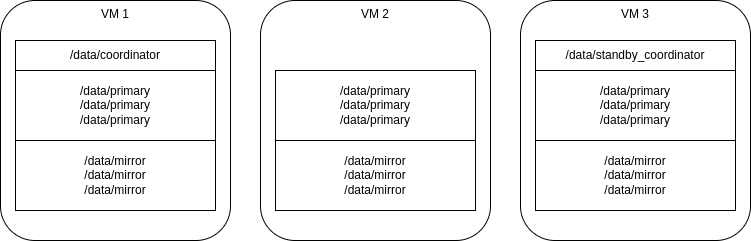
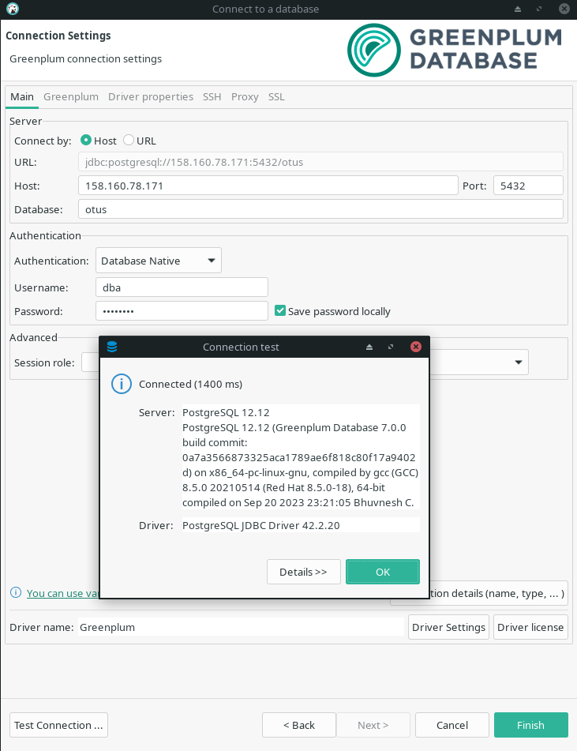

# PG Advanced - Домашняя работа 15 - Greenplum

Развернем кластер Greenplum в яндекс-облаке на виртуалках с CentOS 8 Stream как наиболее близкой к [требованиям](https://docs.vmware.com/en/VMware-Greenplum/7/greenplum-database/install_guide-platform-requirements-overview.html). Используем 3 виртуальные машины, каждая с минимальными требованиями - 4 CPU/16 Mb RAM/40 Gb HDD. Для данных подключим отдельные диски, отформатируем как XFS, поскольку это единственная официально поддерживаемая файловая система (см. раздел Storage в требованиях).

На виртуалках развернем:
* координатор
* standby координатора
* 3 primary и 3 mirror сегмента - на каждой из машин (!) в реальности класть данные на координатор и его стендбай не надо



## Создание координатора

- Начнем с создания машины для координатора - otus-15-gpc

```
yc compute instance create \
  --name otus-db-pg-lesson15 \
  --zone ru-central1-b \
  --hostname otus-15-gpc \
  --network-interface subnet-name=default-ru-central1-b,nat-ip-version=ipv4 \
  --create-boot-disk image-folder-id=standard-images,image-family=centos-stream-8,type=network-hdd,size=40 \
  --memory 16 \
  --cores 4 \
  --core-fraction 50 \
  --preemptible \
  --metadata-from-file user-data=user-data.yaml
```

- выполним подготовку ОС согласно [документации](https://docs.vmware.com/en/VMware-Greenplum/7/greenplum-database/install_guide-prep_os.html), подключаемся, проверяем ОС:

```
[anton@ant lesson_15]$ ssh anton@158.160.84.97
[anton@otus-15-gpc ~]$ cat /etc/os-release 
NAME="CentOS Stream"
VERSION="8"
ID="centos"
ID_LIKE="rhel fedora"
VERSION_ID="8"
PLATFORM_ID="platform:el8"
PRETTY_NAME="CentOS Stream 8"
```

- отключаем SElinux, перезагружаемся:

```
[anton@otus-15-gpc ~]$ sestatus
SELinux status:                 enabled

[anton@otus-15-gpc ~]$ sudo dnf update
[anton@otus-15-gpc ~]$ sudo dnf install vim
[anton@otus-15-gpc ~]$ sudo vim /etc/selinux/config
...
SELINUX=disabled
...
[anton@otus-15-gpc ~]$ sudo reboot
...
[anton@otus-15-gpc ~]$ sestatus
SELinux status:                 disabled
```

- ВЫполняем конфигурацию в sysctl.conf и limits.conf - память и пр.

```
[anton@otus-15-gpc ~]$ echo "kernel.shmall = $(expr $(getconf _PHYS_PAGES) / 2)" | sudo tee -a /etc/sysctl.conf
kernel.shmall = 2017434
[anton@otus-15-gpc ~]$ echo "kernel.shmmax = $(expr $(getconf _PHYS_PAGES) / 2 \* $(getconf PAGE_SIZE))" | sudo tee -a /etc/sysctl.conf
kernel.shmmax = 8263409664
[anton@otus-15-gpc ~]$ echo "vm.overcommit_memory = 2" | sudo tee -a /etc/sysctl.conf
vm.overcommit_memory = 2
[anton@otus-15-gpc ~]$ sysctl net.ipv4.ip_local_port_range
net.ipv4.ip_local_port_range = 32768	60999
[anton@otus-15-gpc ~]$ echo "vm.dirty_background_ratio = 3" | sudo tee -a /etc/sysctl.conf
vm.dirty_background_ratio = 3
[anton@otus-15-gpc ~]$ echo "vm.dirty_ratio = 10" | sudo tee -a /etc/sysctl.conf
vm.dirty_ratio = 10
[anton@otus-15-gpc ~]$ sysctl vm.min_free_kbytes
vm.min_free_kbytes = 67584
[anton@otus-15-gpc ~]$ awk 'BEGIN {OFMT = "%.0f";} /MemTotal/ {print "vm.min_free_kbytes =", $2 * .03;}' /proc/meminfo | sudo tee -a /etc/sysctl.conf
vm.min_free_kbytes = 484184
[anton@otus-15-gpc ~]$ ulimit -u
62730
[anton@otus-15-gpc ~]$ cat << EOF | sudo tee -a /etc/security/limits.conf
* soft nofile 524288
* hard nofile 524288
* soft nproc 131072
* hard nproc 131072
EOF
[anton@otus-15-gpc ~]$ echo "kernel.core_pattern=/var/core/core.%h.%t" | sudo tee -a /etc/sysctl.conf
kernel.core_pattern=/var/core/core.%h.%t
[anton@otus-15-gpc ~]$ echo "* soft  core unlimited" | sudo tee -a /etc/security/limits.conf
* soft  core unlimited
[anton@otus-15-gpc ~]$ sudo sysctl -p
net.core.rmem_max = 26214400
net.core.rmem_default = 26214400
net.core.wmem_max = 26214400
net.core.wmem_default = 26214400
kernel.shmall = 2017434
kernel.shmmax = 8263409664
vm.overcommit_memory = 2
vm.dirty_background_ratio = 3
vm.dirty_ratio = 10
vm.min_free_kbytes = 484184
kernel.core_pattern = /var/core/core.%h.%t
```

- создадим и подключим диск для данных (в той же зоне доступности что и машина)
https://cloud.yandex.ru/docs/compute/operations/vm-control/vm-attach-disk

```
[anton@ant lesson_15]$ yc compute disk create gpc-xfs \
    --zone ru-central1-b \
    --description "Greenplum coordinator primary data" \
    --type network-ssd \
    --size 40

[anton@ant lesson_15]$ yc compute instance attach-disk otus-db-pg-lesson15 \
  --disk-name gpc-xfs \
  --mode rw

[anton@ant lesson_15]$ yc compute disk list
+----------------------+---------+-------------+---------------+--------+----------------------+-----------------+--------------------------------+
|          ID          |  NAME   |    SIZE     |     ZONE      | STATUS |     INSTANCE IDS     | PLACEMENT GROUP |          DESCRIPTION           |
+----------------------+---------+-------------+---------------+--------+----------------------+-----------------+--------------------------------+
| epde96k16d816i7jqo3i | gpc-xfs | 42949672960 | ru-central1-b | READY  | epdt83auta84hdr8j0u2 |                 | Greenplum coordinator primary  |
|                      |         |             |               |        |                      |                 | data                           |
| epdijl769gae6h5ba586 |         | 42949672960 | ru-central1-b | READY  | epdt83auta84hdr8j0u2 |                 |                                |
+----------------------+---------+-------------+---------------+--------+----------------------+-----------------+--------------------------------+
```

- отформатируем новый диск как XFS (кстати диск с ОС в Centos Stream 8 - по умолчанию уже в XFS формате, но все равно для данных используем отдельный)

```
[anton@otus-15-gpc ~]$ ls -la /dev/disk/by-id
total 0
drwxr-xr-x 2 root root 120 Nov 27 14:05 .
drwxr-xr-x 6 root root 120 Nov 27 12:49 ..
lrwxrwxrwx 1 root root   9 Nov 27 14:05 virtio-epde96k16d816i7jqo3i -> ../../vdb
lrwxrwxrwx 1 root root   9 Nov 27 12:49 virtio-epdijl769gae6h5ba586 -> ../../vda
lrwxrwxrwx 1 root root  10 Nov 27 14:40 virtio-epdijl769gae6h5ba586-part1 -> ../../vda1
lrwxrwxrwx 1 root root  10 Nov 27 12:49 virtio-epdijl769gae6h5ba586-part2 -> ../../vda2

[anton@otus-15-gpc ~]$ sudo fdisk /dev/vdb
... n, Enter, Enter, Enter, Enter, w ...
Device     Boot Start      End  Sectors Size Id Type
/dev/vdb1        2048 83886079 83884032  40G 83 Linux

[anton@otus-15-gpc ~]$ sudo blkid
/dev/vda2: UUID="73edbcff-1640-4c19-a650-ba9c992984de" BLOCK_SIZE="512" TYPE="xfs" PARTUUID="aeb78de8-85f0-450f-8f2a-3612a515e2c5"
/dev/vda1: PARTUUID="daee0e27-cad0-4053-bcfe-0502c9a8a3da"
/dev/vdb1: PARTUUID="a1457f8b-01"

[anton@otus-15-gpc ~]$ sudo mkfs.xfs -f /dev/vdb
meta-data=/dev/vdb               isize=512    agcount=4, agsize=2621440 blks
         =                       sectsz=4096  attr=2, projid32bit=1
         =                       crc=1        finobt=1, sparse=1, rmapbt=0
         =                       reflink=1    bigtime=0 inobtcount=0
data     =                       bsize=4096   blocks=10485760, imaxpct=25
         =                       sunit=0      swidth=0 blks
naming   =version 2              bsize=4096   ascii-ci=0, ftype=1
log      =internal log           bsize=4096   blocks=5120, version=2
         =                       sectsz=4096  sunit=1 blks, lazy-count=1
realtime =none                   extsz=4096   blocks=0, rtextents=0

[anton@otus-15-gpc ~]$ sudo blkid
/dev/vda2: UUID="73edbcff-1640-4c19-a650-ba9c992984de" BLOCK_SIZE="512" TYPE="xfs" PARTUUID="aeb78de8-85f0-450f-8f2a-3612a515e2c5"
/dev/vda1: PARTUUID="daee0e27-cad0-4053-bcfe-0502c9a8a3da"
/dev/vdb: UUID="b4814758-e54a-45ed-97b9-445710f9dfee" BLOCK_SIZE="4096" TYPE="xfs"
```
- создадим каталог для данных и пропишем его в fstab чтобы он автоматически монтировался

```
[anton@otus-15-gpc ~]$ sudo mkdir -p /data/primary
[anton@otus-15-gpc ~]$ echo "UUID=b4814758-e54a-45ed-97b9-445710f9dfee /data/primary xfs rw,nodev,noatime,inode64 0 2" | sudo tee -a /etc/fstab
[anton@otus-15-gpc ~]$ sudo systemctl daemon-reload
[anton@otus-15-gpc ~]$ sudo mount -a
[anton@otus-15-gpc ~]$ df -lh
Filesystem      Size  Used Avail Use% Mounted on
devtmpfs        7.7G     0  7.7G   0% /dev
tmpfs           7.7G     0  7.7G   0% /dev/shm
tmpfs           7.7G  580K  7.7G   1% /run
tmpfs           7.7G     0  7.7G   0% /sys/fs/cgroup
/dev/vda2        40G  2.7G   38G   7% /
tmpfs           1.6G     0  1.6G   0% /run/user/1000
/dev/vdb         40G  318M   40G   1% /data/primary
```

- Продолжим конфижить согласно доке - disk read-ahead, hugepages, no IPC, ssh connections limits

```
[anton@otus-15-gpc ~]$ sudo /sbin/blockdev --getra /dev/vdb
8192
[anton@otus-15-gpc ~]$ echo "/sbin/blockdev --setra 16384 /dev/vdb" | sudo tee -a /etc/rc.d/rc.local
/sbin/blockdev --setra 16384 /dev/vdb
[anton@otus-15-gpc ~]$ sudo chmod +x /etc/rc.d/rc.local
[anton@otus-15-gpc ~]$ cat /sys/kernel/mm/*transparent_hugepage/enabled
[always] madvise never
[anton@otus-15-gpc ~]$ sudo grubby --update-kernel=ALL --args="transparent_hugepage=never"
[anton@otus-15-gpc ~]$ sudo reboot
[anton@otus-15-gpc ~]$ cat /sys/kernel/mm/*transparent_hugepage/enabled
always madvise [never]
[anton@otus-15-gpc ~]$ sudo vim /etc/systemd/logind.conf
RemoveIPC=no
[anton@otus-15-gpc ~]$ sudo service systemd-logind restart
Redirecting to /bin/systemctl restart systemd-logind.service
[anton@otus-15-gpc ~]$ echo "MaxStartups 200" | sudo tee -a /etc/ssh/sshd_config
MaxStartups 200
[anton@otus-15-gpc ~]$ echo "MaxSessions 200" | sudo tee -a /etc/ssh/sshd_config
MaxSessions 200
[anton@otus-15-gpc ~]$ sudo service sshd restart
Redirecting to /bin/systemctl restart sshd.service
```

- Всё, пора завести пользователя для установки и работы с гринпламом: gpadmin/YZs8ZobwNQ и сделать ему пару ключей

```
[anton@otus-15-gpc ~]$ sudo groupadd gpadmin
[anton@otus-15-gpc ~]$ sudo useradd gpadmin -r -m -g gpadmin
[anton@otus-15-gpc ~]$ sudo passwd gpadmin
Changing password for user gpadmin.
New password: 
Retype new password: 
passwd: all authentication tokens updated successfully.
[anton@otus-15-gpc ~]$ su gpadmin
Password: 
[gpadmin@otus-15-gpc anton]$ ssh-keygen -t rsa -b 4096
Generating public/private rsa key pair.
Enter file in which to save the key (/home/gpadmin/.ssh/id_rsa): 
Created directory '/home/gpadmin/.ssh'.
Enter passphrase (empty for no passphrase): 
Enter same passphrase again: 
Your identification has been saved in /home/gpadmin/.ssh/id_rsa.
Your public key has been saved in /home/gpadmin/.ssh/id_rsa.pub.
The key fingerprint is:
SHA256:7GxYf5kZoSi1fG6+K5rKOvO9aDJoqTeiYXTd63E1CnA gpadmin@otus-15-gpc.ru-central1.internal
The key's randomart image is:
+---[RSA 4096]----+
|                 |
|                 |
|     . E.   .    |
|    . ++ o . .   |
| . . ..oS oo.    |
|. .    *o+o .=   |
|.o.   .o+o+ =    |
|++B..o.o+o .     |
|*o.X=.=+ .+o     |
+----[SHA256]-----+
[anton@otus-15-gpc ~]$ sudo visudo
# %wheel        ALL=(ALL)       ALL
%wheel        ALL=(ALL)       NOPASSWD: ALL
[anton@otus-15-gpc ~]$ sudo usermod -aG wheel gpadmin
```

- Скачивание. На [оф. сайте](https://network.pivotal.io/products/vmware-greenplum#/releases/1379486/file_groups/15992), прямой ссылки на RPM нет, видим некий pivnet, идем смотреть на чудо - https://github.com/pivotal-cf/pivnet-cli, качаем бинарник этого пивнета, пробуем запустить:

```
[anton@ant lesson_15]$ ./pivnet-linux-amd64-4.1.1 download-product-files --product-slug='vmware-greenplum' --release-version='7.0.0' --product-file-id=1607380
Please login first
```

- Требует авторизации, идём регистрироваться на сайт vmware под впном, регимся на левую почту, вбиваем всякую чушь в формы, получаем токен на странице Edit profile: `token123123213token41231231-r`

- Используем токен для входа, соглашаемся с агриментом, наконец качаем

```
[anton@ant lesson_15]$ ./pivnet-linux-amd64-4.1.1 login --api-token='......-r'
Logged-in successfully
[anton@ant lesson_15]$ ./pivnet-linux-amd64-4.1.1 download-product-files --product-slug='vmware-greenplum' --release-version='7.0.0' --product-file-id=1607380
2023/11/28 19:59:00 Downloading 'greenplum-db-7.0.0-el8-x86_64.rpm' to 'greenplum-db-7.0.0-el8-x86_64.rpm'
Downloader.Get: could not create new download link in get: user with email 'casandor@proton.me' has not accepted the current EULA for release with 'id'=1379486. The EULA for this release can be accepted at https://network.tanzu.vmware.com/products/19/releases/1379486/eulas/208.
[anton@ant lesson_15]$ ./pivnet-linux-amd64-4.1.1 download-product-files --product-slug='vmware-greenplum' --release-version='7.0.0' --product-file-id=1607380
2023/11/28 19:59:36 Downloading 'greenplum-db-7.0.0-el8-x86_64.rpm' to 'greenplum-db-7.0.0-el8-x86_64.rpm'
 123.49 MiB / 123.49 MiB [=========================================] 100.00% 12s
2023/11/28 19:59:50 Verifying SHA256
2023/11/28 19:59:51 Successfully verified SHA256
```

- Полученный rpm льем на сервер в /tmp

```
[anton@ant lesson_15]$ scp greenplum-db-7.0.0-el8-x86_64.rpm anton@158.160.81.182:/tmp
greenplum-db-7.0.0-el8-x86_64.rpm
```

- И теперь ставим из под gpadmin

```
[anton@ant lesson_15]$ sudo su - gpadmin
[gpadmin@otus-15-gpc ~]$ sudo yum install /tmp/greenplum-db-7.0.0-el8-x86_64.rpm
...
Complete!
[gpadmin@otus-15-gpc ~]$ sudo chown -R gpadmin:gpadmin /usr/local/greenplum*
[gpadmin@otus-15-gpc ~]$ sudo chgrp -R gpadmin /usr/local/greenplum*
```

## Создание стендбая и машины для данных

- Машина с данными - otus-15-gpd, стендбай координатора - otus-15-gps, сразу привязываем к ним отдельные диски

```
yc compute instance create \
  --name otus-db-pg-lesson15-data \
  --zone ru-central1-b \
  --hostname otus-15-gpd \
  --network-interface subnet-name=default-ru-central1-b,nat-ip-version=ipv4 \
  --create-boot-disk image-folder-id=standard-images,image-family=centos-stream-8,type=network-hdd,size=40 \
  --memory 16 \
  --cores 4 \
  --core-fraction 50 \
  --preemptible \
  --metadata-from-file user-data=user-data.yaml

yc compute disk create gpd-xfs \
    --zone ru-central1-b \
    --description "Greenplum primary data" \
    --type network-ssd \
    --size 40

yc compute instance attach-disk otus-db-pg-lesson15-data \
  --disk-name gpd-xfs \
  --mode rw

yc compute instance create \
  --name otus-db-pg-lesson15-stdb \
  --zone ru-central1-b \
  --hostname otus-15-gps \
  --network-interface subnet-name=default-ru-central1-b,nat-ip-version=ipv4 \
  --create-boot-disk image-folder-id=standard-images,image-family=centos-stream-8,type=network-hdd,size=40 \
  --memory 16 \
  --cores 4 \
  --core-fraction 50 \
  --preemptible \
  --metadata-from-file user-data=user-data.yaml

yc compute disk create gps-xfs \
    --zone ru-central1-b \
    --description "Greenplum standby data" \
    --type network-ssd \
    --size 40

yc compute instance attach-disk otus-db-pg-lesson15-stdb \
  --disk-name gps-xfs \
  --mode rw
```

- На каждой ноде повторяем все то же самое что и на координаторе - конфигурация, подключение диска, создание gpadmin за исключением создания ключа (его потом копируем с координатора)

- Проверяем чтобы на всех машинах у пользователя gpadmin были одинаковые uid/gid

```
[anton@otus-15-gpc ~]$ id -u gpadmin
994
[anton@otus-15-gpc ~]$ id -g gpadmin
1002
```

- На каждую машину закачиваем RPM гринплама и устанавливаем

- Настраиваем синхронизацию времени на хосте с данными и стендбае с сервером координатора. В centos за это отвечает служба chronyd, она по умолчанию установлена и запущена.

```
[anton@otus-15-gpc ~]$ sudo systemctl status chronyd
● chronyd.service - NTP client/server
   Loaded: loaded (/usr/lib/systemd/system/chronyd.service; enabled; vendor preset: enabled)
   Active: active (running) since Mon 2023-11-27 15:01:11 UTC; 14min ago
```

- На хосте с данными в конфиге chrony указываем адрес координатора и адрес стендбая

```
[gpadmin@otus-15-gpd ~]$ sudo vim /etc/chrony.conf
...
server otus-15-gpc prefer
server otus-15-gps
```

- На стендбае координатора в конфиге chrony указываем только адрес координатора: `server otus-15-gpc prefer`

- Рестартим службу после изменения конфига (на каждой машине)

```
[gpadmin@otus-15-gpd ~]$ sudo systemctl restart chronyd
```

- Настраиваем беспарольный ssh между всеми машинами. Для начала на всех хостах без исключения (в т.ч. координатор) включаем парольную аутентификацию

```
sudo vim /etc/ssh/sshd_config
...
PasswordAuthentication yes
...
!x
sudo service sshd restart
```

- Затем с координатора перекидываем ключик (и на самого себя тоже)

```
[anton@otus-15-gpc ~]$ sudo su - gpadmin
[gpadmin@otus-15-gpc ~]$ echo ". /usr/local/greenplum-db-7.0.0/greenplum_path.sh" >> .bashrc
[gpadmin@otus-15-gpc ~]$ . .bashrc
[gpadmin@otus-15-gpc ~]$ ssh-copy-id otus-15-gpd
[gpadmin@otus-15-gpc ~]$ ssh-copy-id otus-15-gps
[gpadmin@otus-15-gpc ~]$ ssh-copy-id otus-15-gpc
```

- Выключаем парольную аутентификацию (PasswordAuthentication no) и делаем проверку соединения:

```
[gpadmin@otus-15-gpc ~]$ ssh gpadmin@otus-15-gpd
Last login: Wed Nov 29 09:22:23 2023
[gpadmin@otus-15-gpd ~]$ exit
logout
Connection to otus-15-gpd closed.
[gpadmin@otus-15-gpc ~]$ ssh gpadmin@otus-15-gps
Last login: Wed Nov 29 09:22:48 2023
[gpadmin@otus-15-gps ~]$ exit
logout
Connection to otus-15-gps closed.
[gpadmin@otus-15-gpc ~]$ ssh gpadmin@otus-15-gpc
Last login: Wed Nov 29 09:34:43 2023
[gpadmin@otus-15-gpc ~]$ exit
logout
Connection to otus-15-gpc closed.
```

- Кладем на координатор в домашний каталог пользователя gpadmin файлик hostfile_exkeys со списком хостов

```
[gpadmin@otus-15-gpc ~]$ cat <<EOF >>hostfile_exkeys
otus-15-gpc
otus-15-gps
otus-15-gpd
EOF
[gpadmin@otus-15-gpc ~]$ cat hostfile_exkeys 
otus-15-gpc
otus-15-gps
otus-15-gpd
```

- Запускаем утилиту gpssh-exkeys

```
[gpadmin@otus-15-gpc ~]$ gpssh-exkeys -f hostfile_exkeys 
[STEP 1 of 5] create local ID and authorize on local host
  ... /home/gpadmin/.ssh/id_rsa file exists ... key generation skipped

[STEP 2 of 5] keyscan all hosts and update known_hosts file

[STEP 3 of 5] retrieving credentials from remote hosts
  ... send to otus-15-gpc
  ... send to otus-15-gps
  ... send to otus-15-gpd

[STEP 4 of 5] determine common authentication file content

[STEP 5 of 5] copy authentication files to all remote hosts
  ... finished key exchange with otus-15-gpc
  ... finished key exchange with otus-15-gps
  ... finished key exchange with otus-15-gpd

[INFO] completed successfully
```

- Проверяем кластер, команда успешно выводит листинг директории гринплама со всех хостов

```
[gpadmin@otus-15-gpc ~]$ gpssh -f hostfile_exkeys -e 'ls -l /usr/local/greenplum-db-7.0.0'
```

## Создание кластера

- Сначала создадим каталоги для данных используя gpssh

```
[anton@otus-15-gpc ~]$ sudo mkdir -p /data/coordinator
[anton@otus-15-gpc ~]$ sudo chown gpadmin:gpadmin /data/coordinator
[anton@otus-15-gpc ~]$ sudo su - gpadmin
[gpadmin@otus-15-gpc ~]$ gpssh -h otus-15-gps -e 'sudo mkdir -p /data/coordinator'
[otus-15-gps] sudo mkdir -p /data/coordinator
[gpadmin@otus-15-gpc ~]$ gpssh -f hostfile_exkeys -e 'sudo mkdir -p /data/primary'
[otus-15-gpd] sudo mkdir -p /data/primary
[otus-15-gps] sudo mkdir -p /data/primary
[otus-15-gpc] sudo mkdir -p /data/primary
[gpadmin@otus-15-gpc ~]$ gpssh -f hostfile_exkeys -e 'sudo mkdir -p /data/mirror'
[otus-15-gpc] sudo mkdir -p /data/mirror
[otus-15-gpd] sudo mkdir -p /data/mirror
[otus-15-gps] sudo mkdir -p /data/mirror
[gpadmin@otus-15-gpc ~]$ gpssh -f hostfile_exkeys -e 'sudo chown -R gpadmin /data/*'
[otus-15-gpc] sudo chown -R gpadmin /data/*
[otus-15-gps] sudo chown -R gpadmin /data/*
[otus-15-gpd] sudo chown -R gpadmin /data/*
```

- Проведем тест сети

[anton@otus-15-gpc ~]$ gpcheckperf -f hostfile_exkeys -r n -d /tmp > gpcheckperf.out

[Тест сети](files/gpcheckperf.out)

- Проведем тест дисков

[anton@otus-15-gpc ~]$ gpcheckperf -f hostfile_exkeys -r ds -D -d /data/primary -d /data/mirror

[Тест дисков](files/gpcheckperf-disk.out)

- Готовим конфиг для инициализации кластера. В [документации](https://docs.vmware.com/en/VMware-Greenplum/7/greenplum-database/install_guide-init_gpdb.html) сказано что файл со списком хостов не должен содержать координатор и его стендбай, однако в виду того что проект учебный будем располагать данные на всех трёх наших хостах (в реальности так очевидно не стоит делать), поэтому используем вместо отдельного hostfile_gpinitsystem уже готовый hostfile_exkeys

- Копируем образец файла с параметрами

```
[gpadmin@otus-15-gpc ~]$ mkdir gpconfigs
[gpadmin@otus-15-gpc ~]$ cp $GPHOME/docs/cli_help/gpconfigs/gpinitsystem_config /home/gpadmin/gpconfigs/gpinitsystem_config
```

- Правим: указываем hostfile_exkeys вместо hostfile_gpinitsystem, задаем DATA_DIRECTORY для primary и mirror, укажем также сразу создать БД otus

[gpinitsystem_config](files/gpinitsystem_config)

- Инициализируем, сначала с опцией -O чтобы создать конфиг и проверить его

```
gpinitsystem -c gpconfigs/gpinitsystem_config -h hostfile_exkeys -s otus-15-gps -O gpconfigs/config_template

20231129:12:51:02:006649 gpinitsystem:otus-15-gpc:gpadmin-[INFO]:-Checking configuration parameters, please wait...
20231129:12:51:02:006649 gpinitsystem:otus-15-gpc:gpadmin-[INFO]:-Reading Greenplum configuration file gpconfigs/gpinitsystem_config
20231129:12:51:02:006649 gpinitsystem:otus-15-gpc:gpadmin-[INFO]:-Locale has not been set in gpconfigs/gpinitsystem_config, will set to default value
20231129:12:51:02:006649 gpinitsystem:otus-15-gpc:gpadmin-[WARN]:-Coordinator hostname otus-15-gpc does not match hostname output
20231129:12:51:02:006649 gpinitsystem:otus-15-gpc:gpadmin-[INFO]:-Checking to see if otus-15-gpc can be resolved on this host
20231129:12:51:02:006649 gpinitsystem:otus-15-gpc:gpadmin-[INFO]:-Can resolve otus-15-gpc to this host
20231129:12:51:02:006649 gpinitsystem:otus-15-gpc:gpadmin-[INFO]:-COORDINATOR_MAX_CONNECT not set, will set to default value 250
20231129:12:51:03:006649 gpinitsystem:otus-15-gpc:gpadmin-[INFO]:-Checking configuration parameters, Completed
20231129:12:51:03:006649 gpinitsystem:otus-15-gpc:gpadmin-[INFO]:-Commencing multi-home checks, please wait...
...
20231129:12:51:04:006649 gpinitsystem:otus-15-gpc:gpadmin-[INFO]:-Configuring build for standard array
20231129:12:51:04:006649 gpinitsystem:otus-15-gpc:gpadmin-[INFO]:-Commencing multi-home checks, Completed
20231129:12:51:04:006649 gpinitsystem:otus-15-gpc:gpadmin-[INFO]:-Building primary segment instance array, please wait...
.........
20231129:12:51:08:006649 gpinitsystem:otus-15-gpc:gpadmin-[INFO]:-Building group mirror array type , please wait...
.........
20231129:12:51:13:006649 gpinitsystem:otus-15-gpc:gpadmin-[INFO]:-Checking Coordinator host
20231129:12:51:13:006649 gpinitsystem:otus-15-gpc:gpadmin-[INFO]:-Checking new segment hosts, please wait...
..................
20231129:12:51:30:006649 gpinitsystem:otus-15-gpc:gpadmin-[INFO]:-Checking new segment hosts, Completed
```

[config_template](files/config_template) - сгенерированный шаблон, 9 основных сегментов (по 3 на машину) + 9 зеркальных

- Теперь само создание без опции -O. Первый блин комом - упало, т.к. почему-то пыталось использовать полные имена хостов - otus-15-gps.ru-central1.internal, либо что-то не то было с ключами

```
The authenticity of host 'otus-15-gpd.ru-central1.internal (10.129.0.19)' can't be established.
ECDSA key fingerprint is SHA256:dfdUuByNEYJPtL4qZ8nSnuQuHIBYqxD5sMBh9gS1zsc.
Warning: the RSA host key for 'otus-15-gpc.ru-central1.internal' differs from the key for the IP address '10.129.0.29'
Offending key for IP in /home/gpadmin/.ssh/known_hosts:3
Matching host key in /home/gpadmin/.ssh/known_hosts:4
The authenticity of host 'otus-15-gps.ru-central1.internal (10.129.0.25)' can't be established.
ECDSA key fingerprint is SHA256:iUvcGsbM0nRV/JSDdW4TO+GwrEXecbeK/9MALjiB8gM.

20231129:12:58:13:011352 gpinitsystem:otus-15-gpc:gpadmin-[WARN]:-Failed to start Greenplum instance; review gpstart output to
20231129:12:58:13:011352 gpinitsystem:otus-15-gpc:gpadmin-[WARN]:- determine why gpstart failed and reinitialize cluster after resolving
20231129:12:58:13:011352 gpinitsystem:otus-15-gpc:gpadmin-[WARN]:- issues.  Not all initialization tasks have completed so the cluster
20231129:12:58:13:011352 gpinitsystem:otus-15-gpc:gpadmin-[WARN]:- should not be used.
```

[gpinitsystem_err.log](files/gpinitsystem_err.log) - лог первой попытки, до момента создания

- Пробуем на всех машинах добавить в /etc/hosts явное указание имен и адресов:

```
10.129.0.29 otus-15-gpc otus-15-gpc.ru-central1.internal
10.129.0.19 otus-15-gpd otus-15-gpd.ru-central1.internal
10.129.0.25 otus-15-gps otus-15-gps.ru-central1.internal
```

- В случае падения инициализации создается скрипт отката - применим его и дополнительно почистим директорию с данными координатора

```
[gpadmin@otus-15-gpc ~]$ bash ~/gpAdminLogs/backout_gpinitsystem_gpadmin_20231129_125102
[gpadmin@otus-15-gpc ~]$ sudo rm -r /data/coordinator/gpseg-1/
```

- Повторяем попытку (той же командой gpinitsystem). На этот раз кластер создался, несмотря на то что ещё пару раз спросило про ключ (ответил утвердительно - yes):

Warning: the RSA host key for 'otus-15-gpc.ru-central1.internal' differs from the key for the IP address '10.129.0.29'
Offending key for IP in /home/gpadmin/.ssh/known_hosts:3
Matching host key in /home/gpadmin/.ssh/known_hosts:4
Are you sure you want to continue connecting (yes/no)? yes

[gpinitsystem_success.log](files/gpinitsystem_success.log) - лог успешного создания кластера

- После создания добавим необходимые переменные окружения в bashrc, как сказано в логе и документации. Скопируем bashrc на стендбай.

```
[gpadmin@otus-15-gpc ~]$ echo "export COORDINATOR_DATA_DIRECTORY=/data/coordinator/gpseg-1" >> .bashrc
[gpadmin@otus-15-gpc ~]$ echo "export LD_PRELOAD=/lib64/libz.so.1 ps" >> .bashrc
[gpadmin@otus-15-gpc ~]$ . .bashrc
[gpadmin@otus-15-gpc ~]$ scp .bashrc otus-15-gps:`pwd`
.bashrc                                                                                                                                                     100%  524   141.4KB/s   00:00    
```

- Сменим временную зону на московскую (по умолчанию - UTC)

```
[gpadmin@otus-15-gpc ~]$ gpconfig -s TimeZone
Values on all segments are consistent
GUC              : TimeZone
Coordinator value: UTC
Segment     value: UTC
[gpadmin@otus-15-gpc ~]$ gpconfig -c TimeZone -v 'Europe/Moscow'
Warning: the RSA host key for 'otus-15-gpc.ru-central1.internal' differs from the key for the IP address '10.129.0.29'
Offending key for IP in /home/gpadmin/.ssh/known_hosts:3
Matching host key in /home/gpadmin/.ssh/known_hosts:4
Are you sure you want to continue connecting (yes/no)? yes
20231129:13:15:49:048063 gpconfig:otus-15-gpc:gpadmin-[INFO]:-completed successfully with parameters '-c TimeZone -v Europe/Moscow'
```

- Т.к. все время лезет предупреждение про хосты, почистим .ssh/known_hosts на координаторе и зайдём вручную с него на самого себя, чтобы добавились ключи (ответим yes)

```
[gpadmin@otus-15-gpc ~]$ ssh-keygen -R otus-15-gpc
[gpadmin@otus-15-gpc ~]$ ssh-keygen -R otus-15-gpc.ru-central1.internal
[gpadmin@otus-15-gpc ~]$ ssh gpadmin@otus-15-gpc
[gpadmin@otus-15-gpc ~]$ ssh gpadmin@otus-15-gpc.ru-central1.internal
```

- После установки временной зоны нужно рестартануть кластер

`[gpadmin@otus-15-gpc ~]$ gpstop -ra`

## Доступ к БД

- После создания кластера он доступен только для локальных подключений, для работы настраиваем доступ извне https://docs.vmware.com/en/VMware-Greenplum/7/greenplum-database/admin_guide-client_auth.html - добавляем строку в pg_hba с парольной аутентификацией для роли dba и перечитываем конфиг без рестарта

```
[gpadmin@otus-15-gpc ~]$ vim $COORDINATOR_DATA_DIRECTORY/pg_hba.conf
host     all         dba             0.0.0.0/0  password
[gpadmin@otus-15-gpc ~]$ gpstop -u
```

- Создадим саму роль dba (через локальное подключение с координатора)

```
[gpadmin@otus-15-gpc ~]$ psql otus
psql (12.12)
Type "help" for help.

otus=# CREATE ROLE dba WITH LOGIN;
CREATE ROLE
otus=# ALTER ROLE dba WITH PASSWORD 'UHDd7qQ7';
ALTER ROLE
otus=# ALTER ROLE dba VALID UNTIL 'infinity';
ALTER ROLE
```

- Можно настроить алгоритм кодирования паролей

```
[gpadmin@otus-15-gpc ~]$ gpconfig -c password_encryption -v 'scram-sha-256'
20231129:14:01:07:056669 gpconfig:otus-15-gpc:gpadmin-[INFO]:-completed successfully with parameters '-c password_encryption -v scram-sha-256'
[gpadmin@otus-15-gpc ~]$ gpstop -u
```

- Теперь подключимся через DBeaver



## Заливка данных

- Положим файл weather.csv (из предыдущих уроков - 2Гб, 27 млн строк) на координатор в каталог /tmp

- Создадим таблицу weather в базе otus, в качестве ключа распределения используем номер станции и дату

[create_gp_weather_table.sql](files/create_gp_weather_table.sql)

- Создадим настроечный yaml для утилиты gpload в домашнем каталоге пользователя gpadmin. Укажем внутри формат для даты - изначально объявим колонку с датами как text, а потом используем to_timestamp в секции маппинга - по [примеру](https://groups.google.com/a/greenplum.org/g/gpdb-users/c/hRUfdduilg0). Альтернативный [вариант](https://stackoverflow.com/questions/13234818/formatting-external-tables-in-greenplum-postgresql) - выставлять SET DATESTYLE = '...', не пробовал

[weather_load.yaml](files/weather_load.yaml) - итоговый конфиг для закачки данных

- запустим загрузку с координатора из под пользователя gpadmin. Ключ -V можно опустить если не надо кучу сообщений DEBUG, ключ -W запрашивает пароль, можно также обойтись без него

```
[gpadmin@otus-15-gpc ~]$ gpload -d otus -f weather_load.yaml -l weather_load.log -V -W

2023-11-30 15:32:12|INFO|gpload session started 2023-11-30 15:32:12
2023-11-30 15:32:12|INFO|no host supplied, defaulting to localhost
2023-11-30 15:32:13|LOG|trying to run gpfdist -p 8999 -P 9000 -f "/tmp/weather.csv" -t 30 -V
2023-11-30 15:32:13|LOG|gpfdist says: 2023-11-30 15:32:13 19748 INFO Before opening listening sockets - following listening sockets are available:
2023-11-30 15:32:13|LOG|gpfdist says: 2023-11-30 15:32:13 19748 INFO IPV6 socket: [::]:8999
2023-11-30 15:32:13|LOG|gpfdist says: 2023-11-30 15:32:13 19748 INFO IPV4 socket: 0.0.0.0:8999
2023-11-30 15:32:13|LOG|gpfdist says: 2023-11-30 15:32:13 19748 INFO Trying to open listening socket:
2023-11-30 15:32:13|LOG|gpfdist says: 2023-11-30 15:32:13 19748 INFO IPV6 socket: [::]:8999
2023-11-30 15:32:13|LOG|gpfdist says: 2023-11-30 15:32:13 19748 INFO Opening listening socket succeeded
2023-11-30 15:32:13|LOG|gpfdist says: 2023-11-30 15:32:13 19748 INFO Trying to open listening socket:
2023-11-30 15:32:13|LOG|gpfdist says: 2023-11-30 15:32:13 19748 INFO IPV4 socket: 0.0.0.0:8999
2023-11-30 15:32:13|LOG|gpfdist says: 2023-11-30 15:32:13 19748 INFO Opening listening socket succeeded
2023-11-30 15:32:13|LOG|gpfdist says: Serving HTTP on port 8999, directory /home/gpadmin
2023-11-30 15:32:13|INFO|started gpfdist -p 8999 -P 9000 -f "/tmp/weather.csv" -t 30 -V
2023-11-30 15:32:13|LOG|gpfdist is running on port 8999
2023-11-30 15:32:13|LOG|INSERT INTO "public"."weather" ("station_id","city_name","dt","season","avg_temp_c","min_temp_c","max_temp_c","precipitation_mm","snow_depth_mm","avg_wind_dir_deg","avg_wind_speed_kmh","peak_wind_gust_kmh","avg_sea_level_pres_hpa","sunshine_total_min") SELECT station_id,city_name,to_timestamp(dt,'YYYY-MM-DDXHH24:MI:SS.MS+TZH:TZM'),season,avg_temp_c,min_temp_c,max_temp_c,precipitation_mm,snow_depth_mm,avg_wind_dir_deg,avg_wind_speed_kmh,peak_wind_gust_kmh,avg_sea_level_pres_hpa,sunshine_total_min FROM ext_gpload_a1b007aa_8f95_11ee_a666_d00d1d40d5ee
2023-11-30 15:33:51|WARN|230976 bad rows
2023-11-30 15:33:51|INFO|running time: 99.64 seconds
2023-11-30 15:33:51|LOG|killing gpfdist
2023-11-30 15:33:51|LOG|terminating all threads
2023-11-30 15:33:51|LOG|all threads are terminated
2023-11-30 15:33:51|LOG|removing temporary data
2023-11-30 15:33:52|INFO|rows Inserted          = 27390794
2023-11-30 15:33:52|INFO|rows Updated           = 0
2023-11-30 15:33:52|INFO|data formatting errors = 230976
2023-11-30 15:33:52|INFO|gpload succeeded with warnings
```

- Итого, 27 млн загрузилось менее чем за 2 минуты. Посмотрим как лежат данные:

```
otus=# \dt+
                        List of relations
 Schema |  Name   | Type  | Owner | Storage | Size  | Description 
--------+---------+-------+-------+---------+-------+-------------
 public | weather | table | dba   | heap    | 12 GB | 
(1 row)

otus=# SELECT count(*) c, gp_segment_id FROM weather GROUP BY 2;
    c    | gp_segment_id 
---------+---------------
 3043484 |             4
 3046116 |             8
 3042351 |             0
 3045318 |             5
 3043230 |             2
 3040703 |             6
 3046047 |             3
 3041808 |             1
 3041737 |             7
(9 rows)

otus=# select * from gp_toolkit.gp_skew_coefficients;
 skcoid | skcnamespace | skcrelname |        skccoeff         
--------+--------------+------------+-------------------------
  17117 | public       | weather    | 0.065476864453392479000
(1 row)

otus=# select * from gp_toolkit.gp_skew_idle_fractions;
 sifoid | sifnamespace | sifrelname |      siffraction       
--------+--------------+------------+------------------------
  17117 | public       | weather    | 0.00088455083274715882
(1 row)
```

- Перекосов нет, попробуем выполнить запросы

```
-- 1) общее количество
SELECT count(*) FROM weather;
-- 1 row(s) fetched - 53.922s, результат = 27390794

-- 2) разброс дат
SELECT min(dt), max(dt) FROM weather;
-- 1 row(s) fetched - 6.710s, 1750-02-01 00:30:00.000	 2023-09-05 00:00:00.000

-- 3) количество по городам
SELECT city_name, count(*) FROM weather GROUP BY city_name ORDER BY city_name;
-- 200 row(s) fetched - 7.539s

-- 4) предельные температуры Волгограда
SELECT max(max_temp_c), min(min_temp_c) FROM weather WHERE city_name = 'Volgograd';
-- 1 row(s) fetched - 6.67s, 42.6	-48.4

-- 5) средняя температура в Волгограде 1 января 2000 г
SELECT avg_temp_c FROM weather WHERE city_name = 'Volgograd' AND dt >= '2000-01-01' AND dt < '2000-01-02';
-- 1 row(s) fetched - 6.315s, -2.4
```
