# PG Advanced - Домашняя работа 16 - Citus DB

Развернем кластер Citus DB в managed kubernetes сервисе от яндекс-облака.
Для установки воспользуемся open-source решением https://stackgres.io/install/ от компании OnGres, которое предоставляет различные CRD для управления кластером Citus в K8s.


## Создание сервиса Kubernetes

- Для начала через UI яндекс-облака создаем сервис кубера версии 1.28 с именем *otuskube*, посмотрим на него в консоли:

```
anton@aminkin:~$ yc managed-kubernetes clusters list
+----------------------+----------+---------------------+---------+---------+-----------------------+---------------------+
|          ID          |   NAME   |     CREATED AT      | HEALTH  | STATUS  |   EXTERNAL ENDPOINT   |  INTERNAL ENDPOINT  |
+----------------------+----------+---------------------+---------+---------+-----------------------+---------------------+
| catemsr4c7jsq0lboti3 | otuskube | 2023-12-08 10:00:52 | HEALTHY | RUNNING | https://158.160.75.21 | https://10.129.0.28 |
+----------------------+----------+---------------------+---------+---------+-----------------------+---------------------+
```

- Также через UI облака добавим группу машин с именем *citusnodes* в сервис кубера - 4 машины по 4 CPU/8 Gb RAM/96Gb HDD, виртуализация containerd (докер запрещён с 1.24)

```
anton@aminkin:~$ yc managed-kubernetes node-group list
+----------------------+----------------------+------------+----------------------+---------------------+---------+------+
|          ID          |      CLUSTER ID      |    NAME    |  INSTANCE GROUP ID   |     CREATED AT      | STATUS  | SIZE |
+----------------------+----------------------+------------+----------------------+---------------------+---------+------+
| catag277epckp97gj187 | catemsr4c7jsq0lboti3 | citusnodes | cl1dkakh3ru8fncmb593 | 2023-12-08 11:01:37 | RUNNING |    4 |
+----------------------+----------------------+------------+----------------------+---------------------+---------+------+

anton@aminkin:~$ yc managed-kubernetes node-group list-nodes citusnodes
+--------------------------------+---------------------------+--------------------------------+-------------+--------+
|         CLOUD INSTANCE         |      KUBERNETES NODE      |           RESOURCES            |    DISK     | STATUS |
+--------------------------------+---------------------------+--------------------------------+-------------+--------+
| epds4mhormoo0ind6a7e           | cl1dkakh3ru8fncmb593-esog | 4 50% core(s), 8.0 GB of       | 96.0 GB hdd | READY  |
| RUNNING_ACTUAL                 |                           | memory                         |             |        |
| epdqmumg0gks5kd5vjac           | cl1dkakh3ru8fncmb593-ikij | 4 50% core(s), 8.0 GB of       | 96.0 GB hdd | READY  |
| RUNNING_ACTUAL                 |                           | memory                         |             |        |
| epd60uci55cjc1k74dgj           | cl1dkakh3ru8fncmb593-yhod | 4 50% core(s), 8.0 GB of       | 96.0 GB hdd | READY  |
| RUNNING_ACTUAL                 |                           | memory                         |             |        |
| epd1q3k98cmc9dgqmt8c           | cl1dkakh3ru8fncmb593-ykyv | 4 50% core(s), 8.0 GB of       | 96.0 GB hdd | READY  |
| RUNNING_ACTUAL                 |                           | memory                         |             |        |
+--------------------------------+---------------------------+--------------------------------+-------------+--------+
```

- Установим [kubectl](https://kubernetes.io/ru/docs/tasks/tools/install-kubectl/) на локальную машину

```
anton@aminkin:~$ kubectl version --client
Client Version: v1.28.4
Kustomize Version: v5.0.4-0.20230601165947-6ce0bf390ce3
```

- Добавим учетку от сервиса в kubectl (прописывается автоматически в ~/.kube/config) и проверим доступ. Команду для добавления (get-credentials) можно скопировать из UI облака.

```
anton@aminkin:~$ yc managed-kubernetes cluster get-credentials otuskube --external

Context 'yc-otuskube' was added as default to kubeconfig '/home/anton/.kube/config'.
Check connection to cluster using 'kubectl cluster-info --kubeconfig /home/anton/.kube/config'.

Note, that authentication depends on 'yc' and its config profile 'default'.
To access clusters using the Kubernetes API, please use Kubernetes Service Account.

anton@aminkin:~$ kubectl config view
apiVersion: v1
clusters:
- cluster:
    certificate-authority-data: DATA+OMITTED
    server: https://158.160.75.21
  name: yc-managed-k8s-catemsr4c7jsq0lboti3
contexts:
- context:
    cluster: yc-managed-k8s-catemsr4c7jsq0lboti3
    user: yc-managed-k8s-catemsr4c7jsq0lboti3
  name: yc-otuskube
current-context: yc-otuskube
kind: Config
preferences: {}
users:
- name: yc-managed-k8s-catemsr4c7jsq0lboti3
  user:
    exec:
      apiVersion: client.authentication.k8s.io/v1beta1
      args:
      - k8s
      - create-token
      - --profile=default
      command: /home/anton/yandex-cloud/bin/yc
      env: null
      interactiveMode: IfAvailable
      provideClusterInfo: false

anton@aminkin:~$ kubectl cluster-info
Kubernetes control plane is running at https://158.160.75.21
CoreDNS is running at https://158.160.75.21/api/v1/namespaces/kube-system/services/kube-dns:dns/proxy
```

## Установка StackGres

- Пытаемся установить StackGres по [документации](https://stackgres.io/install/) вариантом через kubectl. Для продуктивов рекомендуют использовать helm. На всякий случай сохраним конфигурацию в [sgres.yaml](sgres.yaml), т.к. сайт sgres.io не всегда доступен (возможно блокирует доступ).

```
anton@aminkin:~$ kubectl apply -f 'https://sgres.io/install?adminui-service-type=LoadBalancer&grafana-autoEmbed=true'
namespace/stackgres created
customresourcedefinition.apiextensions.k8s.io/sgbackupconfigs.stackgres.io created
customresourcedefinition.apiextensions.k8s.io/sgbackups.stackgres.io created
customresourcedefinition.apiextensions.k8s.io/sgdbops.stackgres.io created
customresourcedefinition.apiextensions.k8s.io/sgdistributedlogs.stackgres.io created
customresourcedefinition.apiextensions.k8s.io/sginstanceprofiles.stackgres.io created
customresourcedefinition.apiextensions.k8s.io/sgobjectstorages.stackgres.io created
customresourcedefinition.apiextensions.k8s.io/sgpoolconfigs.stackgres.io created
customresourcedefinition.apiextensions.k8s.io/sgpgconfigs.stackgres.io created
customresourcedefinition.apiextensions.k8s.io/sgscripts.stackgres.io created
clusterrolebinding.rbac.authorization.k8s.io/stackgres-restapi-admin created
clusterrolebinding.rbac.authorization.k8s.io/stackgres-restapi created
service/stackgres-operator created
service/stackgres-restapi created
deployment.apps/stackgres-operator created
deployment.apps/stackgres-restapi created
serviceaccount/stackgres-operator-init created
clusterrolebinding.rbac.authorization.k8s.io/stackgres-operator-init created
job.batch/stackgres-operator-cr-updater created
job.batch/stackgres-operator-crd-upgrade created
job.batch/stackgres-operator-conversion-webhooks created
job.batch/stackgres-operator-create-certificate created
job.batch/stackgres-operator-integrate-grafana created
job.batch/stackgres-operator-set-crd-version created
job.batch/stackgres-operator-wait created
serviceaccount/stackgres-operator created
serviceaccount/stackgres-restapi created
secret/stackgres-restapi created
configmap/stackgres-operator-grafana-dashboard created
configmap/stackgres-restapi-nginx created
clusterrole.rbac.authorization.k8s.io/stackgres-operator created
clusterrole.rbac.authorization.k8s.io/stackgres-restapi created
clusterrolebinding.rbac.authorization.k8s.io/stackgres-operator created
Error from server (Invalid): error when creating "https://sgres.io/install?adminui-service-type=LoadBalancer&grafana-autoEmbed=true": CustomResourceDefinition.apiextensions.k8s.io "sgclusters.stackgres.io" is invalid: metadata.annotations: Too long: must have at most 262144 bytes
Error from server (Invalid): error when creating "https://sgres.io/install?adminui-service-type=LoadBalancer&grafana-autoEmbed=true": CustomResourceDefinition.apiextensions.k8s.io "sgshardedclusters.stackgres.io" is invalid: metadata.annotations: Too long: must have at most 262144 bytes
```

- Упало с ошибками `metadata.annotations: Too long`. По советам из сети пробуем kubectl **create** вместо apply, но ругается, что объекты уже существуют

```
Error from server (AlreadyExists): error when creating "https://sgres.io/install?adminui-service-type=LoadBalancer&grafana-autoEmbed=true": customresourcedefinitions.apiextensions.k8s.io "sgclusters.stackgres.io" already exists
```

- Оставим в таком виде и проверим что действительно создалось через OpenLens. Утилита подхватывает кластер без проблем - на лету тянет конфиг из `~/.kube/config`, видим ноды, нужные CRD - SGCluster, SGShardedCluster

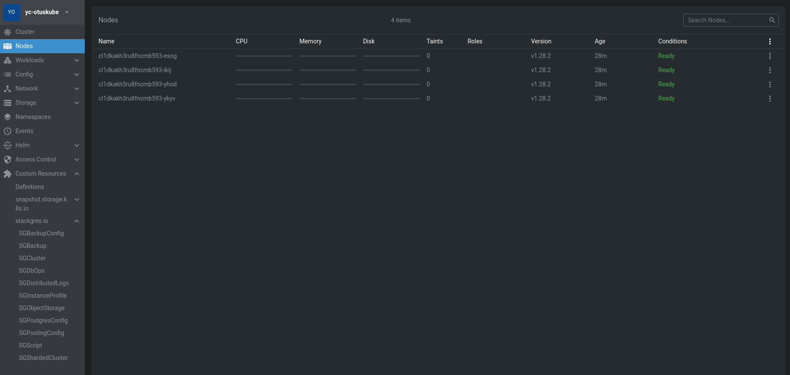

- Видим что запущены поды оператора, вроде бы ок...

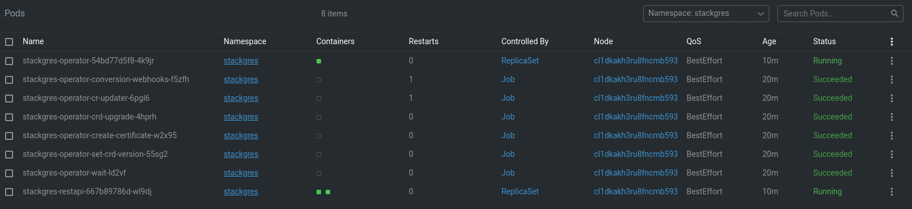


## Создание кластера Citus

- Пробуем создать кластера Citus по конфигу [sc_sharded_cluster.yaml](sc_sharded_cluster.yaml), подсмотренному у товарища Альваро Эрнандеса на CitusCon 2023 - https://learn.microsoft.com/en-us/events/cituscon-an-event-for-postgres-2023/citus-on-kubernetes-citus-con-an-event-for-postgres-2023

```
anton@aminkin:~$ kubectl apply -f sc_sharded_cluster.yaml
sgshardedcluster.stackgres.io/otus created
```

- Но по факту ничего не создается, т.к. stackgres все же встал криво (см. ошибки выше). Пробуем переустановить, почистим всё и сделаем снова kubectl **create** (не apply!).

```
anton@aminkin:~$ kubectl delete crds --all
anton@aminkin:~$ kubectl delete ns stackgres
anton@aminkin:~$ kubectl delete clusterrole stackgres-restapi
anton@aminkin:~$ kubectl delete clusterrole stackgres-operator
anton@aminkin:~$ kubectl delete clusterrolebinding stackgres-restapi-admin
anton@aminkin:~$ kubectl delete clusterrolebinding stackgres-restapi
anton@aminkin:~$ kubectl delete clusterrolebinding stackgres-operator-init
anton@aminkin:~$ kubectl delete clusterrolebinding stackgres-operator
anton@aminkin:~$ kubectl create -f 'https://sgres.io/install?adminui-service-type=LoadBalancer&grafana-autoEmbed=true'
namespace/stackgres created
customresourcedefinition.apiextensions.k8s.io/sgbackupconfigs.stackgres.io created
customresourcedefinition.apiextensions.k8s.io/sgbackups.stackgres.io created
customresourcedefinition.apiextensions.k8s.io/sgclusters.stackgres.io created
customresourcedefinition.apiextensions.k8s.io/sgdbops.stackgres.io created
customresourcedefinition.apiextensions.k8s.io/sgdistributedlogs.stackgres.io created
customresourcedefinition.apiextensions.k8s.io/sginstanceprofiles.stackgres.io created
customresourcedefinition.apiextensions.k8s.io/sgobjectstorages.stackgres.io created
customresourcedefinition.apiextensions.k8s.io/sgpoolconfigs.stackgres.io created
customresourcedefinition.apiextensions.k8s.io/sgpgconfigs.stackgres.io created
customresourcedefinition.apiextensions.k8s.io/sgscripts.stackgres.io created
customresourcedefinition.apiextensions.k8s.io/sgshardedclusters.stackgres.io created
clusterrolebinding.rbac.authorization.k8s.io/stackgres-restapi-admin created
clusterrolebinding.rbac.authorization.k8s.io/stackgres-restapi created
service/stackgres-operator created
service/stackgres-restapi created
deployment.apps/stackgres-operator created
deployment.apps/stackgres-restapi created
serviceaccount/stackgres-operator-init created
clusterrolebinding.rbac.authorization.k8s.io/stackgres-operator-init created
job.batch/stackgres-operator-cr-updater created
job.batch/stackgres-operator-crd-upgrade created
job.batch/stackgres-operator-conversion-webhooks created
job.batch/stackgres-operator-create-certificate created
job.batch/stackgres-operator-integrate-grafana created
job.batch/stackgres-operator-set-crd-version created
job.batch/stackgres-operator-wait created
serviceaccount/stackgres-operator created
serviceaccount/stackgres-restapi created
secret/stackgres-restapi created
configmap/stackgres-operator-grafana-dashboard created
configmap/stackgres-restapi-nginx created
clusterrole.rbac.authorization.k8s.io/stackgres-operator created
clusterrole.rbac.authorization.k8s.io/stackgres-restapi created
clusterrolebinding.rbac.authorization.k8s.io/stackgres-operator created
```

- Теперь ошибок нет, повторим создание кластера citus

```
anton@aminkin:~$ kubectl apply -f sc_sharded_cluster.yaml
sgshardedcluster.stackgres.io/otus created
```

- На этот раз поды создались, но не все - некоторые висят как pending

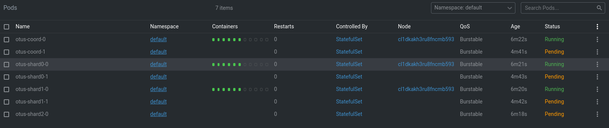

- Пробуем добавить ресурсов в кластер - поднимем количество ядер до 6, память до 18 Gb. К сожалению обновить нормально машины кластера в облаке не удалось, поскольку данный процесс подразумевает создание новых вм и переключение на них, но создание новых падает с ошибкой, поскольку упирается в лимит 500Gb на одно облако по дискам. Пришлось пересоздать сервис кубера с нуля. Когда новый кластер поднялся в него были добавлены узлы, установлен stackgres и запущено создание кластера Otus, однако проблема не ушла.

- Через OpenLens удалось увидеть ошибку, которая показала что проблема с pending нодами состоит вовсе не в нехватке ресурсов, а в правилах anti-affinity установленных по умолчанию для продуктивных сред - чтобы поды создавались на разных машинах:

`0/4 nodes are available: 4 node(s) didn't match pod anti-affinity rules. preemption: 0/4 nodes are available: 4 No preemption victims found for incoming pod..`

- Для решения: нужно либо увеличить количество машин, либо отключить правила. Воспользуемся вторым вариантом - согласно [доке](https://stackgres.io/doc/1.5/reference/crd/sgshardedcluster/#sgshardedclusterspecnonproductionoptions) добавим в *sc_sharded_cluster.yaml* инструкцию для не продуктивов - disableClusterPodAntiAffinity: true. После этого необходимо [рестартовать кластер](https://stackgres.io/doc/latest/administration/manual-restart/).

- Перед рестартом посмотрим на состояние кластера через UI stackgres. Чтобы до него достучаться можно прокинуть порт как указано в [документации](https://stackgres.io/doc/1.5/administration/adminui/), тогда интерфейс будет доступен по localhost:8443

```
[anton@ant lesson_16]$ kubectl get pods --namespace stackgres -l "app=stackgres-restapi" -o jsonpath="{.items[0].metadata.name}"
stackgres-restapi-55fb5fc586-gfm2x
[anton@ant lesson_16]$ kubectl port-forward stackgres-restapi-55fb5fc586-gfm2x --address 0.0.0.0 8443:9443 --namespace stackgres &
[1] 211916
[anton@ant lesson_16]$ Forwarding from 0.0.0.0:8443 -> 9443
[anton@ant lesson_16]$ Handling connection for 8443
```

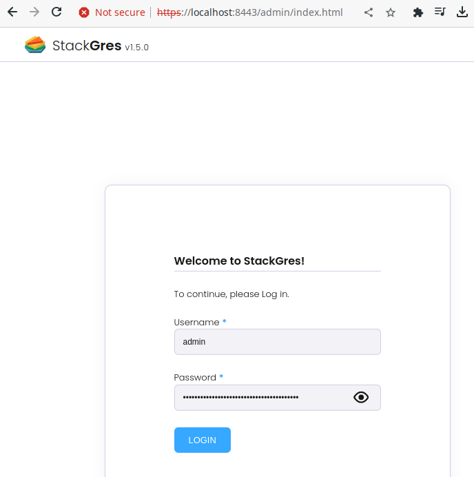

- Либо вариант попроще - подсмотреть адрес в балансировщике сервиса stackgres-restapi через UI облака и зайти по нему, например https://158.160.131.134/

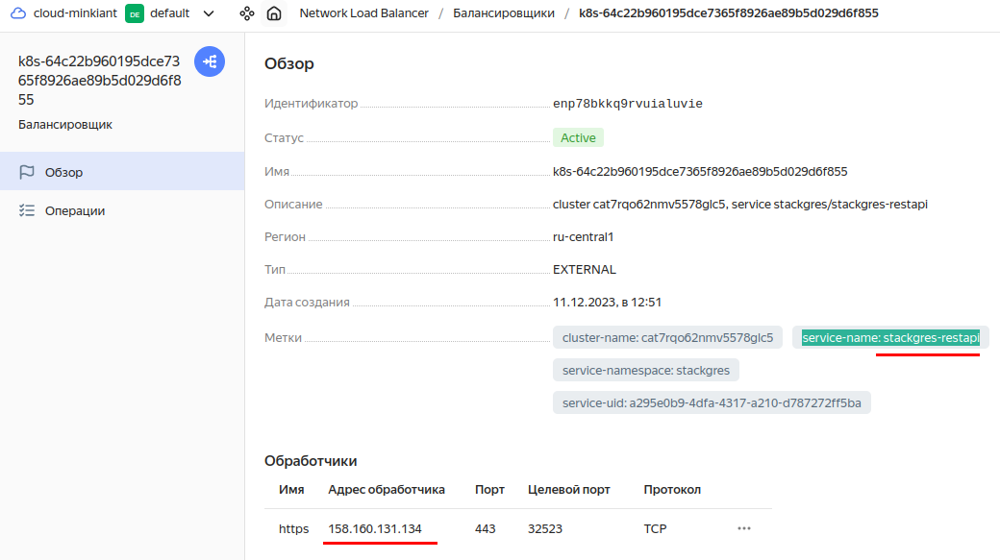

- Чтобы авторизоваться в UI stackgres нужен пароль и логин, получим их из секретов:

```
[anton@ant lesson_16]$ kubectl get secret -n stackgres stackgres-restapi --template '{{ printf "username = %s\n" (.data.k8sUsername | base64decode) }}'
username = admin
[anton@ant lesson_16]$ kubectl get secret -n stackgres stackgres-restapi --template '{{ printf "password = %s\n" (.data.clearPassword | base64decode) }}'
password = ...................................
```

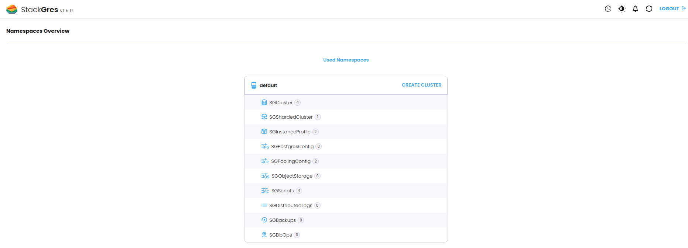

- Действительно в UI отображается что кластеру требуется рестарт, но кнопок растарта не видно, UI здесь больше для мониторинга, хотя и возможности редактирования конфигов тоже есть.

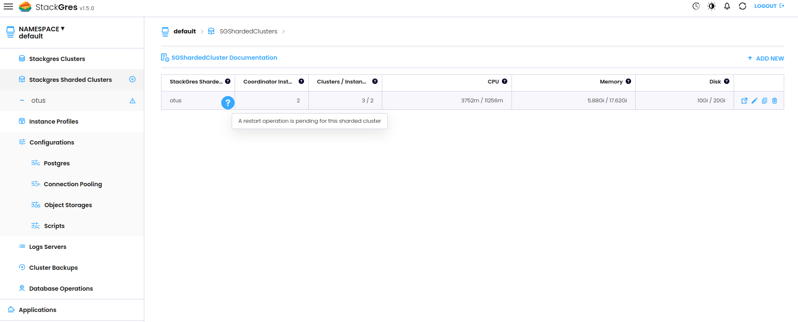

- Для рестарта получим ноды которые нужно рестартить 

```
[anton@ant lesson_16]$ kubectl get sgclusters.stackgres.io -A --template '
{{- range $item := .items }}
  {{- range $item.status.conditions }}
    {{- if eq .type "PendingRestart" }}
      {{- printf "%s.%s %s=%s\n" $item.metadata.namespace $item.metadata.name .type .status }}
    {{- end }}
  {{- end }}
{{- end }}'
default.otus-coord PendingRestart=True
default.otus-shard0 PendingRestart=True
default.otus-shard1 PendingRestart=True
default.otus-shard2 PendingRestart=True
```

- Удалим поды которые в состоянии Pending, они должны пересоздаться автоматически

```
[anton@ant lesson_16]$ export NAMESPACE=default
[anton@ant lesson_16]$ export SGCLUSTER=otus
[anton@ant lesson_16]$ kubectl delete -n "$NAMESPACE" pod "otus-coord-1"
pod "otus-coord-1" deleted
[anton@ant lesson_16]$ kubectl delete -n "$NAMESPACE" pod "otus-shard0-1"
pod "otus-shard0-1" deleted
[anton@ant lesson_16]$ kubectl delete -n "$NAMESPACE" pod "otus-shard1-1"
pod "otus-shard1-1" deleted
[anton@ant lesson_16]$ kubectl delete -n "$NAMESPACE" pod "otus-shard2-1"
pod "otus-shard2-1" deleted
```

- После этой процедуры кластеру CITUS стало лучше - в состоянии Pending остались висеть только два пода - стендбай координатора и одного из шардов. На этот раз OpenLens показал ошибку с нехваткой места (её же можно наблюдать в UI облака) - опять тот же самый лимит в 500Gb:

`running PreBind plugin "VolumeBinding": binding volumes: provisioning failed for PVC "otus-coord-data-otus-coord-1"`

- Оказалось, что PVC выделяются не на виртуалках, а из оставшегося места YC облака после создания узлов, т.е. для самих узлов много места выделять не надо. Пересоздаем сервис кубера в облаке третий раз, добавим ещё побольше ядер - по 8 на ноду, т.к. жаловалось на нехватку, а диски **урежем до минимально возможного размера - 64 Gb** на ноду.

- Переподнимаем всё с нуля, на этот раз кластер успешно поднялся, все поды активны!

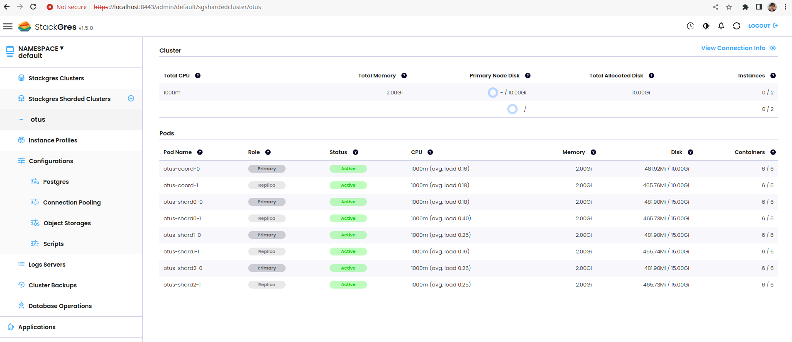


## Подключение

- Как гласит [документация](https://stackgres.io/doc/latest/administration/sharded-cluster/connection/), по умолчанию кластер не доступен извне, нужно настраивать сервисы как NodePort либо LoadBalancer. Основной сервис для доступа к координатору называется также как и кластер - otus. Для доступа к воркерам есть otus-reads и otus-shards.

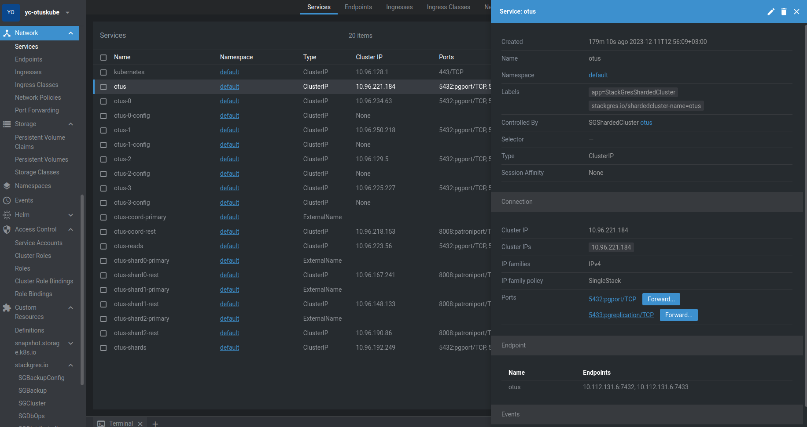

- Посмотрим на сервисы из консоли:

```
[anton@ant lesson_16]$ kubectl get services -l stackgres.io/shardedcluster-name=otus
NAME          TYPE        CLUSTER-IP      EXTERNAL-IP   PORT(S)             AGE
otus          ClusterIP   10.96.221.184   <none>        5432/TCP,5433/TCP   3h9m
otus-reads    ClusterIP   10.96.223.56    <none>        5432/TCP,5433/TCP   3h9m
otus-shards   ClusterIP   10.96.192.249   <none>        5432/TCP,5433/TCP   3h9m
```

- Будем пробовать второй метод - LoadBalancer - добавим в конфиг *sc_sharded_cluster.yaml* блок с балансировщиками и переконфигурируем

```
  postgresServices:
    coordinator:
      primary:
        type: LoadBalancer
      any:
        type: LoadBalancer
    shards:
      primaries:
        type: LoadBalancer
```

`[anton@ant lesson_16]$ kubectl apply -f sc_sharded_cluster.yaml`

- Из трёх поднялся только один, остальные два сказали:

`Error syncing load balancer: failed to ensure load balancer: failed to ensure cloud loadbalancer: failed to start cloud lb creation: request-id = 4a517a96-8daa-4cd3-b44c-a9d734927c0c rpc error: code = ResourceExhausted desc = Quota limit ylb.networkLoadBalancers.count exceeded`

- Дело опять в жмотских [лимитах YA облака](https://cloud.yandex.ru/docs/network-load-balancer/concepts/limits) - `Количество балансировщиков в одном облаке = 2`. У нас один используется под stackgres UI, так что свободен только один - отдадим его основному узлу координатора, остальным поставим NodePort.

```
  postgresServices:
    coordinator:
      primary:
        type: LoadBalancer
      any:
        type: NodePort
    shards:
      primaries:
        type: NodePort
```

- Теперь все хорошо

```
[anton@ant lesson_16]$ kubectl get services -l stackgres.io/shardedcluster-name=otus
NAME          TYPE           CLUSTER-IP      EXTERNAL-IP       PORT(S)                         AGE
otus          LoadBalancer   10.96.221.184   158.160.138.122   5432:32664/TCP,5433:30561/TCP   3h28m
otus-reads    NodePort       10.96.223.56    <none>            5432:30633/TCP,5433:31970/TCP   3h28m
otus-shards   NodePort       10.96.192.249   <none>            5432:31039/TCP,5433:31854/TCP   3h28m
```

- Пробуем подключиться извне по указанному адресу, для этого добываем пароль пользователя postgres/superuser из секретов, где он лежит в base64

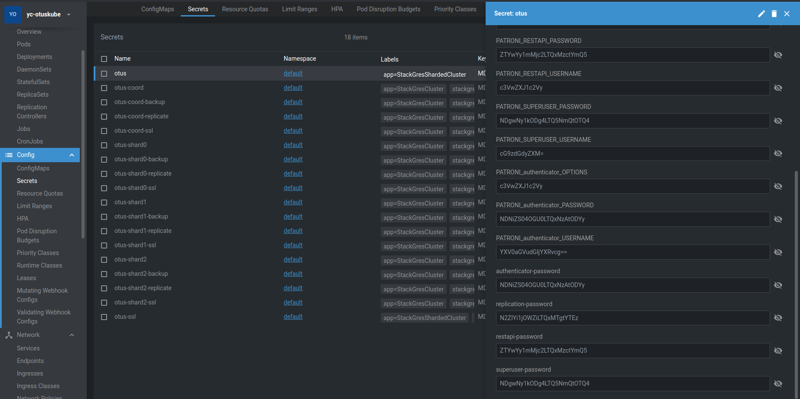

```
[anton@ant lesson_16]$ kubectl get secret otus --template '{{ printf "%s" (index .data "superuser-password" | base64decode) }}'
4807-d888-496d-948
```

- Успешно зашли через DBeaver

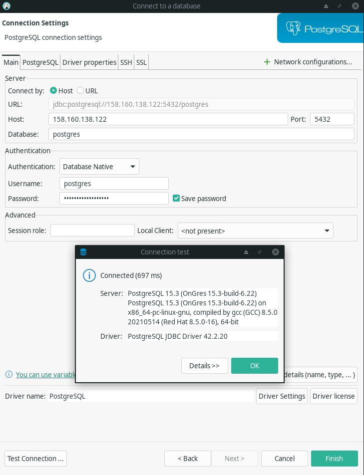

- Альтернативный вариант - как с интерфейсом, прокинуть порт на под otus-coord-0 и подключаться через localhost

`kubectl port-forward otus-coord-0 --address 0.0.0.0 5445:5432 --namespace default`

- Также успешно зашли чере psql. Видим что база otus уже создана, глянем версию Citus и список воркеров.

```
[anton@ant lesson_16]$ psql -U postgres -h 158.160.138.122 -d postgres
Password for user postgres: 
psql (16.1, server 15.3 (OnGres 15.3-build-6.22))
SSL connection (protocol: TLSv1.3, cipher: TLS_AES_256_GCM_SHA384, compression: off)
Type "help" for help.

postgres=# \l
                                                   List of databases
   Name    |  Owner   | Encoding | Locale Provider | Collate |  Ctype  | ICU Locale | ICU Rules |   Access privileges   
-----------+----------+----------+-----------------+---------+---------+------------+-----------+-----------------------
 otus      | postgres | UTF8     | libc            | C.UTF-8 | C.UTF-8 |            |           | 
 postgres  | postgres | UTF8     | libc            | C.UTF-8 | C.UTF-8 |            |           | 
 template0 | postgres | UTF8     | libc            | C.UTF-8 | C.UTF-8 |            |           | =c/postgres          +
           |          |          |                 |         |         |            |           | postgres=CTc/postgres
 template1 | postgres | UTF8     | libc            | C.UTF-8 | C.UTF-8 |            |           | =c/postgres          +
           |          |          |                 |         |         |            |           | postgres=CTc/postgres
(4 rows)

[anton@ant lesson_16]$ psql -U postgres -h 158.160.138.122 -d otus
Password for user postgres: 
psql (16.1, server 15.3 (OnGres 15.3-build-6.22))
SSL connection (protocol: TLSv1.3, cipher: TLS_AES_256_GCM_SHA384, compression: off)
Type "help" for help.

otus=# SELECT * FROM citus_version();
                                                    citus_version                                                     
----------------------------------------------------------------------------------------------------------------------
 Citus 11.3.0 on x86_64-pc-linux-gnu, compiled by gcc (GCC) 8.5.0 20210514 (Red Hat 8.5.0-16), 64-bit gitref: v11.3.0
(1 row)

otus=# SELECT * FROM master_get_active_worker_nodes();
  node_name   | node_port 
--------------+-----------
 10.112.128.7 |      7433
 10.112.130.7 |      7433
 10.112.129.8 |      7433
(3 rows)

Time: 28,349 ms
```

## Заливка данных

- Возьмем тот же датасет о погоде который заливали на предыдущих уроках в формате csv - 2 Gb, 27 млн строк

- Создадим таблицу и распределим её по погодным станциям

```
otus=# CREATE TABLE weather (
    station_id              VARCHAR(50),
    city_name               VARCHAR(250),
    dt                      TIMESTAMP,
    season                  VARCHAR(50),
    avg_temp_c              float4,
    min_temp_c              float4,
    max_temp_c              float4,
    precipitation_mm        float4,
    snow_depth_mm           float4,
    avg_wind_dir_deg        float4,
    avg_wind_speed_kmh      float4,
    peak_wind_gust_kmh      float4,
    avg_sea_level_pres_hpa  float4,
    sunshine_total_min      float4
);
CREATE TABLE
otus=# SELECT create_distributed_table('weather', 'station_id');
 create_distributed_table 
--------------------------
 
(1 row)
```

- Зальём данные, проверим размер и количество залитого

```
otus=# set time zone 'Europe/Moscow';
SET

otus=# \timing
Timing is on.

otus=# \COPY weather(
  station_id,
  city_name,
  dt,
  season,
  avg_temp_c,
  min_temp_c,
  max_temp_c,
  precipitation_mm,
  snow_depth_mm,
  avg_wind_dir_deg,
  avg_wind_speed_kmh,
  peak_wind_gust_kmh,
  avg_sea_level_pres_hpa,
  sunshine_total_min
)
FROM 'weather.csv'
DELIMITER ','
CSV HEADER;
COPY 27621770
Time: 181251,083 ms (03:01,251)

otus=# SELECT table_name, table_size FROM citus_tables;
 table_name | table_size 
------------+------------
 weather    | 2316 MB
(1 row)

otus=# SELECT sum(result::float) AS estimated_count
  FROM run_command_on_shards(
    'weather',
    $cmd$
      SELECT reltuples
        FROM pg_class c
        JOIN pg_catalog.pg_namespace n on n.oid=c.relnamespace
       WHERE (n.nspname || '.' || relname)::regclass = '%s'::regclass
         AND n.nspname NOT IN ('citus', 'pg_toast', 'pg_catalog')
    $cmd$
  );
 estimated_count 
-----------------
        27621770
(1 row)
```

- Всё залетело за 3 минуты, посмотрим распределение

```
otus=# SELECT * FROM citus_shards;
 table_name | shardid |   shard_name   | citus_table_type | colocation_id |   nodename   | nodeport | shard_size 
------------+---------+----------------+------------------+---------------+--------------+----------+------------
 weather    |  102040 | weather_102040 | distributed      |             2 | 10.112.128.7 |     7433 |   88711168
 weather    |  102041 | weather_102041 | distributed      |             2 | 10.112.129.8 |     7433 |   83066880
 weather    |  102042 | weather_102042 | distributed      |             2 | 10.112.130.7 |     7433 |   56573952
 weather    |  102043 | weather_102043 | distributed      |             2 | 10.112.128.7 |     7433 |   78790656
 weather    |  102044 | weather_102044 | distributed      |             2 | 10.112.129.8 |     7433 |   80191488
 weather    |  102045 | weather_102045 | distributed      |             2 | 10.112.130.7 |     7433 |   67985408
 weather    |  102046 | weather_102046 | distributed      |             2 | 10.112.128.7 |     7433 |   95797248
 weather    |  102047 | weather_102047 | distributed      |             2 | 10.112.129.8 |     7433 |   66117632
 weather    |  102048 | weather_102048 | distributed      |             2 | 10.112.130.7 |     7433 |   66240512
 weather    |  102049 | weather_102049 | distributed      |             2 | 10.112.128.7 |     7433 |   61063168
 weather    |  102050 | weather_102050 | distributed      |             2 | 10.112.129.8 |     7433 |   77619200
 weather    |  102051 | weather_102051 | distributed      |             2 | 10.112.130.7 |     7433 |   60776448
 weather    |  102052 | weather_102052 | distributed      |             2 | 10.112.128.7 |     7433 |   62914560
 weather    |  102053 | weather_102053 | distributed      |             2 | 10.112.129.8 |     7433 |   75431936
 weather    |  102054 | weather_102054 | distributed      |             2 | 10.112.130.7 |     7433 |   73023488
 weather    |  102055 | weather_102055 | distributed      |             2 | 10.112.128.7 |     7433 |   93511680
 weather    |  102056 | weather_102056 | distributed      |             2 | 10.112.129.8 |     7433 |   73269248
 weather    |  102057 | weather_102057 | distributed      |             2 | 10.112.130.7 |     7433 |   80904192
 weather    |  102058 | weather_102058 | distributed      |             2 | 10.112.128.7 |     7433 |   75128832
 weather    |  102059 | weather_102059 | distributed      |             2 | 10.112.129.8 |     7433 |  119496704
 weather    |  102060 | weather_102060 | distributed      |             2 | 10.112.130.7 |     7433 |   80920576
 weather    |  102061 | weather_102061 | distributed      |             2 | 10.112.128.7 |     7433 |   75448320
 weather    |  102062 | weather_102062 | distributed      |             2 | 10.112.129.8 |     7433 |   92676096
 weather    |  102063 | weather_102063 | distributed      |             2 | 10.112.130.7 |     7433 |   74817536
 weather    |  102064 | weather_102064 | distributed      |             2 | 10.112.128.7 |     7433 |   61259776
 weather    |  102065 | weather_102065 | distributed      |             2 | 10.112.129.8 |     7433 |   72589312
 weather    |  102066 | weather_102066 | distributed      |             2 | 10.112.130.7 |     7433 |   79888384
 weather    |  102067 | weather_102067 | distributed      |             2 | 10.112.128.7 |     7433 |   76242944
 weather    |  102068 | weather_102068 | distributed      |             2 | 10.112.129.8 |     7433 |   56377344
 weather    |  102069 | weather_102069 | distributed      |             2 | 10.112.130.7 |     7433 |   62078976
 weather    |  102070 | weather_102070 | distributed      |             2 | 10.112.128.7 |     7433 |   70246400
 weather    |  102071 | weather_102071 | distributed      |             2 | 10.112.129.8 |     7433 |   88858624
(32 rows)

otus=# SELECT * FROM pg_dist_shard;
 logicalrelid | shardid | shardstorage | shardminvalue | shardmaxvalue 
--------------+---------+--------------+---------------+---------------
 weather      |  102040 | t            | -2147483648   | -2013265921
 weather      |  102041 | t            | -2013265920   | -1879048193
 weather      |  102042 | t            | -1879048192   | -1744830465
 weather      |  102043 | t            | -1744830464   | -1610612737
 weather      |  102044 | t            | -1610612736   | -1476395009
 weather      |  102045 | t            | -1476395008   | -1342177281
 weather      |  102046 | t            | -1342177280   | -1207959553
 weather      |  102047 | t            | -1207959552   | -1073741825
 weather      |  102048 | t            | -1073741824   | -939524097
 weather      |  102049 | t            | -939524096    | -805306369
 weather      |  102050 | t            | -805306368    | -671088641
 weather      |  102051 | t            | -671088640    | -536870913
 weather      |  102052 | t            | -536870912    | -402653185
 weather      |  102053 | t            | -402653184    | -268435457
 weather      |  102054 | t            | -268435456    | -134217729
 weather      |  102055 | t            | -134217728    | -1
 weather      |  102056 | t            | 0             | 134217727
 weather      |  102057 | t            | 134217728     | 268435455
 weather      |  102058 | t            | 268435456     | 402653183
 weather      |  102059 | t            | 402653184     | 536870911
 weather      |  102060 | t            | 536870912     | 671088639
 weather      |  102061 | t            | 671088640     | 805306367
 weather      |  102062 | t            | 805306368     | 939524095
 weather      |  102063 | t            | 939524096     | 1073741823
 weather      |  102064 | t            | 1073741824    | 1207959551
 weather      |  102065 | t            | 1207959552    | 1342177279
 weather      |  102066 | t            | 1342177280    | 1476395007
 weather      |  102067 | t            | 1476395008    | 1610612735
 weather      |  102068 | t            | 1610612736    | 1744830463
 weather      |  102069 | t            | 1744830464    | 1879048191
 weather      |  102070 | t            | 1879048192    | 2013265919
 weather      |  102071 | t            | 2013265920    | 2147483647
(32 rows)

Time: 28,732 ms
```

- Более-менее равномерно. Посмотрим план на запрос с подсчетом :количества строк

```
otus=# explain analyze select count(*) from weather;
                                                                                  QUERY PLAN                                                                                  
------------------------------------------------------------------------------------------------------------------------------------------------------------------------------
 Aggregate  (cost=250.00..250.02 rows=1 width=8) (actual time=2067.036..2067.038 rows=1 loops=1)
   ->  Custom Scan (Citus Adaptive)  (cost=0.00..0.00 rows=100000 width=8) (actual time=2067.009..2067.014 rows=32 loops=1)
         Task Count: 32
         Tuple data received from nodes: 256 bytes
         Tasks Shown: One of 32
         ->  Task
               Tuple data received from node: 8 bytes
               Node: host=10.112.129.8 port=7433 dbname=otus
               ->  Finalize Aggregate  (cost=14660.03..14660.04 rows=1 width=8) (actual time=1794.868..1794.945 rows=1 loops=1)
                     ->  Gather  (cost=14659.81..14660.02 rows=2 width=8) (actual time=1794.863..1794.940 rows=1 loops=1)
                           Workers Planned: 2
                           Workers Launched: 0
                           ->  Partial Aggregate  (cost=13659.81..13659.82 rows=1 width=8) (actual time=1794.132..1794.133 rows=1 loops=1)
                                 ->  Parallel Seq Scan on weather_102053 weather  (cost=0.00..12768.25 rows=356625 width=0) (actual time=0.029..1295.801 rows=855900 loops=1)
                   Planning Time: 0.272 ms
                   Execution Time: 1795.016 ms
 Planning Time: 0.943 ms
 Execution Time: 2067.110 ms
(18 rows)

Time: 2099,917 ms (00:02,100)
```

- Попробуем выполнить разные запросы

```
-- 1) общее количество
SELECT count(*) FROM weather;
-- 1 row(s) fetched - 1.404s, результат = 27621770

-- 2) разброс дат
SELECT min(dt), max(dt) FROM weather;
-- 1 row(s) fetched - 1.936s, 1750-02-01 00:29:43.000	2023-09-05 00:00:00.000

-- 3) количество по городам
SELECT city_name, count(*) FROM weather GROUP BY city_name ORDER BY city_name;
-- 200 row(s) fetched - 3.927s

-- 4) предельные температуры Волгограда
SELECT max(max_temp_c), min(min_temp_c) FROM weather WHERE city_name = 'Volgograd';
-- 1 row(s) fetched - 1.673s, 42.6	-48.4

-- 5) средняя температура в Волгограде 1 января 2000 г
SELECT avg_temp_c FROM weather WHERE city_name = 'Volgograd' AND dt >= '2000-01-01' AND dt < '2000-01-02';
-- 1 row(s) fetched - 1.519s, -2.4
```

- Теперь сконвертируем таблицу в колоночный формат хранения

```
otus=#  SELECT alter_table_set_access_method('weather', 'columnar');
NOTICE:  creating a new table for public.weather
NOTICE:  moving the data of public.weather
NOTICE:  dropping the old public.weather
NOTICE:  renaming the new table to public.weather
 alter_table_set_access_method 
-------------------------------
 
(1 row)

Time: 23513,695 ms (00:23,514)
```

- Те же запросы в колоночном формате

```
-- 1) общее количество
SELECT count(*) FROM weather;
-- 1 row(s) fetched - 986ms, результат = 27621770

-- 2) разброс дат
SELECT min(dt), max(dt) FROM weather;
-- 1 row(s) fetched - 1.661s, 1750-02-01 00:29:43.000	2023-09-05 00:00:00.000

-- 3) количество по городам
SELECT city_name, count(*) FROM weather GROUP BY city_name ORDER BY city_name;
-- 200 row(s) fetched - 3.208s

-- 4) предельные температуры Волгограда
SELECT max(max_temp_c), min(min_temp_c) FROM weather WHERE city_name = 'Volgograd';
-- 1 row(s) fetched - 1.786s, 42.6	-48.4

-- 5) средняя температура в Волгограде 1 января 2000 г
SELECT avg_temp_c FROM weather WHERE city_name = 'Volgograd' AND dt >= '2000-01-01' AND dt < '2000-01-02';
-- 1 row(s) fetched - 1.434s, -2.4
```

- Слегка быстрее но особой разницы на этих данных не заметно. Однако если посмотреть на размер таблицы, то он уменьшился на порядок!

```
otus=# SELECT table_name, table_size FROM citus_tables;
 table_name | table_size 
------------+------------
 weather    | 297 MB
(1 row)

Time: 62,150 ms
otus=# SELECT * FROM citus_shards;
 table_name | shardid |   shard_name   | citus_table_type | colocation_id |   nodename   | nodeport | shard_size 
------------+---------+----------------+------------------+---------------+--------------+----------+------------
 weather    |  102072 | weather_102072 | distributed      |             2 | 10.112.128.7 |     7433 |   11493376
 weather    |  102073 | weather_102073 | distributed      |             2 | 10.112.129.8 |     7433 |   10788864
 weather    |  102074 | weather_102074 | distributed      |             2 | 10.112.130.7 |     7433 |    7225344
 weather    |  102075 | weather_102075 | distributed      |             2 | 10.112.128.7 |     7433 |   10182656
 weather    |  102076 | weather_102076 | distributed      |             2 | 10.112.129.8 |     7433 |   10215424
 weather    |  102077 | weather_102077 | distributed      |             2 | 10.112.130.7 |     7433 |    8757248
 weather    |  102078 | weather_102078 | distributed      |             2 | 10.112.128.7 |     7433 |   12025856
 weather    |  102079 | weather_102079 | distributed      |             2 | 10.112.129.8 |     7433 |    8462336
 weather    |  102080 | weather_102080 | distributed      |             2 | 10.112.130.7 |     7433 |    8708096
 weather    |  102081 | weather_102081 | distributed      |             2 | 10.112.128.7 |     7433 |    7929856
 weather    |  102082 | weather_102082 | distributed      |             2 | 10.112.129.8 |     7433 |    9920512
 weather    |  102083 | weather_102083 | distributed      |             2 | 10.112.130.7 |     7433 |    7757824
 weather    |  102084 | weather_102084 | distributed      |             2 | 10.112.128.7 |     7433 |    8290304
 weather    |  102085 | weather_102085 | distributed      |             2 | 10.112.129.8 |     7433 |    9748480
 weather    |  102086 | weather_102086 | distributed      |             2 | 10.112.130.7 |     7433 |    9281536
 weather    |  102087 | weather_102087 | distributed      |             2 | 10.112.128.7 |     7433 |   11870208
 weather    |  102088 | weather_102088 | distributed      |             2 | 10.112.129.8 |     7433 |    9527296
 weather    |  102089 | weather_102089 | distributed      |             2 | 10.112.130.7 |     7433 |   10485760
 weather    |  102090 | weather_102090 | distributed      |             2 | 10.112.128.7 |     7433 |    9453568
 weather    |  102091 | weather_102091 | distributed      |             2 | 10.112.129.8 |     7433 |   15179776
 weather    |  102092 | weather_102092 | distributed      |             2 | 10.112.130.7 |     7433 |   10362880
 weather    |  102093 | weather_102093 | distributed      |             2 | 10.112.128.7 |     7433 |    9723904
 weather    |  102094 | weather_102094 | distributed      |             2 | 10.112.129.8 |     7433 |   12017664
 weather    |  102095 | weather_102095 | distributed      |             2 | 10.112.130.7 |     7433 |    9789440
 weather    |  102096 | weather_102096 | distributed      |             2 | 10.112.128.7 |     7433 |    7528448
 weather    |  102097 | weather_102097 | distributed      |             2 | 10.112.129.8 |     7433 |    9420800
 weather    |  102098 | weather_102098 | distributed      |             2 | 10.112.130.7 |     7433 |   10125312
 weather    |  102099 | weather_102099 | distributed      |             2 | 10.112.128.7 |     7433 |    9699328
 weather    |  102100 | weather_102100 | distributed      |             2 | 10.112.129.8 |     7433 |    7086080
 weather    |  102101 | weather_102101 | distributed      |             2 | 10.112.130.7 |     7433 |    8019968
 weather    |  102102 | weather_102102 | distributed      |             2 | 10.112.128.7 |     7433 |    9011200
 weather    |  102103 | weather_102103 | distributed      |             2 | 10.112.129.8 |     7433 |   11567104
(32 rows)

Time: 31,589 ms
```

- Напоследок глянем ресурсы использованные подами после заливки через UI stackgres

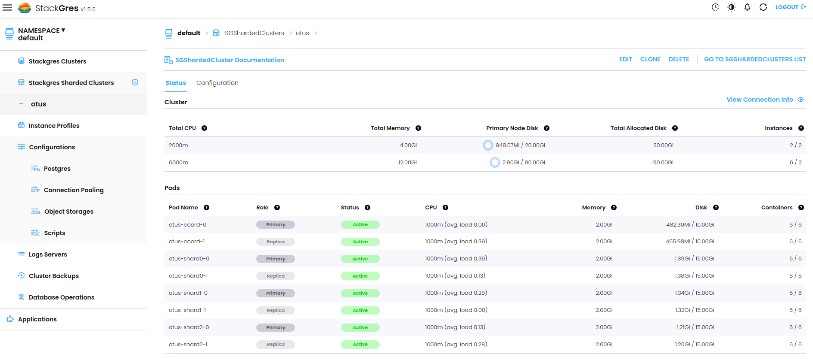