# PG Advanced - Домашняя работа 20 - Managed postgres services

- Создадим более-менее одинаковые кластера Postgres в облаках Яндекса и Контакта. Поскольку в VK последняя версия PG - 14, будем использовать её. Здесь у YA очевидное преимущество, т.к. он уже поддерживает 16-ю версию (на 12.2023). По лимитам на ресурсы без обращения в поддержку у яндекса также лучше, поэтому будем ориентироваться на [максимум доступный Вконтакту](https://cloud.vk.com/docs/base/account/concepts/quotasandlimits) без лишних телодвижений (обращения в поддержку) - 4 CPU Ice Lake / 8 Gb RAM на машину. По диску ограничения не такие существенные, сделаем 40 Gb SSD диски.

## YA Cloud

- Managed Service for PostgreSQL / Кластеры / Создать кластер. При создании непонятно что именно будет создано, надо читать документацию. Укажем окружение PRESTABLE, сделаем два хоста. Стоимость: 15 498.40 руб/мес.

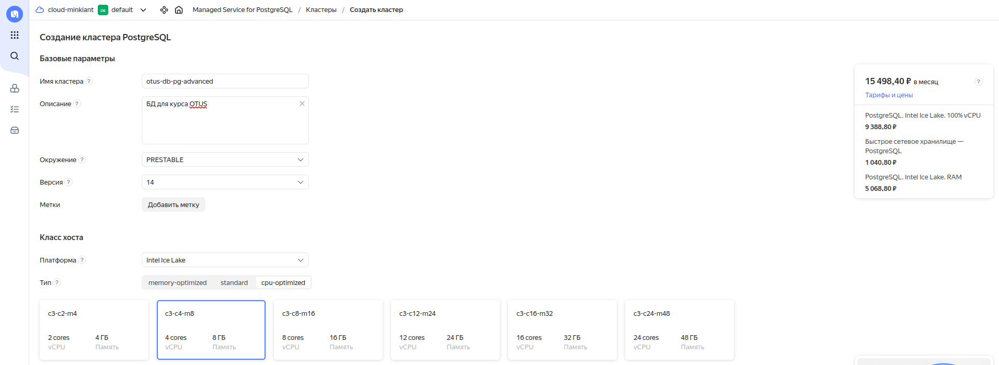

- Бакапы отключить нельзя, зато можно низкоуровнево настроить параметры постгреса

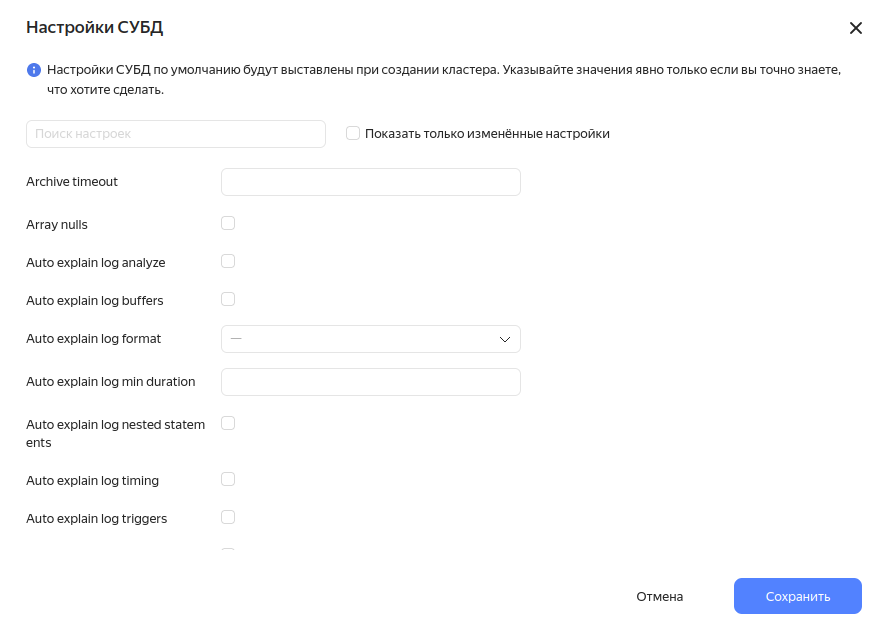

- Смотрим что создалось

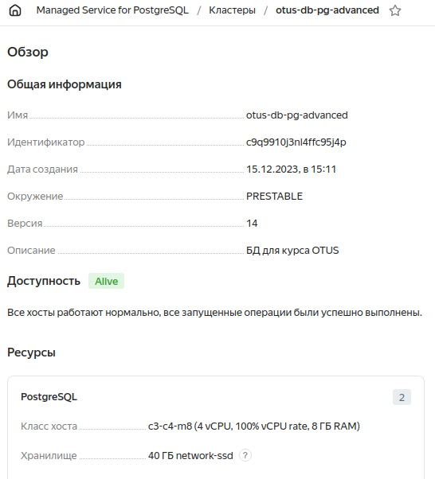

- Два хоста - мастер и реплика, удобно смотреть на вкладке "Топология"

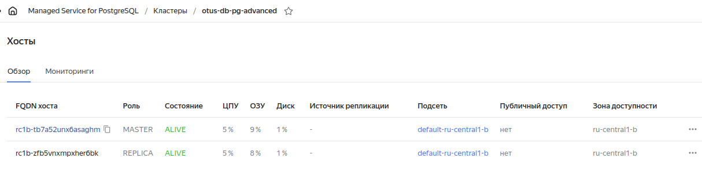
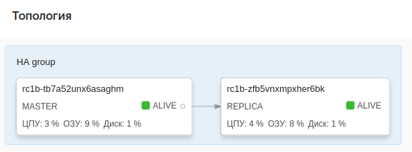

- При создании указывали сразу сделать БД otus и вот она

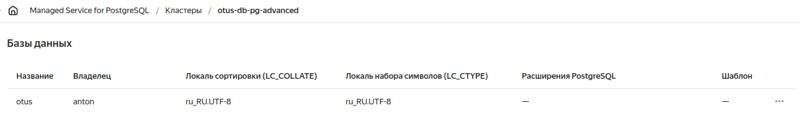

- Можно в неё установить расширения, достаточно большой выбор

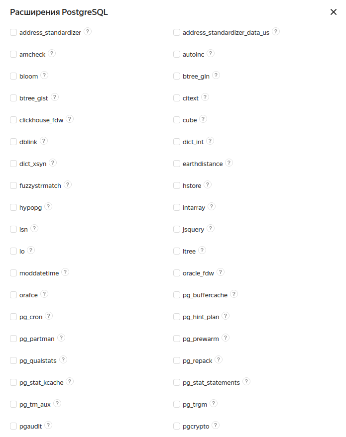

- Резервные копии создаются сразу, Data Lens и SQL через браузер не включал, доступен стандартный мониторинг 

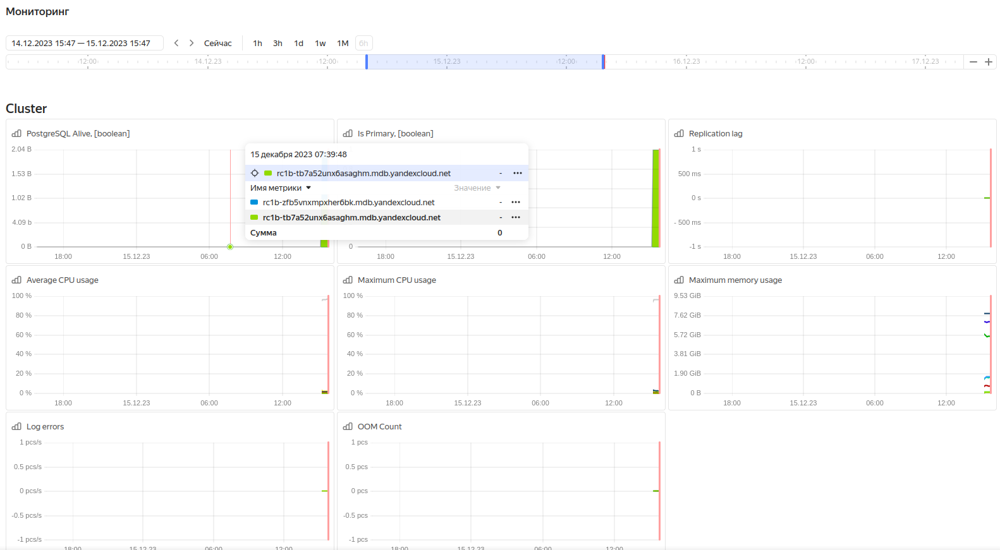

- По умолчанию база доступна только из облака (с других виртуалок). Попробуем включить публичный доступ для мастера по [документации](https://cloud.yandex.ru/docs/managed-postgresql/operations/connect). Здесь публичный доступ надо включать ко всем хостам, т.к. в случае смены мастера мы не сможем подключиться. Кстати, в интерфейсе есть кнопка для ручного switchover - "Переключить мастер".

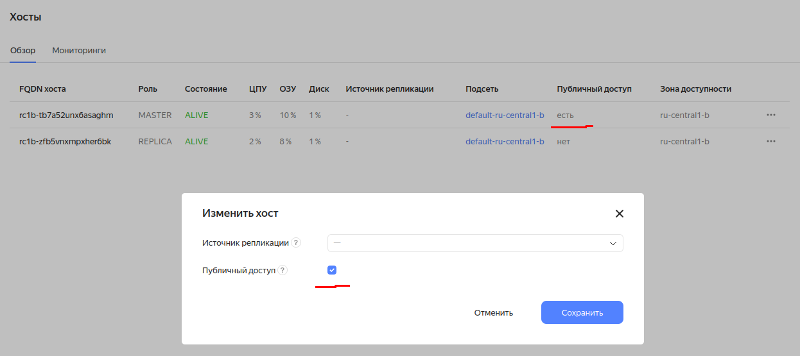

- Теперь надо настроить группы безопасности

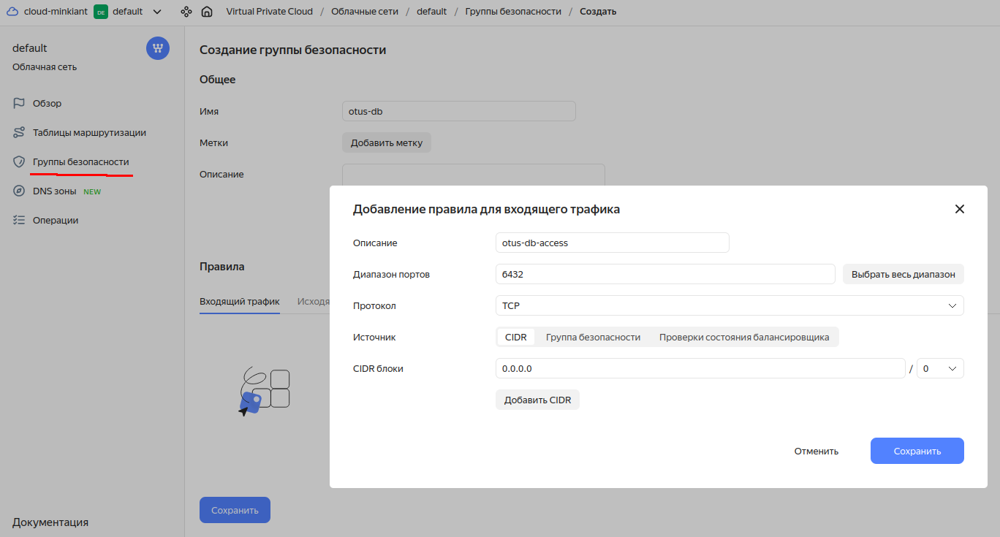

- И получить ключ SSL

```
[anton@ant ~]$ mkdir -p ~/.postgresql && \
wget "https://storage.yandexcloud.net/cloud-certs/CA.pem" \
     --output-document ~/.postgresql/root.crt && \
chmod 0600 ~/.postgresql/root.crt
--2023-12-15 16:19:22--  https://storage.yandexcloud.net/cloud-certs/CA.pem
Loaded CA certificate '/etc/ssl/certs/ca-certificates.crt'
Resolving storage.yandexcloud.net (storage.yandexcloud.net)... 213.180.193.243, 2a02:6b8::1d9
Connecting to storage.yandexcloud.net (storage.yandexcloud.net)|213.180.193.243|:443... connected.
HTTP request sent, awaiting response... 200 OK
Length: 3579 (3,5K) [application/x-x509-ca-cert]
Saving to: ‘/home/anton/.postgresql/root.crt’

/home/anton/.postgr 100%[===================>]   3,50K  --.-KB/s    in 0s      

2023-12-15 16:19:22 (57,9 MB/s) - ‘/home/anton/.postgresql/root.crt’ saved [3579/3579]
```
- Идём на страницу со списком хостов и кликаем копировать на имени хоста, получаем адрес вида rc1b-tb7a52unx6asaghm.mdb.yandexcloud.net, так мы будем подключаться к конкретному хосту, который является мастером в текущий момент. Чтобы всегда подключаться к мастеру, даже в случае его смены, нужно использовать особый FQDN - c-<идентификатор_кластера>.rw.mdb.yandexcloud.net. Порт используется 6432, бд otus и логин пароль исплоьзуем те что указывали при создании кластера.

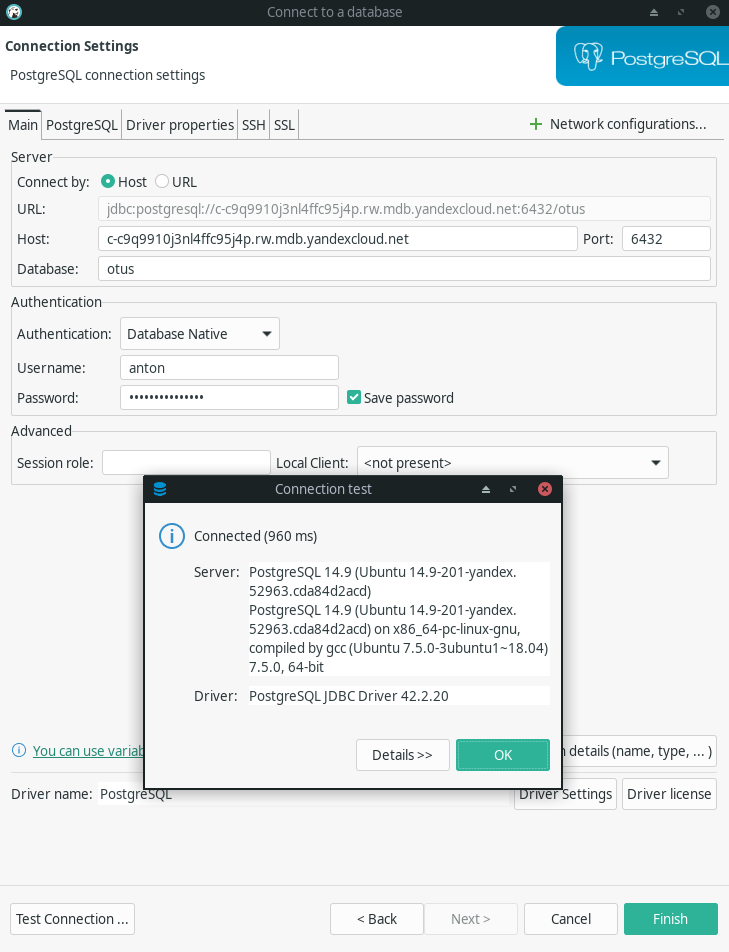

- И через psql

```
[anton@ant ~]$ psql "host=c-c9q9910j3nl4ffc95j4p.rw.mdb.yandexcloud.net \
      port=6432 \
      sslmode=verify-full \
      dbname=otus \
      user=anton \
      target_session_attrs=read-write"
Password for user anton: 
psql (16.1, server 14.9 (Ubuntu 14.9-201-yandex.52963.cda84d2acd))
SSL connection (protocol: TLSv1.3, cipher: TLS_AES_256_GCM_SHA384, compression: off)
Type "help" for help.

otus=> 
```

- Создадим табличку и зальём датасет с данными о погоде, использовавшийся на предыдущих уроках

```
otus=> CREATE TABLE weather (
    station_id              VARCHAR(50),
    city_name               VARCHAR(250),
    dt                      TIMESTAMP,
    season                  VARCHAR(50),
    avg_temp_c              float4,
    min_temp_c              float4,
    max_temp_c              float4,
    precipitation_mm        float4,
    snow_depth_mm           float4,
    avg_wind_dir_deg        float4,
    avg_wind_speed_kmh      float4,
    peak_wind_gust_kmh      float4,
    avg_sea_level_pres_hpa  float4,
    sunshine_total_min      float4
);
CREATE TABLE
otus=> \timing
Timing is on.
otus=> \COPY weather(
  station_id,
  city_name,
  dt,
  season,
  avg_temp_c,
  min_temp_c,
  max_temp_c,
  precipitation_mm,
  snow_depth_mm,
  avg_wind_dir_deg,
  avg_wind_speed_kmh,
  peak_wind_gust_kmh,
  avg_sea_level_pres_hpa,
  sunshine_total_min
)
FROM 'weather.csv'
DELIMITER ','
CSV HEADER;
Time: 234791,037 ms (03:54,791)
```

- Выполним запросы

```
-- 1) общее количество
SELECT count(*) FROM weather;
-- 1 row(s) fetched - 2.12s, результат = 27621770

-- 2) разброс дат
SELECT min(dt), max(dt) FROM weather;
-- 1 row(s) fetched - 2.767s, 1750-02-01 00:29:43.000	2023-09-05 00:00:00.000

-- 3) количество по городам
SELECT city_name, count(*) FROM weather GROUP BY city_name ORDER BY city_name;
-- 200 row(s) fetched - 5.48s

-- 4) предельные температуры Волгограда
SELECT max(max_temp_c), min(min_temp_c) FROM weather WHERE city_name = 'Volgograd';
-- 1 row(s) fetched - 2.283s, 42.6	-48.4

-- 5) средняя температура в Волгограде 1 января 2000 г
SELECT avg_temp_c FROM weather WHERE city_name = 'Volgograd' AND dt >= '2000-01-01' AND dt < '2000-01-02';
-- 1 row(s) fetched - 2.235s, -2.4
```


## VK Cloud

- VK Cloud / Cloud Databases / Инстансы баз данных / Создание новой базы данных. При создании явно выбирается что нужно поднять - обычный инстанс (single), мастер-реплика или HA cluster. Поскольку ресурсов по умолчанию для HA-кластера даже в минимальной конфигурации не хватает (нужно запрашивать больше памяти в поддержке), то будем создавать вариант мастер-реплика. Стоимость 13 024.40 руб/мес - подешевле чем аналогичный вариант в YA.

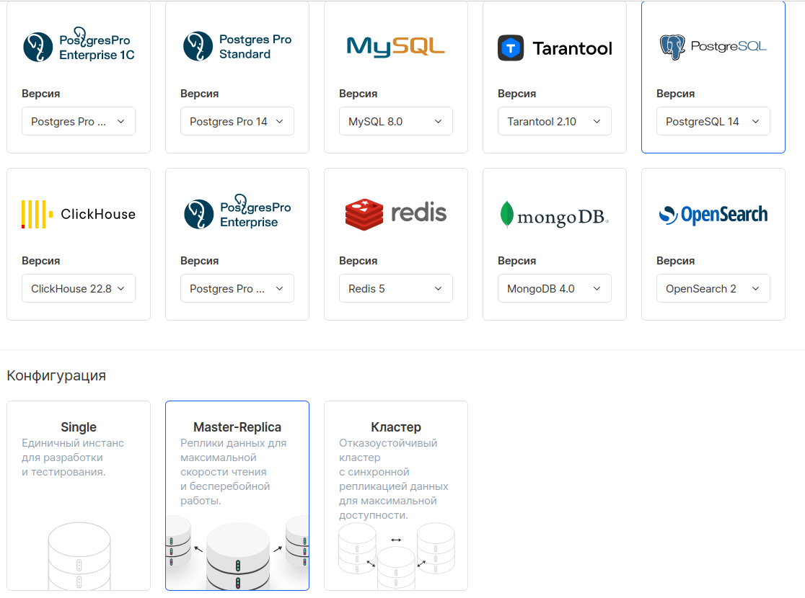
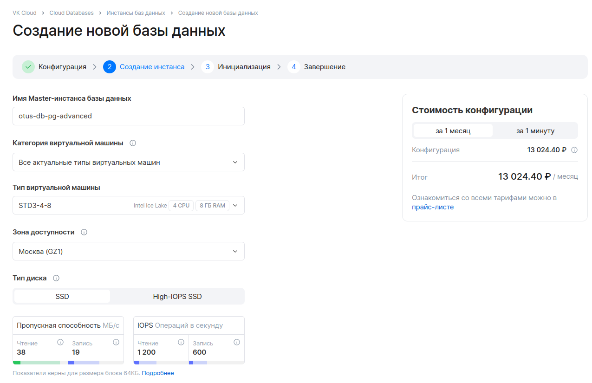

- Отключим резервное копирование и мониторинг, назначим внешний IP (по умолчанию выключено)

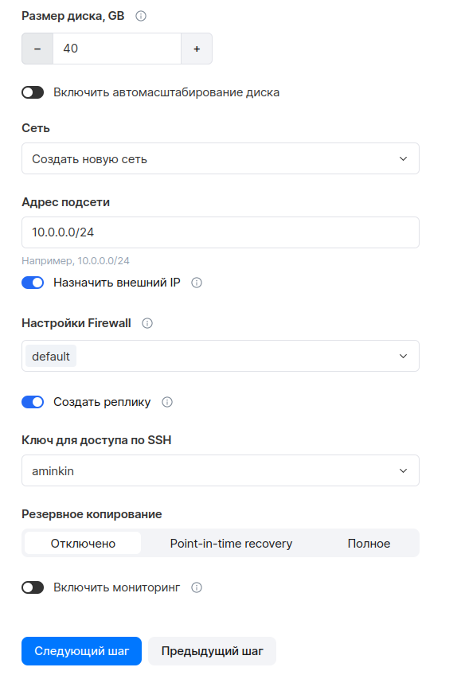

- Смотрим что создалось

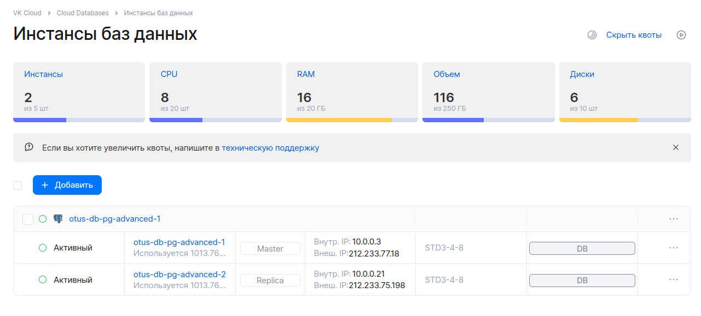
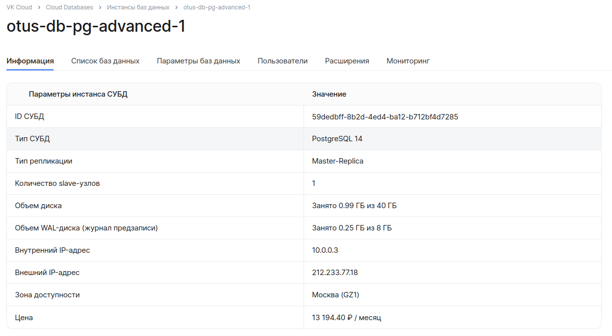

- В инстанс можно добавлять расширения как и в YA, но список поменьше

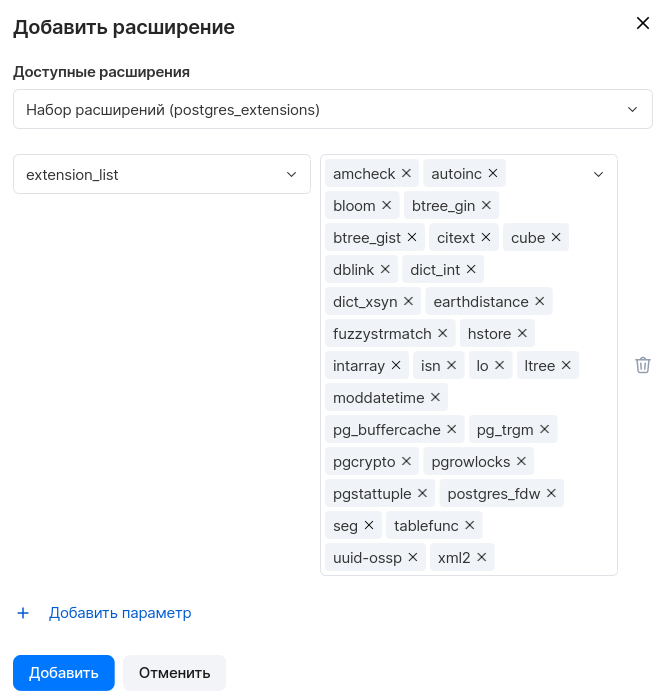

- Мониторинг имеется

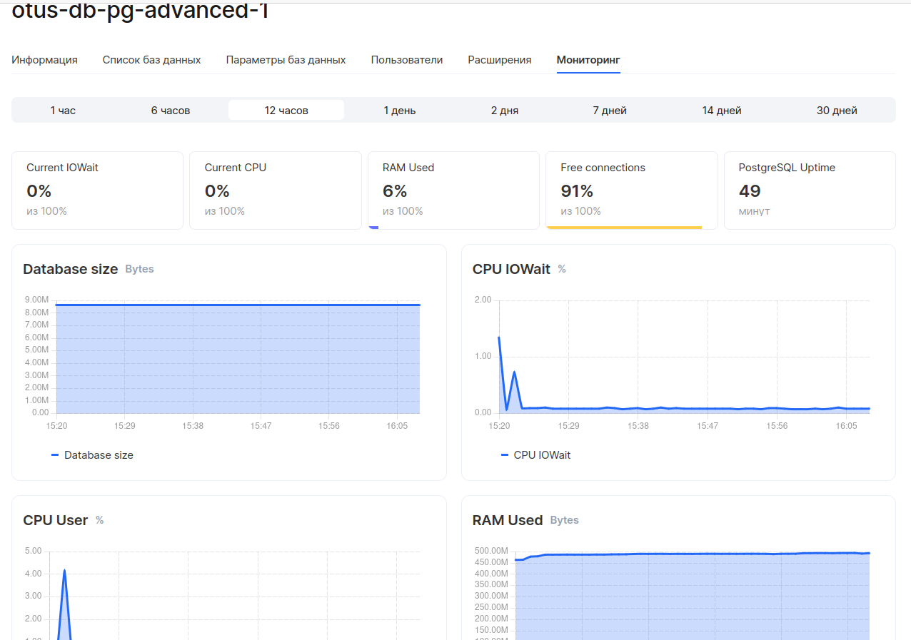

- Подключение производится по внешнему IP кластера который можно найти на странице с описанием, без всяких SSL. При смене мастера скорее всего придется менять IP для подключения. В интерфейсе у реплики есть функционал "Преобразовать в мастер". Подключение идет на стандартном порту 5432, база - postgres либо по умолчанию создается бд с именем кластера - otus-db-pg-advanced.

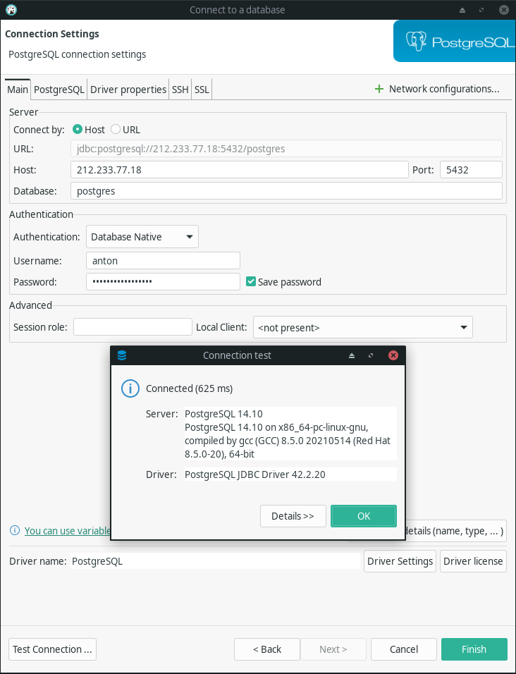

- Подключимся через psql к базе otus-db-pg-advanced и зальём тестовый датасет. Скорость заливки немного быстрее - 3 минуты против 4 на YA, но это может быть связано с сетью.

```
[anton@ant lesson_20]$ psql "host=212.233.77.18 \
      dbname=otus-db-pg-advanced \
      user=anton \
      target_session_attrs=read-write"
Password for user anton: 
psql (16.1, server 14.10)
Type "help" for help.

otus-db-pg-advanced=> CREATE TABLE weather (
    station_id              VARCHAR(50),
    city_name               VARCHAR(250),
    dt                      TIMESTAMP,
    season                  VARCHAR(50),
    avg_temp_c              float4,
    min_temp_c              float4,
    max_temp_c              float4,
    precipitation_mm        float4,
    snow_depth_mm           float4,
    avg_wind_dir_deg        float4,
    avg_wind_speed_kmh      float4,
    peak_wind_gust_kmh      float4,
    avg_sea_level_pres_hpa  float4,
    sunshine_total_min      float4
);
CREATE TABLE
otus-db-pg-advanced=> \timing
Timing is on.
otus-db-pg-advanced=> \COPY weather(
  station_id,
  city_name,
  dt,
  season,
  avg_temp_c,
  min_temp_c,
  max_temp_c,
  precipitation_mm,
  snow_depth_mm,
  avg_wind_dir_deg,
  avg_wind_speed_kmh,
  peak_wind_gust_kmh,
  avg_sea_level_pres_hpa,
  sunshine_total_min
)
FROM 'weather.csv'
DELIMITER ','
CSV HEADER;
COPY 27621770
Time: 180654,051 ms (03:00,654)
```

- Выполним запросы, тут по скорости работы примерно одинаково с YA cloud.

```
-- 1) общее количество
SELECT count(*) FROM weather;
-- 1 row(s) fetched - 2.196s, результат = 27621770

-- 2) разброс дат
SELECT min(dt), max(dt) FROM weather;
-- 1 row(s) fetched - 2.525s, 1750-02-01 00:29:43.000	2023-09-05 00:00:00.000

-- 3) количество по городам
SELECT city_name, count(*) FROM weather GROUP BY city_name ORDER BY city_name;
-- 200 row(s) fetched - 4.472s

-- 4) предельные температуры Волгограда
SELECT max(max_temp_c), min(min_temp_c) FROM weather WHERE city_name = 'Volgograd';
-- 1 row(s) fetched - 2.69s, 42.6	-48.4

-- 5) средняя температура в Волгограде 1 января 2000 г
SELECT avg_temp_c FROM weather WHERE city_name = 'Volgograd' AND dt >= '2000-01-01' AND dt < '2000-01-02';
-- 1 row(s) fetched - 2.78s, -2.4
```
