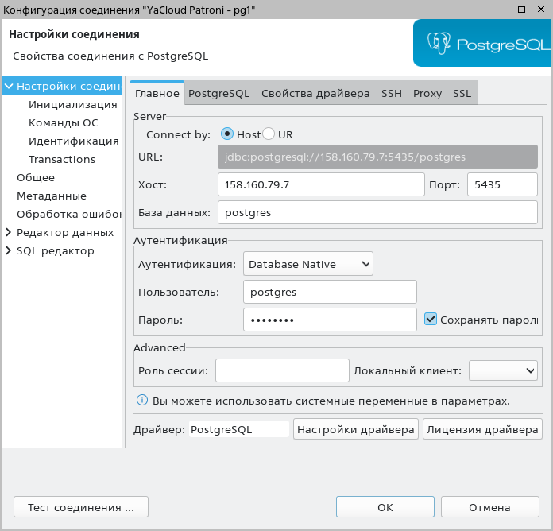
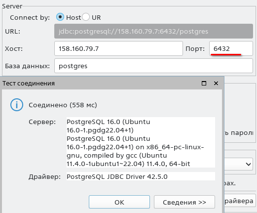
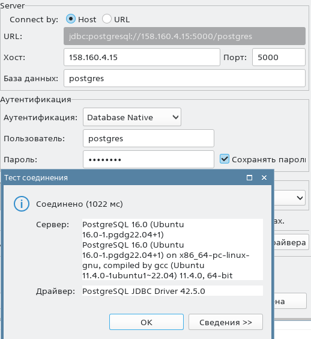
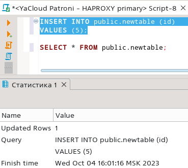
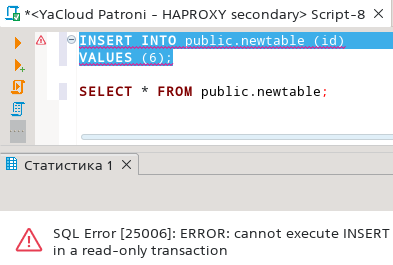
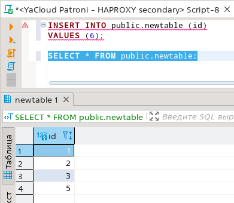

# PG Advanced - Домашняя работа 6 - HA кластер Postgres

## Подготовка Yandex Cloud

### Создадим через UI YC сервисный аккаунт otus-sa и настроим его согласно https://cloud.yandex.ru/docs/iam/quickstart-sa

- создадим ключ для сервисного аккаунта
```
[anton@ant lesson_6]$ yc iam key create --service-account-name otus-sa --output otus-sa-key.json
id: aje16hu5l2hge1q5jm2b
service_account_id: ajencg9rd0c7pbb5vo2n
created_at: "2023-09-25T15:29:24.749880631Z"
key_algorithm: RSA_2048
```

- создадим профиль
```
[anton@ant lesson_6]$ yc config profile create otus-sa-profile
Profile 'otus-sa-profile' created and activated
```

- указываем в конфигурации профиля авторизованный ключ сервисного аккаунта

`yc config set service-account-key otus-sa-key.json`

- почему-то после этих манипуляций пропала авторизация в CLI, перезадаём токен доступа и идентификатор облака

```
[anton@ant lesson_6]$ yc config set token y0_AgAA............................81dQ
[anton@ant lesson_6]$ yc config set cloud-id b1ggcf53dq70c4s4oa6j
[anton@ant lesson_6]$ yc resource-manager folder list
+----------------------+---------+--------+--------+
|          ID          |  NAME   | LABELS | STATUS |
+----------------------+---------+--------+--------+
| b1ggfiad3opmftvi9r55 | default |        | ACTIVE |
+----------------------+---------+--------+--------+
[anton@ant lesson_6]$ yc config profile list
default
otus-sa-profile ACTIVE
[anton@ant lesson_6]$ yc config set folder-id b1ggfiad3opmftvi9r55
[anton@ant lesson_6]$ yc vpc network list
+----------------------+---------+
|          ID          |  NAME   |
+----------------------+---------+
| enpi8htrfm74c3ctr69r | default |
+----------------------+---------+
```

## DCS на основе etcd

### Создадим группу виртуальных машин в YC для кластера etcd

- создадим конфиг [vm_spec_etcd.yaml](vm_spec_etcd.yaml) для группы машин согласно документации:
https://cloud.yandex.ru/docs/compute/operations/instance-groups/create-fixed-group
https://cloud.yandex.ru/docs/compute/concepts/instance-groups/instance-template#instance-template

- идентификатор сети возьмем из вывода команды yc vpc network list выше, идентификатор образа (image_id) для ubuntu возьмем здесь - https://cloud.yandex.ru/marketplace/products/yc/ubuntu-22-04-lts, для имени хоста используем шаблон etcd{instance.index} (см https://github.com/yandex-cloud/docs/blob/master/ru/compute/concepts/instance-groups/variables-in-the-template.md)

- создадим машины по конфигу:
```
[anton@ant lesson_6]$ yc compute instance-group create --file vm_spec_etcd.yaml
done (1m27s)
...
```

- посмотрим список машин
```
[anton@ant lesson_6]$ yc compute instance-group list-instances etcd-group
+----------------------+---------------------------+----------------+-------------+----------------------+----------------+
|     INSTANCE ID      |           NAME            |  EXTERNAL IP   | INTERNAL IP |        STATUS        | STATUS MESSAGE |
+----------------------+---------------------------+----------------+-------------+----------------------+----------------+
| epd94354o61nvpmgsv9a | cl1pot7467q2cnscjp09-ugod | 158.160.80.138 | 10.129.0.20 | RUNNING_ACTUAL [31s] |                |
| epd203eqabf29o8l8ut8 | cl1pot7467q2cnscjp09-ulew | 158.160.80.164 | 10.129.0.19 | RUNNING_ACTUAL [15s] |                |
| epddvkser5q5u33o6rl8 | cl1pot7467q2cnscjp09-ypij | 84.252.136.167 | 10.129.0.31 | RUNNING_ACTUAL [13s] |                |
+----------------------+---------------------------+----------------+-------------+----------------------+----------------+
```

### установка и настройка etcd

- зайдём на первую машину etcd, установим etcd
```
[anton@ant lesson_6]$ ssh anton@158.160.80.138
anton@etcd1:~$ sudo apt update && sudo apt upgrade -y && sudo apt install -y etcd
```

- создадим конфиг /etc/default/etcd, внутри сети машины пингуются по хостнеймам

```
cat > temp.cfg << EOF 
ETCD_NAME="$(hostname)"
ETCD_DATA_DIR="/var/lib/etcd"
ETCD_LISTEN_CLIENT_URLS="http://0.0.0.0:2379"
ETCD_ADVERTISE_CLIENT_URLS="http://$(hostname):2379"
ETCD_LISTEN_PEER_URLS="http://0.0.0.0:2380"
ETCD_INITIAL_ADVERTISE_PEER_URLS="http://$(hostname):2380"
ETCD_INITIAL_CLUSTER_TOKEN="PatroniCluster"
ETCD_INITIAL_CLUSTER="etcd1=http://etcd1:2380,etcd2=http://etcd2:2380,etcd3=http://etcd3:2380"
ETCD_INITIAL_CLUSTER_STATE="new"
EOF
cat temp.cfg | sudo tee -a /etc/default/etcd
```

- повторим все шаги для 2 и 3 ноды
```
[anton@ant lesson_6]$ ssh anton@158.160.80.164
...
[anton@ant lesson_6]$ ssh anton@84.252.136.167
...
```

- стартуем etcd одновременно минимум на двух нодах, а лучше на всех трех, если после установки имеется запущенный кластер, сначала его остановим

`sudo systemctl stop etcd`
`sudo systemctl start etcd`

- проверка
```
anton@etcd1:~$ etcdctl cluster-health
member 9a1f33941721f94d is healthy: got healthy result from http://etcd1:2379
member 9df0146dd9068bd2 is healthy: got healthy result from http://etcd3:2379
member f2aeb69aaf7ffcbf is healthy: got healthy result from http://etcd2:2379
cluster is healthy
```

- делаем рестарт группы машин, проверяем статус после рестарта
```
[anton@ant lesson_6]$ yc compute instance-group stop etcd-group
...
[anton@ant lesson_6]$ yc compute instance-group start etcd-group
...
[anton@ant lesson_6]$ ssh anton@158.160.80.138
anton@etcd1:~$ etcdctl cluster-health
member 9a1f33941721f94d is healthy: got healthy result from http://etcd1:2379
member 9df0146dd9068bd2 is healthy: got healthy result from http://etcd3:2379
member f2aeb69aaf7ffcbf is healthy: got healthy result from http://etcd2:2379
cluster is healthy
```

## Postgresql + patroni

- создадим конфиг [vm_spec_pg.yaml](vm_spec_pg.yaml) для группы машин постгреса (4 Gb RAM, 30 Gb HDD), добавим в него в секцию write_files файл [postgresql-16.sh](postgresql-16.sh) для установки постгреса

- создадим машины по конфигу:
```
[anton@ant lesson_6]$ yc compute instance-group create --file vm_spec_pg.yaml
done (43s)
...

[anton@ant lesson_6]$ yc compute instance-group list
+----------------------+------------+--------+------+
|          ID          |    NAME    | STATUS | SIZE |
+----------------------+------------+--------+------+
| cl1pot7467q2cnscjp09 | etcd-group | ACTIVE |    3 |
| cl1ia39nsp9563l1t92s | pg-group   | ACTIVE |    3 |
+----------------------+------------+--------+------+
```

- берем публичные адреса и идём на машины (по очереди)
```
[anton@ant lesson_6]$ yc compute instance-group list-instances pg-group
+----------------------+---------------------------+----------------+-------------+----------------------+----------------+
|     INSTANCE ID      |           NAME            |  EXTERNAL IP   | INTERNAL IP |        STATUS        | STATUS MESSAGE |
+----------------------+---------------------------+----------------+-------------+----------------------+----------------+
| epdsjc6fu5ilbmurqsj8 | cl1ia39nsp9563l1t92s-azoj | 158.160.79.7   | 10.129.0.8  | RUNNING_ACTUAL [17s] |                |
| epdhv28rakb2n036c9kb | cl1ia39nsp9563l1t92s-adyn | 158.160.28.133 | 10.129.0.14 | RUNNING_ACTUAL [16s] |                |
| epdv9ahhlli24kbv7cfg | cl1ia39nsp9563l1t92s-usib | 158.160.81.197 | 10.129.0.26 | RUNNING_ACTUAL [16s] |                |
+----------------------+---------------------------+----------------+-------------+----------------------+----------------+
```

- ставим постгрес
```
[anton@ant lesson_6]$ ssh anton@158.160.79.7
anton@pg1:~$ . /tmp/postgresql-16.sh 
...
```
- ставим патрони
```
anton@pg1:~$ sudo apt-get install -y python3 python3-pip git mc
anton@pg1:~$ sudo pip3 install psycopg2-binary patroni[etcd]
```

- удаляем текущий кластер постгреса, созданный автоматически при установке
```
anton@pg1:~$ sudo -u postgres pg_ctlcluster 16 main stop
anton@pg1:~$ sudo -u postgres pg_dropcluster 16 main 
```

- создадим каталог для данных и отдадим его пользователю постгреса
```
anton@pg1:~$ sudo mkdir -p /data/patroni/16
anton@pg1:~$ sudo chown -R postgres:postgres /data/patroni
anton@pg1:~$ sudo chmod -R 775 /data/patroni
```

- создаем конфиг патрони: [patroni.yml](patroni.yml), прописываем в него внутренние ip-адреса машин
```
anton@pg1:~$ sudo mkdir /etc/patroni
anton@pg1:~$ sudo vim /etc/patroni/patroni.yml
anton@pg1:~$ sudo chown -R  postgres:postgres /etc/patroni
```

- создаем файл для сервиса: [patroni.service](patroni.service), в котором прописана ссылка на вышесозданный patroni.yml
```
anton@pg1:~$ sudo vim /etc/systemd/system/patroni.service
```

- стартуем
```
anton@pg1:~$ sudo systemctl daemon-reload
anton@pg1:~$ sudo systemctl enable patroni
Created symlink /etc/systemd/system/multi-user.target.wants/patroni.service → /etc/systemd/system/patroni.service.
anton@pg1:~$ sudo systemctl start patroni
anton@pg1:~$ sudo patronictl -c /etc/patroni/patroni.yml list 
+ Cluster: pgcluster (7286025966731134891) ---+----+-----------+
| Member | Host            | Role   | State   | TL | Lag in MB |
+--------+-----------------+--------+---------+----+-----------+
| pg1    | 10.129.0.8:5435 | Leader | running |  1 |           |
+--------+-----------------+--------+---------+----+-----------+
```

- идём повторять балет на 2 и 3 нодах, подправляя имя ноды и ip-адреса в patroni.yml
```
anton@pg2:~$ sudo patronictl -c /etc/patroni/patroni.yml list 
+ Cluster: pgcluster (7286025966731134891) -----+----+-----------+
| Member | Host             | Role    | State   | TL | Lag in MB |
+--------+------------------+---------+---------+----+-----------+
| pg1    | 10.129.0.8:5435  | Leader  | running |  1 |           |
| pg2    | 10.129.0.14:5435 | Replica | running |  1 |         0 |
+--------+------------------+---------+---------+----+-----------+

anton@pg3:~$ sudo patronictl -c /etc/patroni/patroni.yml list 
+ Cluster: pgcluster (7286025966731134891) -------+----+-----------+
| Member | Host             | Role    | State     | TL | Lag in MB |
+--------+------------------+---------+-----------+----+-----------+
| pg1    | 10.129.0.8:5435  | Leader  | running   |  1 |           |
| pg2    | 10.129.0.14:5435 | Replica | streaming |  1 |         0 |
| pg3    | 10.129.0.26:5435 | Replica | streaming |  1 |         0 |
+--------+------------------+---------+-----------+----+-----------+
```

- проверим подключение извне (к мастер-ноде) и создадим табличку



```
CREATE TABLE public.newtable (
	id integer NOT NULL,
	CONSTRAINT newtable_pk PRIMARY KEY (id)
);
```

## PGbouncer

- на каждой машине с постгресом делаем установку

`sudo apt install -y pgbouncer`

- меняем параметры в конфиге, в качестве базы будем использовать стандартную postgres, а хост пропишем как ip-адрес, т.к. по localhost получаем таймаут
- кроме того, раскомментируем строку с ignore_startup_parameters иначе получим ошибку "FATAL: unsupported startup parameter: extra_float_digits"

```
anton@pg1:~$ sudo vim /etc/pgbouncer/pgbouncer.ini
...
[databases]
postgres = host=10.129.0.8 port=5435 dbname=postgres
...
listen_addr = *
...
admin_users = postgres
...
ignore_startup_parameters = extra_float_digits
```

- теперь добавим пользователя - выберем из бд, подключившись напрямую к патрони и положим в userlist.txt
```
select usename, passwd from pg_shadow order by 1
...

anton@pg1:~$ sudo vim /etc/pgbouncer/userlist.txt
"postgres" "SCRAM-SHA-256$4096:1cgq8nY/QHvfIQQJ5hWu7A==$OSrY6BXcKNdP99C8Hhe0QniASX/i7tajRs1ulgi7A5Q=:NT+95PPER1OeUh2S5aFmbDY/AoefmWor0ZJtPCSXzQI="
```

- рестартуем баунсер

`anton@pg1:~$ sudo systemctl restart pgbouncer`

- пробуем подключиться извне поменяв порт на 6432



- повторяем упражнение на pg2 и pg3 с заменой внутреннего ip в конфиге

## HAProxy

- поднимем отдельную виртуалку для haproxy

```
yc compute instance create \
  --name otus-db-hap-lesson6 \
  --zone ru-central1-b \
  --hostname otus-db-haproxy \
  --network-interface subnet-name=default-ru-central1-b,nat-ip-version=ipv4 \
  --create-boot-disk image-folder-id=standard-images,image-family=ubuntu-2204-lts,type=network-hdd,size=20 \
  --memory 4 \
  --core-fraction 50 \
  --preemptible \
  --metadata-from-file user-data=user-data.yaml
```

- зайдём на неё и поставим haproxy по инструкции с https://haproxy.debian.net/
```
[anton@ant lesson_6]$ ssh anton@158.160.4.15
anton@otus-db-haproxy:~$ sudo apt update && sudo apt upgrade -y
anton@otus-db-haproxy:~$ sudo apt-get install --no-install-recommends software-properties-common
anton@otus-db-haproxy:~$ sudo add-apt-repository ppa:vbernat/haproxy-2.8
anton@otus-db-haproxy:~$ sudo apt-get install haproxy=2.8.\*
```

- добавим в конфиг [haproxy.cfg](haproxy.cfg) секции stats, primary и standbys, в которых указываем ноды патрони pg1,2,3 и порт баунсера - 6432

```
anton@otus-db-haproxy:~$ sudo vim /etc/haproxy/haproxy.cfg
...
anton@otus-db-haproxy:~$ haproxy -f /etc/haproxy/haproxy.cfg -c
Configuration file is valid
```
- рестарт

`anton@otus-db-haproxy:~$ sudo systemctl restart haproxy`

- проверка - запустим на просмотр лог через journalctl и попробуем подключиться из бобра на наш адрес по портам 5001 и 5000

```
anton@otus-db-haproxy:~$ sudo journalctl -u haproxy.service -n 100 -f
Oct 04 12:51:04 otus-db-haproxy haproxy[37816]: 94.233.70.118:60814 [04/Oct/2023:12:51:03.858] standbys standbys/pg2 1/0/541 60248 -- 1/1/0/0/0 0/0
Oct 04 12:52:32 otus-db-haproxy haproxy[37816]: 94.233.70.118:49534 [04/Oct/2023:12:52:31.462] primary primary/pg1 1/0/997 60249 -- 1/1/0/0/0 0/0
```


- при попытке изменения данных через 5000 все хорошо



- при попытке изменения данных через 5001 получаем SQL Error [25006]: ERROR: cannot execute INSERT in a read-only transaction



## Проверка отказоустойчивости

- выключим одну из нод кластера через UI облака, пусть это будет лидер pg1 и проверим с другой ноды состояние:

```
anton@pg2:~$ sudo patronictl -c /etc/patroni/patroni.yml list 
+ Cluster: pgcluster (7286025966731134891) -------+----+-----------+
| Member | Host             | Role    | State     | TL | Lag in MB |
+--------+------------------+---------+-----------+----+-----------+
| pg1    | 10.129.0.8:5435  | Replica | stopped   |    |   unknown |
| pg2    | 10.129.0.14:5435 | Replica | streaming |  2 |         0 |
| pg3    | 10.129.0.26:5435 | Leader  | running   |  2 |           |
+--------+------------------+---------+-----------+----+-----------+
```

- т.к. ноды создавались в облаке с помощью группы виртуальных машин, то машина автоматически стартует обратно, после запуска проверяем статус кластера:

```
anton@pg2:~$ sudo patronictl -c /etc/patroni/patroni.yml list 
+ Cluster: pgcluster (7286025966731134891) -------+----+-----------+
| Member | Host             | Role    | State     | TL | Lag in MB |
+--------+------------------+---------+-----------+----+-----------+
| pg1    | 10.129.0.8:5435  | Replica | streaming |  2 |         0 |
| pg2    | 10.129.0.14:5435 | Replica | streaming |  2 |         0 |
| pg3    | 10.129.0.26:5435 | Leader  | running   |  2 |           |
+--------+------------------+---------+-----------+----+-----------+
```

- запрашиваем данные через haproxy, всё на месте:


