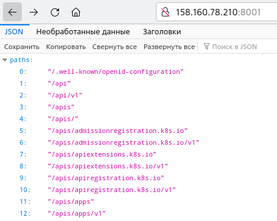
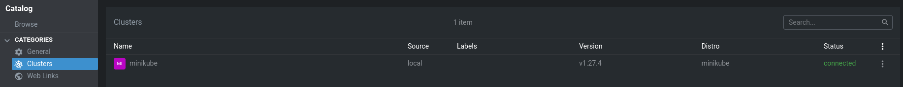
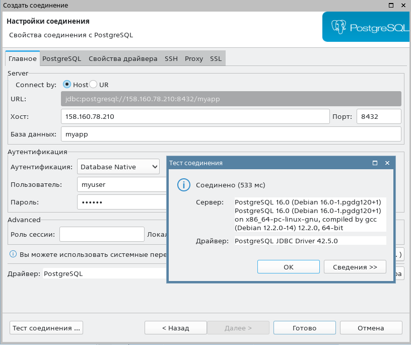

# PG Advanced - Домашняя работа 8-9 - Postgres в minikube

## Создание виртуалки

```
yc compute instance create \
  --name otus-db-pg-lesson8 \
  --zone ru-central1-b \
  --hostname otus-db-pg-vm-8 \
  --network-interface subnet-name=default-ru-central1-b,nat-ip-version=ipv4 \
  --create-boot-disk image-folder-id=standard-images,image-family=ubuntu-2204-lts,type=network-hdd,size=40 \
  --memory 8 \
  --cores 4 \
  --core-fraction 50 \
  --preemptible \
  --metadata-from-file user-data=user-data.yaml
```
[user-data.yaml](user-data.yaml)

## Установка minikube

- установка докера

```
anton@otus-db-pg-vm-8:~$ sudo apt-get update
anton@otus-db-pg-vm-8:~$ sudo install -m 0755 -d /etc/apt/keyrings
anton@otus-db-pg-vm-8:~$ curl -fsSL https://download.docker.com/linux/ubuntu/gpg | sudo gpg --dearmor -o /etc/apt/keyrings/docker.gpg
anton@otus-db-pg-vm-8:~$ sudo chmod a+r /etc/apt/keyrings/docker.gpg
anton@otus-db-pg-vm-8:~$ echo \
  "deb [arch="$(dpkg --print-architecture)" signed-by=/etc/apt/keyrings/docker.gpg] https://download.docker.com/linux/ubuntu \
  "$(. /etc/os-release && echo "$VERSION_CODENAME")" stable" | \
  sudo tee /etc/apt/sources.list.d/docker.list > /dev/null
anton@otus-db-pg-vm-8:~$ sudo apt-get update
anton@otus-db-pg-vm-8:~$ sudo apt-get install docker-ce docker-ce-cli containerd.io docker-buildx-plugin docker-compose-plugin docker-compose
```

- установка миникуба согласно https://minikube.sigs.k8s.io/docs/start/
```
curl -LO https://storage.googleapis.com/minikube/releases/latest/minikube-linux-amd64
sudo install minikube-linux-amd64 /usr/local/bin/minikube
```

- стартуем, если жалуется на нехватку прав, то по подсказке добавляемся в группу докера
```
anton@otus-db-pg-vm-8:~$ sudo usermod -aG docker $USER && newgrp docker
anton@otus-db-pg-vm-8:~$ minikube start
* minikube v1.31.2 on Ubuntu 22.04 (amd64)
* Automatically selected the docker driver. Other choices: none, ssh
* Using Docker driver with root privileges
* Starting control plane node minikube in cluster minikube
* Pulling base image ...
* Downloading Kubernetes v1.27.4 preload ...
    > preloaded-images-k8s-v18-v1...:  393.21 MiB / 393.21 MiB  100.00% 28.21 M
    > gcr.io/k8s-minikube/kicbase...:  447.61 MiB / 447.62 MiB  100.00% 29.47 M
* Creating docker container (CPUs=2, Memory=2200MB) ...
* Preparing Kubernetes v1.27.4 on Docker 24.0.4 ...
  - Generating certificates and keys ...
  - Booting up control plane ...
  - Configuring RBAC rules ...
* Configuring bridge CNI (Container Networking Interface) ...
  - Using image gcr.io/k8s-minikube/storage-provisioner:v5
* Verifying Kubernetes components...
* Enabled addons: storage-provisioner, default-storageclass
* kubectl not found. If you need it, try: 'minikube kubectl -- get pods -A'
* Done! kubectl is now configured to use "minikube" cluster and "default" namespace by default
```

- проверяем доступность кластера извне

1) установим утилиту OpenLens - скачаиваем архив с нужной архитектурой, устанавливаем через менеджер ОС (например под Астру 1.7 берём OpenLens-6.5.2-366.amd64.deb и открываем в QApt)
https://github.com/MuhammedKalkan/OpenLens/releases?page=1

2) запускаем на виртуалке с миникубом прокси чтобы ресурсы стали доступны извне, указываем слушать со всех адресов
```
anton@otus-db-pg-vm-8:~$ minikube kubectl -- proxy --accept-hosts='*' --address='0.0.0.0' --disable-filter=true &
[1] 57788
anton@otus-db-pg-vm-8:~$ W1006 13:56:36.097285   57796 proxy.go:175] Request filter disabled, your proxy is vulnerable to XSRF attacks, please be cautious
Starting to serve on [::]:8001
```
после этого по внешнему ip-адресу http://158.160.78.210:8001/ открывается json с ресурсами апи:



3) берем с виртуалки конфиг кластера, а также с помощью filezilla копируем на локальный комп папочку ~/.minikube (оттуда понадобятся сертификаты)

`anton@otus-db-pg-vm-8:~$ cat ~/.kube/config`

4) запускаем OpenLens и добавляем в него наш кластер через Add Clusters from Kubeconfig - вставляем скопированный текст конфига, заменяем в нём ip на внешний, а также прописываем пути к сертификатам - туда куда мы скачали каталог ./minikube, например:

```
...
server: http://158.160.78.210:8001
...
certificate-authority: /mnt/dev/sdb1/Education/PgAdvanced/otus-pg-adv/lesson_9/.minikube/ca.crt
...
client-certificate: /mnt/dev/sdb1/Education/PgAdvanced/otus-pg-adv/lesson_9/.minikube/profiles/minikube/client.crt
client-key: /mnt/dev/sdb1/Education/PgAdvanced/otus-pg-adv/lesson_9/.minikube/profiles/minikube/client.key
...
```

кластер подключен в OpenLens:



## Разворачивание Postgres

- возьмем [postgres.yaml](postgres.yaml) из лекции и применим в миникубе
```
anton@otus-db-pg-vm-8:~$ minikube kubectl -- apply -f postgres.yaml
service/postgres created
statefulset.apps/postgres-statefulset created
```

- проверяем локальное подключение, для этого установим на виртуалке клиент постгреса
```
anton@otus-db-pg-vm-8:~$ sudo apt install postgresql-client
anton@otus-db-pg-vm-8:~$ minikube service list
|-------------|------------|--------------|---------------------------|
|  NAMESPACE  |    NAME    | TARGET PORT  |            URL            |
|-------------|------------|--------------|---------------------------|
| default     | kubernetes | No node port |                           |
| default     | postgres   |         5432 | http://192.168.49.2:30545 |
| kube-system | kube-dns   | No node port |                           |
|-------------|------------|--------------|---------------------------|
anton@otus-db-pg-vm-8:~$ psql -h 192.168.49.2 -p 30545 -U myuser -d myapp
Password for user myuser: 
psql (14.9 (Ubuntu 14.9-0ubuntu0.22.04.1), server 16.0 (Debian 16.0-1.pgdg120+1))
WARNING: psql major version 14, server major version 16.
         Some psql features might not work.
Type "help" for help.

myapp=#
```

- для подкюлчения снаружи сделаем порт-форвардинг, не будем закрывать консоль
```
anton@otus-db-pg-vm-8:~$ minikube kubectl -- port-forward --address 0.0.0.0 service/postgres 8432:5432
Forwarding from 0.0.0.0:8432 -> 5432
```

- пробуем подкюллчиться через dbeaver



после подключения в консоли форвардинга увидим:

`Handling connection for 8432`
